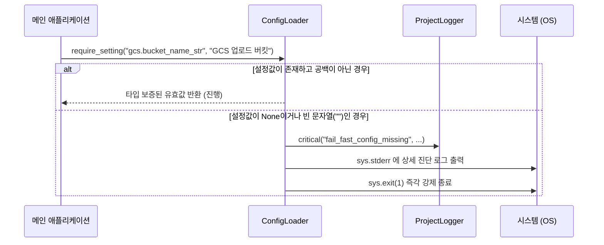

# 04. Fail-Fast 필수 설정 검증 (`require_setting`)

> **소속 모듈**: `agent_common.config_loader.ConfigLoader`  
> **핵심 메서드**: `ConfigLoader.require_setting(path, message="", config_file=None)`  
> **연계 원칙**: `AGENTS.md` 제1.3조 (Fail-Fast & Program Stability)

---

## 1. 개요 및 원칙

분산 데이터 파이프라인이나 백그라운드 워커에서 데이터베이스 연결 정보, 스토리지 버킷 경로, 암호화 키와 같은 **필수 설정값이 누락된 상태로 실행되면**, 수 시간 동안 데이터를 처리한 뒤 뒤늦게 에러를 발생시키거나 데이터 유실/오염을 초래합니다.

`ConfigLoader.require_setting()`은 시스템 아키텍처 원칙 **"Fail-Fast (빠른 실패)"**를 철저히 구현합니다. 필수 설정값이 비어있거나 누락된 경우, 런타임 중간이 아닌 **프로그램 기동 시점(Startup Phase)**에 즉각 프로세스를 정상 종료(`sys.exit(1)`)시킴으로써 불완전한 상태에서의 작업을 차단합니다.

---

## 2. 메서드 시그니처 및 파라미터

```python
def require_setting(
    self, 
    path: str, 
    message: str = "", 
    config_file: str | Path | None = None
) -> Any:
```

- **`path` (str, 필수)**: 점 표기법으로 작성된 필수 설정 경로 (예: `"ecs.endpoint_url"`, `"bigquery.dataset_id"`)
- **`message` (str, 선택)**: 설정 누락 시 운영자에게 원인 파악을 돕기 위해 출력할 추가 설명 문구
- **`config_file` (str | Path | None, 선택)**: 특정 설정 파일에 한정하여 검증할 경우 해당 파일 경로 (미지정 시 전체 병합된 `config_dir` 설정 기준 검증)
- **반환값 (`Any`)**: 유효하게 검증된 설정값 (키의 타입 접미사 `_int`, `_str` 등에 맞춰 자동 형 변환 및 보증 완료)

---

## 3. 동작 메커니즘 및 검증 절차



### 판정 기준 (누락으로 간주되는 경우):
1. 설정 경로의 키가 딕셔너리에 아예 존재하지 않는 경우
2. 키의 값이 `None`인 경우
3. 문자열 값이면서 공백 제거(`.strip()`) 후 빈 문자열(`""`)인 경우

---

## 4. 진단 출력 및 오류 로그

설정 누락 발생 시 콘솔 표준 에러(`sys.stderr`)와 로거(`logger.critical`)에 다음 정보를 포함한 명확한 한글 메시지가 1줄로 출력됩니다:

- **누락된 설정 키 경로**: `path`
- **사용자 추가 메시지**: `message`
- **조회 대상 파일 및 실제 존재 여부**: `config_file` 및 `[파일 존재함]` / `[파일 없음]`
- **실제 파일에서 발견된 키 목록**: `(조회된 파일 키: ['ecs', 'logging'])`

이를 통해 운영자는 오타인지, 파일 누락인지, 스키마 불일치인지를 1초 만에 파악할 수 있습니다.

---

## 5. 실전 사용 예시

### 5.1. CLI 및 기동 초기 진입점 검증

```python
import sys
from agent_common.config_loader import ConfigLoader

loader = ConfigLoader()

# 1. 필수 인프라 연결 정보 검증 (누락 시 즉각 종료)
ecs_endpoint: str = loader.require_setting(
    "ecs.endpoint_url", 
    message="Dell ECS 스토리지 접속을 위한 필수 엔드포인트 URL입니다."
)

bq_table: str = loader.require_setting(
    "bigquery.table_id", 
    message="적재 대상 BigQuery 테이블 ID입니다."
)

# 2. 타입 접미사 자동 보증 활용
max_retry: int = loader.require_setting(
    "transfer.max_retries_int",
    message="이관 실패 시 최대 재시도 횟수입니다."
)

print(f"모든 필수 설정 검증 완료: ECS={ecs_endpoint}, BQ={bq_table}, Retry={max_retry}")
```

### 5.2. 특정 설정 파일 지정 검증

프로젝트 전체 병합 설정이 아닌 특정 전용 설정 파일(예: `table_rules.yml`)을 직접 검증할 때도 활용할 수 있습니다:

```python
# table_rules.yml 내의 pk_columns_list 필수 지정 여부 검증
pk_cols: list = loader.require_setting(
    "schema.pk_columns_list",
    message="Upsert 처리를 위한 Primary Key 컬럼 목록이 누락되었습니다.",
    config_file="config/table_rules.yml"
)
```

---

## 6. AGENTS.md 가이드라인과의 일치성

- **규칙 1.3.1**: 필수 설정값 누락 시 코드 상수에 임의로 fallback하지 않고 즉각 Fail-Fast 종료.
- **규칙 1.3.2**: 프로그램 기동 초기(Startup Phase)에 모든 설정을 완벽히 검증하여, 실제 데이터 적재 루프 도중 비정상 종료되는 현상을 방지.
