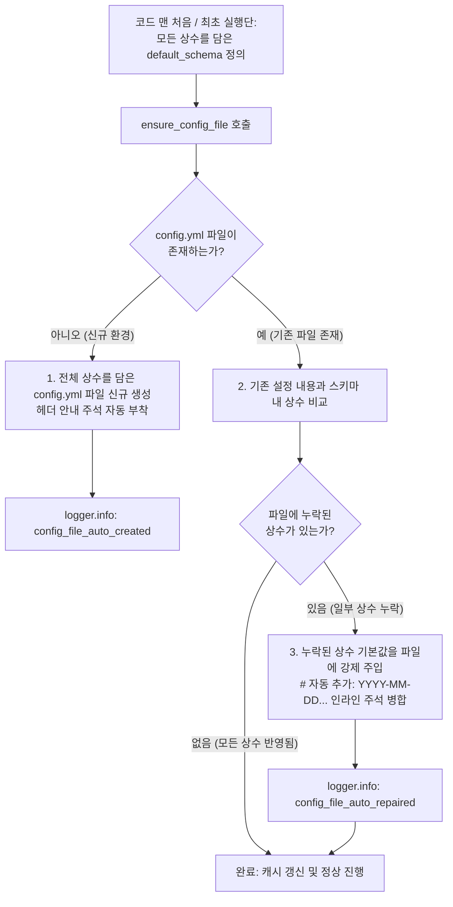

# 1.6. 모든 상수의 설정 파일화 및 템플릿 보정 (`ensure_config_file`)

> **소속 모듈**: `agent_common.config_loader.ConfigLoader`  
> **핵심 메서드**: `ConfigLoader.ensure_config_file()`, `ConfigLoader.register_schema()`  
> **연계 원칙**: `AGENTS.md` 제1.1조 (No Hardcoding & 설정 분리 원칙)

---

## 1. 핵심 설계 철학: 왜 이 기능이 필요한가?

> **"‘자가 치유(Self-healing)’는 동작 방식일 뿐, 본질이자 주 목적은 ‘코드 내 모든 상수의 설정 파일화(외부화)와 가시화’입니다."**

많은 프로그램에서 개발자들은 소스 코드 곳곳에 기본 상수값(타임아웃, 배치 크기, 재시도 횟수, 워커 수 등)을 하드코딩해 두고, 설정 파일에 값이 없으면 코드 내부의 기본값(fallback)을 조용히 꺼내 쓰는 방식을 취하곤 합니다.  
하지만 이러한 방식은 심각한 문제를 야기합니다:

- **설정 항목의 블랙박스화**: 소스 코드를 직접 열어 분석하지 않는 한, 개발자나 이용자는 **"이 프로그램에 어떤 튜닝 가능한 상수가 존재하는지"**, **"기본값으로 몇 초, 몇 개가 지정되어 있는지"** 알 방법이 없습니다.
- **하드코딩 분리 원칙 위배**: `AGENTS.md` 제1.1조(No Hardcoding)에 명시된 대로 시스템의 동작을 제어하는 모든 상수와 파라미터는 설정 파일로 완전히 외부화되어야 합니다.

### 본 기능의 주 목적과 실현 원리

1. **모든 상수의 설정 파일화 (주 목적)**:
   - 코드 내부에 숨어 있는 모든 상수값을 설정 파일(`config.yml`)로 강제 외부화하여 운영자와 개발자에게 100% 투명하게 공개합니다.
2. **코드 맨 처음 / 최초 실행단 스키마 선언**:
   - 모든 상수를 config화하기 위해, **코드의 맨 처음과 최초 실행단(Entry Point)**에서 시스템에 필요한 모든 상수와 초기 기본값을 담은 **설정 스키마(`default_schema`)**를 선언합니다.
3. **상수값 강제 주입 (말이 '자가 치유'이지 실질은 '상수 강제 주입')**:
   - 설정 파일에 특정 설정이 누락되어 있다면, 코드 내부에서 조용히 기본값으로 땜질(Silent Fallback)하는 대신 **설정 파일에 누락된 상수의 기본값을 물리적으로 강제 주입(기록)**합니다.
   - 이렇게 강제로 상수값을 파일에 밀어 넣어 줌으로써, 개발자나 이용자가 생성/보정된 설정 파일만 열어보면 **"어떤 상수가 존재하며 현재 무슨 값으로 설정되어 있는지"** 즉시 파악하고 직관적으로 수정할 수 있게 됩니다.

---

## 2. 메서드 시그니처 및 파라미터

```python
def ensure_config_file(
    self, 
    config_file_name: str = "config.yml", 
    default_schema: Optional[dict[str, Any]] = None
) -> Path:
```

- **`config_file_name` (str)**: 검증 및 상수를 주입·보정할 대상 설정 파일명 (기본값: `"config.yml"`)
- **`default_schema` (dict | None)**: 코드 최초 실행단에 정의된 기본 상수 딕셔너리 스키마. (미지정 시 `register_schema`로 등록된 스키마 사용)
- **반환값 (`Path`)**: 모든 상수가 파일화되어 보정 완료된 설정 파일의 절대 경로 `Path` 객체

---

## 3. 상수 강제 주입 및 파일 보정 흐름



### 3.1. Case 1: 파일이 아예 없을 때 (신규 자동 생성 및 전체 상수 주입)
- `config/` 디렉터리가 없으면 자동 생성합니다.
- 스키마에 정의된 모든 상수와 가이드 헤더 주석을 포함하여 `config.yml` 파일을 즉시 생성합니다.
- 사용자는 이 파일을 열어 시스템에 존재하는 모든 상수를 한눈에 확인하고 바로 값을 커스터마이징할 수 있습니다.

### 3.2. Case 2: 파일은 있으나 새로운 상수가 없을 때 (상수 강제 주입 및 인라인 주석)
- 기존 사용자가 설정해 둔 값과 주석을 100% 보존합니다.
- 파일에 아직 반영되지 않은 누락된 상수를 찾아 기본값을 파일 끝 또는 해당 블록에 **강제로 기록**합니다.
- 추가된 라인 끝에 `# [자동 추가: 2026-09-04 14:30:00+09:00]`와 같은 **타임스탬프 인라인 주석**을 붙여, 운영자가 어떤 상수가 파일에 새로 주입되었는지 즉시 인지할 수 있도록 합니다.

---

## 4. 실전 활용 예시

### 4.1. 애플리케이션 최초 기동단(Entry Point) 작성 패턴

```python
from agent_common.config_loader import ConfigLoader

loader = ConfigLoader()

# ==============================================================================
# [핵심 원칙] 코드 맨 처음 / 최초 실행단에 시스템의 모든 상수를 스키마로 정의
# 소스 코드 내부의 하드코딩을 배제하고, 설정 파일로 투명하게 노출할 모든 상수를 선언합니다.
# ==============================================================================
APP_DEFAULT_SCHEMA = {
    "transfer": {
        "max_workers_int": 4,          # 동시 전송 워커 수 상수
        "batch_size_int": 500,         # 1회 배치 처리 행 수 상수
        "timeout_seconds_int": 30,     # 네트워크 타임아웃(초) 상수
        "enable_metrics_bool": True    # 메트릭 수집 활성화 여부
    },
    "logging": {
        "level_str": "INFO",           # 기본 로그 레벨 상수
        "language": "KO"               # 로그 출력 언어
    }
}

# 1. 스키마 등록 (런타임 기본 뼈대로 상시 유지)
loader.register_schema(APP_DEFAULT_SCHEMA)

# 2. 모든 상수의 설정 파일화 실행 (누락된 상수가 있다면 config.yml에 강제 주입)
config_path = loader.ensure_config_file("config.yml", default_schema=APP_DEFAULT_SCHEMA)
print(f"모든 상수가 파일화되어 보정 완료된 경로: {config_path}")
```

### 4.2. 보정 결과 파일 예시 (`config/config.yml`)

기존에 사용자가 `max_workers_int: 8`만 수동으로 적어두고 나머지 상수는 몰랐던 상태라면, 실행 직후 다음과 같이 모든 상수가 파일에 **강제 주입**됩니다:

```yaml
transfer:
  max_workers_int: 8
  batch_size_int: 500  # [자동 추가: 2026-09-04 14:35:10+09:00]
  timeout_seconds_int: 30  # [자동 추가: 2026-09-04 14:35:10+09:00]
  enable_metrics_bool: true  # [자동 추가: 2026-09-04 14:35:10+09:00]
logging:
  level_str: "INFO"  # [자동 추가: 2026-09-04 14:35:10+09:00]
  language: "KO"  # [자동 추가: 2026-09-04 14:35:10+09:00]
```

- 사용자가 정의한 기존 커스텀 값(`max_workers_int: 8`)은 안전하게 보존됩니다.
- 미처 몰랐거나 새로 추가된 모든 상수값들이 파일에 기록되어, 사용자가 메모장이나 편집기로 열었을 때 **"아, 이런 상수가 있었구나!"** 하고 즉시 파악할 수 있게 됩니다.

---

## 5. 기대 효과 및 아키텍처적 의의

1. **모든 상수의 완전한 설정 파일화 (하드코딩 배제)**:
   - 코드 곳곳에 흩어져 숨어 있는 매직 넘버를 완전히 제거하고, 설정 파일이라는 단일 창구로 상수를 일원화합니다.
2. **개발자 및 이용자의 설정 가시성(Visibility) 극대화**:
   - 소스 코드를 뒤져보지 않아도 `config.yml` 파일만 열면 프로그램에 존재하는 모든 제어 상수와 기본값을 한눈에 확인할 수 있습니다.
3. **침묵하는 기본값(Silent Fallback) 방지**:
   - 설정이 없다고 해서 코드 내부에서 조용히 기본값으로 땜질하는 것이 아니라, 설정 파일에 명시적으로 상수값을 강제 기록하여 설정과 런타임 동작의 일치성을 보증합니다.
4. **배포 안정성 및 버전 마이그레이션 자동화**:
   - 신규 버전 배포 시 새롭게 추가된 설정 상수가 기존 환경의 `config.yml`에 자동 반영되므로 배포 사고 및 수동 마이그레이션 부담이 해소됩니다.
