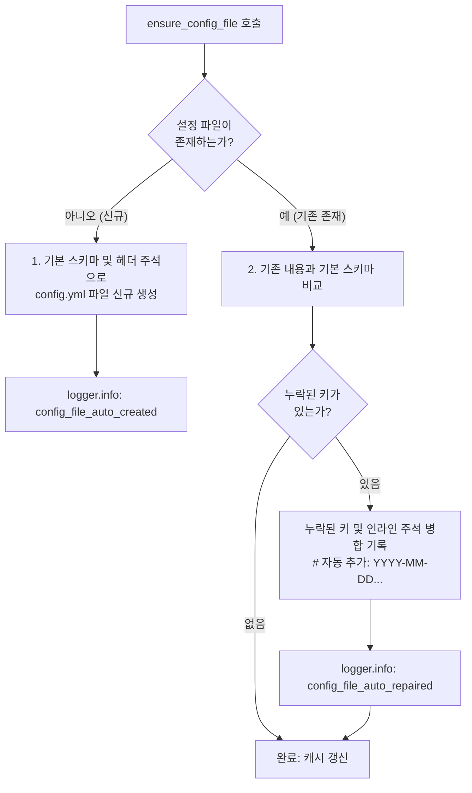

# 06. 설정 파일 템플릿 보정 및 자가 치유 (`ensure_config_file`)

> **소속 모듈**: `agent_common.config_loader.ConfigLoader`  
> **핵심 메서드**: `ConfigLoader.ensure_config_file()`, `ConfigLoader.register_schema()`

---

## 1. 개요 및 해결하려는 문제

신규 환경(개발/검증/운영) 배포 시 설정 파일이 아예 누락되어 프로세스가 시작조차 되지 않거나, 패키지 버전이 업그레이드되면서 새로운 필수 설정 키가 추가되었는데 기존 `config.yml`에 해당 키가 없어 런타임 오류가 발생하는 현상은 잦은 배포 사고의 주원인입니다.

`ConfigLoader.ensure_config_file()`은 다음과 같은 **자가 치유(Self-healing)** 기능을 제공하여 운영 안정성을 극대화합니다:

1. **최초 생성 (Auto-scaffolding)**: 설정 파일이 존재하지 않으면 기본 스키마와 표준 안내 주석을 포함하여 파일을 자동 생성합니다.
2. **누락 키 자동 보정 (Self-healing & Migration)**: 기존 설정 파일이 존재하더라도 신규 버전에서 요구하는 기본 키가 빠져있다면, **기존 설정값과 파일 구조를 그대로 유지한 채 누락된 키만 인라인 주석과 함께 파일에 자동 보정 기록**합니다.

---

## 2. 메서드 시그니처 및 파라미터

```python
def ensure_config_file(
    self, 
    config_file_name: str = "config.yml", 
    default_schema: Optional[dict[str, Any]] = None
) -> Path:
```

- **`config_file_name` (str)**: 검증 및 보정할 설정 파일명 (기본값: `"config.yml"`)
- **`default_schema` (dict | None)**: 기본 뼈대로 사용할 딕셔너리 스키마. (미지정 시 `register_schema`로 등록된 스키마 또는 기본 템플릿 사용)
- **반환값 (`Path`)**: 생성 또는 보정 완료된 설정 파일의 절대 경로 `Path` 객체

---

## 3. 자가 치유(Self-healing) 2단계 동작 과정



### 3.1. Case 1: 파일이 아예 없을 때 (신규 자동 생성)
- 디렉터리(`config/`)가 없으면 `mkdir(parents=True)`로 자동 생성합니다.
- `templates.config_notice_header` 템플릿 주석과 함께 UTF-8 YAML 파일로 깨끗하게 생성합니다.

### 3.2. Case 2: 파일이 있으나 신규 키가 누락되었을 때 (인플레이스 보정)
- 기존 파일의 주석 및 설정값을 훼손하지 않고 누락된 잎사귀 키(Leaf Key)를 탐색합니다.
- 추가된 라인 끝에 `# [자동 추가: 2026-09-04 14:30:00+09:00]`와 같은 **타임스탬프 인라인 주석**을 자동으로 부착하여, 운영자가 어떤 설정이 자동으로 추가되었는지 명확히 인지할 수 있게 합니다.

---

## 4. 실전 활용 예시

### 4.1. 애플리케이션 기동 시 도메인 스키마 등록 및 보정

```python
from agent_common.config_loader import ConfigLoader

loader = ConfigLoader()

# 1. 우리 서비스에서 필요한 기본 설정 스키마 정의
MY_APP_DEFAULT_SCHEMA = {
    "transfer": {
        "max_workers_int": 4,
        "batch_size_int": 500,
        "enable_metrics_bool": True
    },
    "logging": {
        "level_str": "INFO",
        "language": "KO"
    }
}

# 2. 스키마 등록 (fallback 기본값으로 상시 유지됨)
loader.register_schema(MY_APP_DEFAULT_SCHEMA)

# 3. 설정 파일 자가 치유 보정 실행
config_path = loader.ensure_config_file("config.yml", default_schema=MY_APP_DEFAULT_SCHEMA)
print(f"설정 파일 보정 완료: {config_path}")
```

### 4.2. 보정 결과 파일 예시 (`config/config.yml`)

기존에 `max_workers_int: 8`만 적혀 있던 파일이라면, 실행 후 다음과 같이 보정됩니다:

```yaml
transfer:
  max_workers_int: 8
  batch_size_int: 500  # [자동 추가: 2026-09-04 14:35:10+09:00]
  enable_metrics_bool: true  # [자동 추가: 2026-09-04 14:35:10+09:00]
logging:
  level_str: "INFO"  # [자동 추가: 2026-09-04 14:35:10+09:00]
  language: "KO"  # [자동 추가: 2026-09-04 14:35:10+09:00]
```

기존 사용자가 정의한 값(`max_workers_int: 8`)은 100% 안전하게 유지되며, 누락된 키만 타임스탬프 주석과 함께 정밀하게 주입됩니다.

---

## 5. 기대 효과 및 장점

1. **배포 오류 제로화**: 신규 노드나 로컬 개발 PC에서 `config.yml`을 수동으로 복사해올 필요 없이 즉시 기동 가능.
2. **버전 업그레이드 호환성**: 신규 버전에서 추가된 설정 옵션이 기존 환경의 설정 파일에 자동 반영되므로 마이그레이션 부담 해소.
3. **완벽한 감사 추적 (Audit Trail)**: 어떤 키가 언제 자동 추가되었는지 주석과 로그(`config_file_auto_repaired`)로 투명하게 추적 가능.
