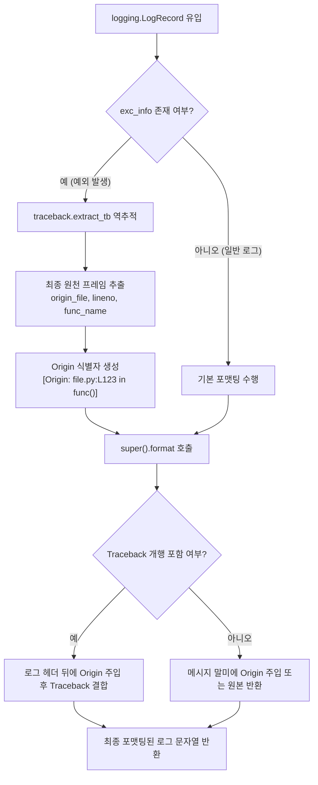

# 2.1. 단일 행 평탄화 포매터 및 예외 원천 추적 (`SingleLineFlattenFormatter`)

> **소속 모듈**: `agent_common.logger.SingleLineFlattenFormatter`  
> **기반 클래스**: `logging.Formatter`  
> **핵심 메서드**: `SingleLineFlattenFormatter.format(record)`, `SingleLineFlattenFormatter.flatten_to_single_line(text)`

---

## 1. 개요 및 엔터프라이즈 배경

클라우드 및 쿠버네티스(K8s), 분산 데이터 파이프라인(Airflow, Kafka, Spark 등) 환경에서는 수많은 컨테이너와 서버로부터 로그를 수집하기 위해 **Logstash**, **Fluentd**, **AWS CloudWatch**, **GCP Cloud Logging**과 같은 중앙 집중형 로그 수집기를 사용합니다.

대부분의 로그 수집 에이전트는 표준 입력(stdout) 또는 로그 파일의 **줄바꿈(Newline, `\n`)을 기준으로 개별 로그 레코드를 분할**합니다. 이로 인해 파이썬의 멀티라인 예외 스택 트레이스(Traceback)가 발생하면 다음과 같은 심각한 문제가 일어납니다:

1. **로그 파편화(Log Fragmentation)**: 하나의 에러 트레이스백이 수십 개의 독립된 무의미한 로그 조각으로 분리되어 검색 및 알람 수식 작성이 불가능해집니다.
2. **원인 규명 지연**: 에러가 발생한 실제 비즈니스 코드의 파일명과 라인 번호(`Origin`)가 수십 줄 뒤의 트레이스백 끝에 묻혀, 신속한 장애 조치가 지연됩니다.
3. **중앙 로그 인덱싱 비용 증가**: 쪼개진 행마다 별도의 타임스탬프와 메타데이터가 붙어 스토리지 및 인덱싱 비용이 급증합니다.

`SingleLineFlattenFormatter`는 이러한 분산 환경의 한계를 극복하기 위해 설계된 커스텀 로깅 포매터입니다.

---

## 2. 핵심 아키텍처 및 동작 메커니즘



### 핵심 처리 단계:

1. **예외 원천 지점(Origin) 역추적 및 태깅**:
   - `record.exc_info`가 존재하는 경우, `traceback.extract_tb()`를 통해 호출 스택의 가장 마지막 프레임(실제 에러를 발생시킨 파일명, 라인 번호, 함수명)을 즉시 추출합니다.
   - 이를 `[Origin: {origin_file}:L{lineno} in {func_name}()]` 형태로 포맷팅하여 메시지 선두/헤더 직후에 즉시 배치합니다.
2. **원형 보존 및 안전 결합**:
   - 다중 행 로그 및 Traceback 구조를 보존하면서, 로그 검색 시스템에서 첫 줄만으로도 즉시 에러 발생 위치를 파악할 수 있도록 결합합니다.
3. **평탄화 유틸리티 지원**:
   - 필요 시 `flatten_to_single_line(text)`를 통해 개행 문자(`\n`, `\r`)를 공백으로 치환하여 완전한 단일 행 스트림으로 변환할 수 있습니다.

---

## 3. 핵심 코드 및 구현 분석

```python
class SingleLineFlattenFormatter(logging.Formatter):
    """
    로그 레코드 및 예외 추적(Traceback) 데이터를 포맷팅하는 공용 커스텀 로깅 포매터 클래스.
    (여러 줄 읽기를 지원하는 로그 수집기 환경에 맞춰 멀티라인 포맷팅을 지원합니다.)
    """

    def flatten_to_single_line(self, text: str) -> str:
        """텍스트 내부의 개행 문자(\n, \r)를 공백으로 변환합니다 (하위 호환성 유지용)."""
        return text.replace("\n", " ").replace("\r", " ")

    def format(self, record: logging.LogRecord) -> str:
        # 0. 예외(Traceback) 발생 원천 지점 정보([Origin: filename:Llineno in funcName()]) 추출
        origin_prefix = ""
        if record.exc_info and len(record.exc_info) >= 3 and record.exc_info[2]:
            try:
                import traceback
                tb_list = traceback.extract_tb(record.exc_info[2])
                if tb_list:
                    last_frame = tb_list[-1]
                    origin_file = Path(last_frame.filename).name
                    origin_prefix = f"[Origin: {origin_file}:L{last_frame.lineno} in {last_frame.name}()] "
            except Exception:
                pass

        # 1. 부모 클래스의 기본 포맷팅 수행 (다중 행 로그 및 Traceback 원형 보존)
        s = super().format(record)

        # 2. Origin 원천 지점 정보가 있으면 메인 로그 메시지 서두/줄말에 결합
        if origin_prefix:
            if "\nTraceback" in s:
                head, tail = s.split("\nTraceback", 1)
                s = f"{head} {origin_prefix}\nTraceback{tail}"
            elif "\n" in s:
                head, tail = s.split("\n", 1)
                s = f"{head} {origin_prefix}\n{tail}"
            else:
                s = f"{s} {origin_prefix}"

        return s
```

---

## 4. 실전 사용 예시

### 4.1. 직접 핸들러에 연결하여 사용하기

```python
import logging
from agent_common.logger import SingleLineFlattenFormatter

# 1. 포매터 인스턴스 생성 (포맷 템플릿 및 날짜 형식 지정)
log_format = "[%(asctime)s][%(levelname)s][%(filename)s:%(lineno)d %(funcName)s()] %(message)s"
date_fmt = "%Y-%m-%d %H:%M:%S"
formatter = SingleLineFlattenFormatter(fmt=log_format, datefmt=date_fmt)

# 2. 콘솔 핸들러 생성 및 포매터 지정
console_handler = logging.StreamHandler()
console_handler.setFormatter(formatter)

# 3. 로거에 등록
logger = logging.getLogger("MyService")
logger.setLevel(logging.INFO)
logger.addHandler(console_handler)

# 4. 예외 발생 테스트
def process_data(data_dict: dict) -> None:
    try:
        val = data_dict["missing_key"]
    except KeyError as e:
        logger.exception("데이터 처리 중 예외 발생")

process_data({})
```

**출력 결과 예시**:
```text
[2026-09-04 22:30:00][ERROR][data_service.py:45 process_data()] 데이터 처리 중 예외 발생 [Origin: data_service.py:43 in process_data()] 
Traceback (most recent call last):
  File "data_service.py", line 43, in process_data
    val = data_dict["missing_key"]
KeyError: 'missing_key'
```

> 💡 **특징**: 로그 메시지의 첫 줄에 `[Origin: data_service.py:43 in process_data()]`가 즉시 표시되므로, 로그 모니터링 대시보드(Kibana, Datadog 등)의 한 줄 요약 뷰에서도 장애 발생 지점을 클릭 없이 즉시 파악할 수 있습니다.

---

## 5. 운영 베스트 프랙티스

1. **`ProjectLogger.configure()` 활용 권장**:
   - `SingleLineFlattenFormatter`를 직접 수동 구성하기보다 `ProjectLogger.configure()`를 사용하면 `config.yml`의 `logging.format` 및 `logging.datefmt`와 자동 연동되어 일관된 포매팅이 유지됩니다.
2. **JSON 로그 수집기 연동 시**:
   - ELK 스택이나 Loki 등에서 단일 행 파싱이 엄격히 요구되는 경우, 메시지 출력 전 `formatter.flatten_to_single_line()`을 호출하여 단일 행으로 변환하거나 로그 수집기(Fluentd)의 multiline 파서를 함께 구성하는 것이 좋습니다.
