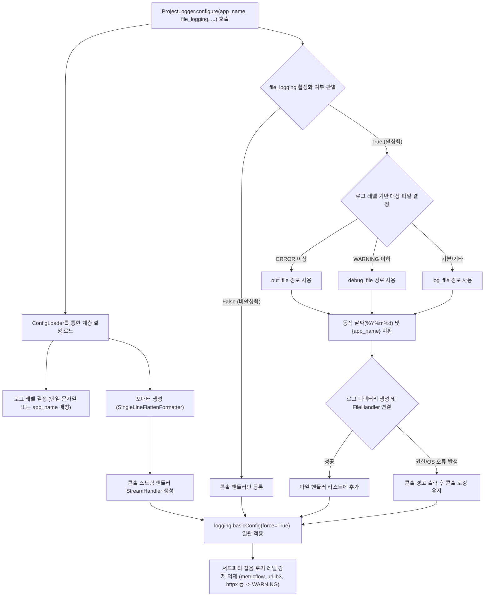

# 2.2. 로깅 환경 일괄 구성 및 핸들러 제어 (`ProjectLogger.configure`)

> **소속 모듈**: `agent_common.logger.ProjectLogger`  
> **핵심 메서드**: `ProjectLogger.configure(config_dir=None, default_log_file="logs/app.log", app_name=None, file_logging=None)`

---

## 1. 개요 및 엔터프라이즈 배경

파이썬의 내장 `logging` 모듈은 분산 서비스 및 엔터프라이즈 환경에서 사용할 때 다음과 같은 고질적인 문제점을 가지고 있습니다:

1. **중복 핸들러로 인한 로그 중복 출력**: 모듈마다 `addHandler()`를 무분별하게 호출하여 동일한 로그가 2회, 3회 중복 출력되는 현상
2. **콘솔/파일 로깅 설정의 파편화**: 개발 환경에서는 콘솔 출력이 필요하고, 운영 환경(배치 서버, K8s Pod, Airflow Worker)에서는 파일 저장 또는 stdout 파이프라인 출력이 선택적으로 제어되어야 함
3. **서드파티 라이브러리의 과도한 디버그 로그 노이즈**: `urllib3`, `httpx`, `botocore` 등 외부 패키지가 뿜어내는 수천 줄의 DEBUG 로그로 인해 실제 비즈니스 에러 식별 불가
4. **권한 및 경로 문제로 인한 기동 실패**: 컨테이너나 공유 파일 시스템 환경에서 로그 디렉터리 권한 부재 시 프로세스 자체가 비정상 종료되는 위험

`ProjectLogger.configure()`는 이 모든 문제를 단 한 번의 호출로 해결하는 **전역 로깅 표준화 팩토리(Factory)** 메서드입니다.

---

## 2. 핵심 아키텍처 및 동작 파이프라인



---

## 3. 주요 기능 및 상세 동작

### 3.1. 애플리케이션 명칭(`app_name`) 기반 로그 레벨 동적 분기
설정 파일의 `logging.level`에 단일 문자열(`"INFO"`) 대신 프로그램별 딕셔너리를 선언하면 실행 중인 스크립트 파일명이나 `app_name`에 맞추어 최적화된 로그 레벨이 자동 적용됩니다:

```yaml
logging:
  level:
    default: "INFO"
    migration_worker: "DEBUG"
    api_gateway: "WARNING"
```

### 3.2. 로그 레벨에 따른 파일 분리 저장 (`out_file` vs `debug_file`)

`ProjectLogger.configure()`는 현재 실행 중인 프로세스의 최종 결정된 `logging.level`에 따라 로그 저장 대상을 지능적으로 분기합니다:

- **`ERROR`, `CRITICAL` 레벨 (장애 발생 감시 모드)**:
  - 심각한 시스템 장애나 예외 로그만 격리하여 저장하는 `logging.out_file` 경로로 자동 라우팅됩니다.
- **`DEBUG`, `INFO`, `WARNING` 레벨 (일반 추적 및 디버깅 모드)**:
  - 통상적인 작업 진행 상태와 경고를 포함한 모든 상세 로그를 기록하는 `logging.debug_file` 경로로 자동 라우팅됩니다.
- **기본/기타 레벨**:
  - 위 분기 설정이 없거나 조건에 해당하지 않을 경우 표준 `logging.file` 경로에 기록됩니다.

#### 엔터프라이즈 데이터 파이프라인의 실전 분기 설정 예시:
```yaml
logging:
  # 프로그램별 실행 로그 레벨 매핑 (WARNING 이하이므로 debug_file로 자동 라우팅)
  level:
    data_extractor: "WARNING"
    stream_processor: "WARNING"
    db_loader: "WARNING"
    
  # 장애/에러 전용 격리 저장 경로 (level이 ERROR, CRITICAL일 때 활성화)
  out_file: "logs/pipeline/out/%Y/%m/%d/{app_name}_out_%Y%m%dT%H%M%S.log"
  
  # 일반 추적/디버깅 전용 저장 경로 (level이 DEBUG, INFO, WARNING일 때 활성화)
  debug_file: "logs/pipeline/debug/%Y/%m/%d/{app_name}_debug_%Y%m%dT%H%M%S.log"
```

> 💡 **동작 예시**:
> - `data_extractor` 배치 프로그램이 기동되면 설정된 레벨이 `WARNING`이므로 `debug_file` 경로인 `logs/pipeline/debug/...` 폴더 아래에 로그가 기록됩니다.
> - 반면, 장애 모니터링 데몬이나 특정 배치가 `ERROR` 레벨로 실행되면 즉시 `out_file` 경로인 `logs/pipeline/out/...` 폴더 아래로 저장 위치가 분리되어, 장애 분석 담당자가 에러 로그 파일만 신속히 선별할 수 있습니다.

### 3.3. 동적 날짜 포맷 및 경로 자동 생성

`out_file`, `debug_file`, `file` 경로 템플릿에는 다양한 동적 치환 태그와 날짜 포맷을 자유롭게 결합할 수 있습니다:

1. **`{app_name}` 치환 태그**:
   - `ProjectLogger.configure(app_name="data_extractor")`로 전달된 애플리케이션 명칭(또는 실행 스크립트 파일명)으로 자동 치환됩니다.
2. **`%Y/%m/%d` 계층형 디렉터리 포맷**:
   - `datetime.now().strftime(...)` 파싱을 통해 연도/월/일 단위의 서브 디렉터리를 자동 계산합니다.
3. **`%Y%m%dT%H%M%S` ISO Compact 타임스탬프**:
   - 프로세스 기동 시점의 고유 타임스탬프(예: `20260904T230715`)를 부여하여 동일 일자에 여러 번 실행되어도 이전 실행 로그가 덮어써지지 않고 독립된 파일로 보존됩니다.
4. **다단계 상위 디렉터리 자동 생성 (`mkdir(parents=True, exist_ok=True)`)**:
   - 타겟 디렉터리(`logs/pipeline/debug/2026/09/04/`)가 시스템에 아직 없더라도 예외 없이 안전하게 디렉터리를 생성하고 파일 핸들러를 연결합니다.

#### 실제 경로 해석 및 생성 검증 예시:
```text
[설정 템플릿]
debug_file: "logs/pipeline/debug/%Y/%m/%d/{app_name}_debug_%Y%m%dT%H%M%S.log"

[런타임 호출 파라미터]
ProjectLogger.configure(app_name="data_extractor", file_logging=True)
실행 일시: 2026-09-04 23:07:15

[최종 자동 생성 경로]
logs/pipeline/debug/2026/09/04/data_extractor_debug_20260904T230715.log
```

### 3.4. 무중단 예외 완화 (Graceful Degradation)
Docker 컨테이너 마운트 볼륨의 권한 문제(`PermissionError`)나 디스크 I/O 오류(`OSError`)가 발생하더라도 프로세스를 종료하지 않고, `sys.stderr`로 경고 메시지를 남긴 뒤 **콘솔 출력 모드로 안전하게 폴백(Fallback)**합니다.

### 3.5. 서드파티 라이브러리 노이즈 차단
기동 시 대량의 로그를 유발하는 `urllib3`, `httpx`, `metricflow` 등의 외부 패키지 로거 레벨을 강제로 `WARNING`으로 고정하여 핵심 비즈니스 로그의 가독성을 보장합니다.

---

## 4. 설정 파일 작성 예시 (`config/config.yml`)

```yaml
logging:
  # 기본 로그 레벨 (문자열 또는 프로그램별 딕셔너리)
  level:
    data_extractor: "WARNING"
    stream_processor: "WARNING"
    db_loader: "WARNING"
    default: "INFO"
  
  # 로그 메시지 템플릿 언어 (KO: 한국어, EN: 영어)
  language: "KO"
  
  # 로그 포맷 및 날짜 표기 형식
  format: "[%(asctime)s][%(levelname)s][%(filename)s:%(lineno)d %(funcName)s()] %(message)s"
  datefmt: "%Y-%m-%d %H:%M:%S"
  
  # 파일 로깅 활성화 여부 (True: 콘솔+파일, False: 콘솔 전용)
  file_logging: true
  
  # 레벨 분기용 파일 경로 (엔터프라이즈 파이프라인 표준)
  out_file: "logs/pipeline/out/%Y/%m/%d/{app_name}_out_%Y%m%dT%H%M%S.log"
  debug_file: "logs/pipeline/debug/%Y/%m/%d/{app_name}_debug_%Y%m%dT%H%M%S.log"
  
  # 기본 로그 파일 경로 (대체용)
  file: "logs/%Y%m%d/{app_name}.log"
```

---

## 5. 실전 사용 코드

### 5.1. 표준 진입점 초기화 패턴

```python
import sys
from agent_common.logger import ProjectLogger

def main():
    # 1. 애플리케이션 기동 시 단 1회 전체 로깅 구성 초기화
    ProjectLogger.configure(
        app_name="data_migrator",
        file_logging=True,              # False 지정 시 파일 저장 없이 stdout만 출력
        default_log_file="logs/migrator.log"
    )

    # 2. 개별 모듈/클래스에서 로거 인스턴스 획득
    logger = ProjectLogger("DataMigrator")

    logger.info("데이터 마이그레이션 파이프라인 초기화 완료")
    
    # 3. 비즈니스 로직 수행
    try:
        # 작업 로직...
        logger.info("작업 정상 진행 중...")
    except Exception as e:
        logger.exception("치명적 장애 발생")

if __name__ == "__main__":
    main()
```

### 5.2. Airflow DAG 및 CLI 옵션 연동 (`--file-log` / `--no-file-log`)

Airflow 환경이나 K8s Pod 환경에서는 로컬 파일 저장을 끄고 표준 출력(stdout)을 Pod 로그 드라이버에 위임하는 것이 유리합니다:

```python
import argparse
from agent_common.logger import ProjectLogger

parser = argparse.ArgumentParser(description="배치 작업 러너")
group = parser.add_mutually_exclusive_group()
group.add_argument("--file-log", "-fl", dest="file_log", action="store_true", default=None)
group.add_argument("--no-file-log", "-nfl", dest="file_log", action="store_false")
args = parser.parse_args()

# CLI 옵션을 file_logging 인자에 바로 전달 (None이면 config.yml 설정 준용)
ProjectLogger.configure(app_name="batch_job", file_logging=args.file_log)
```

---

## 6. 운영 베스트 프랙티스

1. **`configure()`의 호출 위치**:
   - 반드시 메인 스크립트 진입점(`if __name__ == '__main__':` 블록 서두 또는 CLI `main()` 함수 최상단)에서 호출하십시오.
2. **컨테이너 환경 권장 설정**:
   - Docker/Kubernetes 배포 환경에서는 `file_logging: false` 또는 `--no-file-log` 옵션을 권장합니다. 컨테이너 내부 파일 쓰기로 인한 디스크 공간 고갈을 방지하고 컨테이너 로그 수집기가 stdout을 수집하도록 유도합니다.
3. **`force=True` 보장**:
   - `ProjectLogger.configure()`는 내부적으로 `logging.basicConfig(..., force=True)`를 실행하므로, 라이브러리나 모듈 임포트 중에 멋대로 등록된 기본 핸들러들을 깔끔하게 정리하고 단일화합니다.
