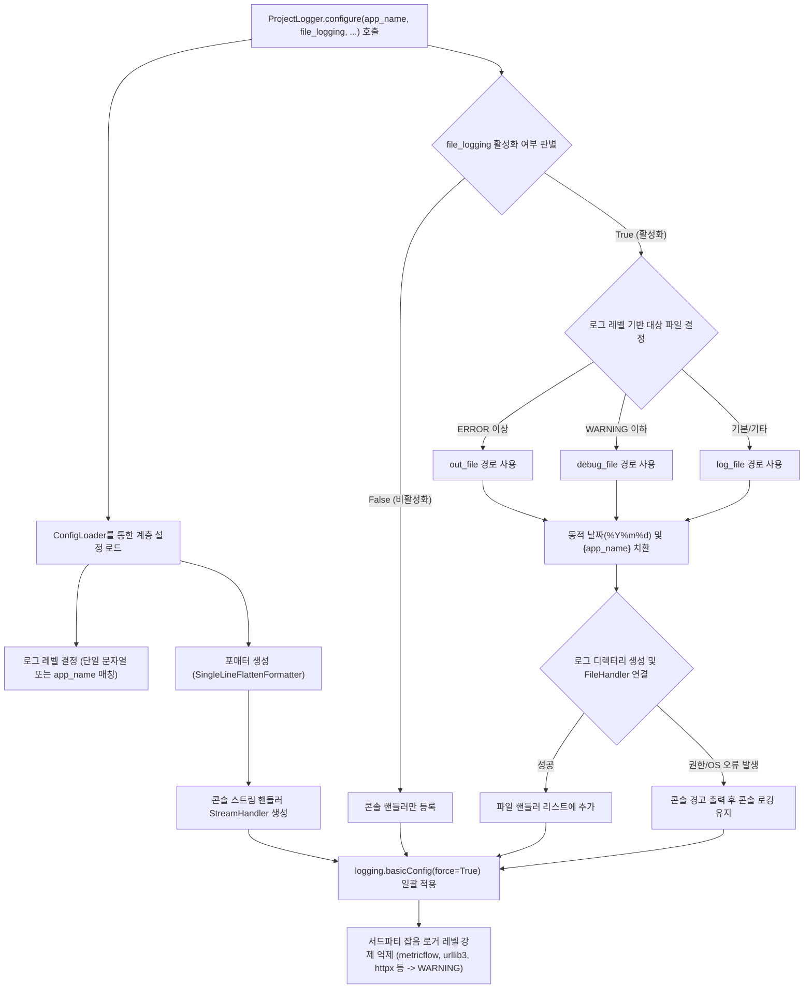

# 2.2. 로깅 환경 일괄 구성 및 핸들러 제어 (`ProjectLogger.configure`)

> **소속 모듈**: `agent_common.logger.ProjectLogger`  
> **핵심 메서드**: `ProjectLogger.configure(config_dir=None, default_log_file="logs/app.log", app_name=None, file_logging=None)`

---

## 1. 개요 및 엔터프라이즈 배경

파이썬의 내장 `logging` 모듈은 분산 서비스 및 엔터프라이즈 환경에서 사용할 때 다음과 같은 고질적인 문제점을 가지고 있습니다:

1. **중복 핸들러로 인한 로그 중복 출력**: 모듈마다 `addHandler()`를 무분별하게 호출하여 동일한 로그가 2회, 3회 중복 출력되는 현상
2. **콘솔/파일 로깅 설정의 파편화**: 개발 환경에서는 콘솔 출력이 필요하고, 운영 환경(배치 서버, K8s Pod, Airflow Worker)에서는 파일 저장 또는 stdout 파이프라인 출력이 선택적으로 제어되어야 함
3. **서드파티 라이브러리의 과도한 디버그 로그 노이즈**: `urllib3`, `httpx`, `botocore` 등 외부 패키지가 뿜어내는 수천 줄의 DEBUG 로그로 인해 실제 비즈니스 에러 식별 불가
4. **권한 및 경로 문제로 인한 기동 실패**: 컨테이너나 공유 파일 시스템 환경에서 로그 디렉터리 권한 부재 시 프로세스 자체가 비정상 종료되는 위험

`ProjectLogger.configure()`는 이 모든 문제를 단 한 번의 호출로 해결하는 **전역 로깅 표준화 팩토리(Factory)** 메서드입니다.

---

## 2. 핵심 아키텍처 및 동작 파이프라인



---

## 3. 주요 기능 및 상세 동작

### 3.1. 애플리케이션 명칭(`app_name`) 기반 로그 레벨 동적 분기
설정 파일의 `logging.level`에 단일 문자열(`"INFO"`) 대신 프로그램별 딕셔너리를 선언하면 실행 중인 스크립트 파일명이나 `app_name`에 맞추어 최적화된 로그 레벨이 자동 적용됩니다:

```yaml
logging:
  level:
    default: "INFO"
    migration_worker: "DEBUG"
    api_gateway: "WARNING"
```

### 3.2. 로그 레벨에 따른 파일 분리 저장 (`out_file` vs `debug_file`)
- `ERROR`, `CRITICAL` 레벨로 기동된 경우: 장애 전용 파일(`logging.out_file`)에 집중 기록
- `DEBUG`, `INFO`, `WARNING` 레벨로 기동된 경우: 상세 추적 파일(`logging.debug_file`)에 기록
- 별도 분기 설정이 없을 경우: 기본 `logging.file` 경로에 기록

### 3.3. 동적 날짜 포맷 및 경로 자동 생성
로그 파일 경로에 `%Y%m%d`, `%Y-%m-%d` 등의 날짜 포맷이나 `{app_name}` 템플릿 태그를 사용할 수 있으며, 상위 디렉터리가 없을 경우 자동으로 생성합니다:
```yaml
logging:
  file: "logs/%Y%m%d/{app_name}.log"
```

### 3.4. 무중단 예외 완화 (Graceful Degradation)
Docker 컨테이너 마운트 볼륨의 권한 문제(`PermissionError`)나 디스크 I/O 오류(`OSError`)가 발생하더라도 프로세스를 종료하지 않고, `sys.stderr`로 경고 메시지를 남긴 뒤 **콘솔 출력 모드로 안전하게 폴백(Fallback)**합니다.

### 3.5. 서드파티 라이브러리 노이즈 차단
기동 시 대량의 로그를 유발하는 `urllib3`, `httpx`, `metricflow` 등의 외부 패키지 로거 레벨을 강제로 `WARNING`으로 고정하여 핵심 비즈니스 로그의 가독성을 보장합니다.

---

## 4. 설정 파일 작성 예시 (`config/config.yml`)

```yaml
logging:
  # 기본 로그 레벨 (문자열 또는 딕셔너리)
  level: "INFO"
  
  # 로그 포맷 및 날짜 표기 형식
  format: "[%(asctime)s][%(levelname)s][%(filename)s:%(lineno)d %(funcName)s()] %(message)s"
  datefmt: "%Y-%m-%d %H:%M:%S"
  
  # 파일 로깅 활성화 여부 (True: 콘솔+파일, False: 콘솔 전용)
  file_logging: true
  
  # 기본 로그 파일 경로 (일자별 폴더 및 app_name 자동 치환)
  file: "logs/%Y%m%d/{app_name}.log"
  
  # 레벨 분기용 파일 경로 (선택 사항)
  out_file: "logs/%Y%m%d/{app_name}_error.log"
  debug_file: "logs/%Y%m%d/{app_name}_debug.log"
```

---

## 5. 실전 사용 코드

### 5.1. 표준 진입점 초기화 패턴

```python
import sys
from agent_common.logger import ProjectLogger

def main():
    # 1. 애플리케이션 기동 시 단 1회 전체 로깅 구성 초기화
    ProjectLogger.configure(
        app_name="data_migrator",
        file_logging=True,              # False 지정 시 파일 저장 없이 stdout만 출력
        default_log_file="logs/migrator.log"
    )

    # 2. 개별 모듈/클래스에서 로거 인스턴스 획득
    logger = ProjectLogger("DataMigrator")

    logger.info("데이터 마이그레이션 파이프라인 초기화 완료")
    
    # 3. 비즈니스 로직 수행
    try:
        # 작업 로직...
        logger.info("작업 정상 진행 중...")
    except Exception as e:
        logger.exception("치명적 장애 발생")

if __name__ == "__main__":
    main()
```

### 5.2. Airflow DAG 및 CLI 옵션 연동 (`--file-log` / `--no-file-log`)

Airflow 환경이나 K8s Pod 환경에서는 로컬 파일 저장을 끄고 표준 출력(stdout)을 Pod 로그 드라이버에 위임하는 것이 유리합니다:

```python
import argparse
from agent_common.logger import ProjectLogger

parser = argparse.ArgumentParser(description="배치 작업 러너")
group = parser.add_mutually_exclusive_group()
group.add_argument("--file-log", "-fl", dest="file_log", action="store_true", default=None)
group.add_argument("--no-file-log", "-nfl", dest="file_log", action="store_false")
args = parser.parse_args()

# CLI 옵션을 file_logging 인자에 바로 전달 (None이면 config.yml 설정 준용)
ProjectLogger.configure(app_name="batch_job", file_logging=args.file_log)
```

---

## 6. 운영 베스트 프랙티스

1. **`configure()`의 호출 위치**:
   - 반드시 메인 스크립트 진입점(`if __name__ == '__main__':` 블록 서두 또는 CLI `main()` 함수 최상단)에서 호출하십시오.
2. **컨테이너 환경 권장 설정**:
   - Docker/Kubernetes 배포 환경에서는 `file_logging: false` 또는 `--no-file-log` 옵션을 권장합니다. 컨테이너 내부 파일 쓰기로 인한 디스크 공간 고갈을 방지하고 컨테이너 로그 수집기가 stdout을 수집하도록 유도합니다.
3. **`force=True` 보장**:
   - `ProjectLogger.configure()`는 내부적으로 `logging.basicConfig(..., force=True)`를 실행하므로, 라이브러리나 모듈 임포트 중에 멋대로 등록된 기본 핸들러들을 깔끔하게 정리하고 단일화합니다.
