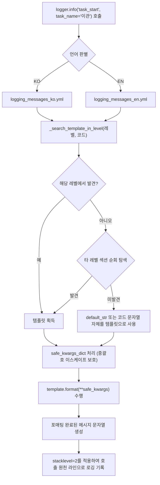

# 2.3. 다국어 로그 메시지 템플릿 사전 및 코드 기반 로깅 (`logging_messages_*.yml`, `log_msg`)

> **소속 모듈**: `agent_common.logger.ProjectLogger`  
> **관련 함수/메서드**: `ProjectLogger.get_log_msg()`, `ProjectLogger.log_msg()`, `ProjectLogger.set_language()`, `get_log_msg()`  
> **메시지 사전 파일**: `agent_common/config/logging_messages_ko.yml`, `logging_messages_en.yml`

---

## 1. 개요 및 엔터프라이즈 배경

엔터프라이즈 서비스 개발 시 코드 내부에 하드코딩된 한글/영어 로그 메시지는 다음과 같은 중대한 문제를 발생시킵니다:

1. **규정 위반 및 유지보수 비용 증대**: AGENTS.md 제1원칙(하드코딩 금지) 위반으로, 메시지 문구 수정 시 소스 코드를 다시 빌드하고 배포해야 하는 비효율성 발생
2. **글로벌 운영 지원 한계**: 해외 운영 센터(NOC)나 외국인 엔지니어 협업 시 한글 로그 메시지로 인한 장애 대응 지연
3. **로그 분석 및 메트릭 표준화 부재**: 로그 메시지가 비정형 텍스트로 자유롭게 작성되어 동일한 유형의 장애를 통계화하거나 알람 룰로 정의하기 극히 어려움

`ProjectLogger`는 이러한 문제를 원천 해결하기 위해 **메시지 코드 기반의 외부 사전 템플릿 연동 시스템**과 **런타임 동적 다국어 전환(KO ⇄ EN)** 기능을 완벽하게 지원합니다.

---

## 2. 핵심 아키텍처 및 템플릿 해석 파이프라인



---

## 3. 메시지 사전 YAML 구조

### 3.1. 한국어 사전 (`agent_common/config/logging_messages_ko.yml`)

```yaml
logging_messages:
  INFO:
    task_start: "🚀 [{task_name}] 작업이 시작되었습니다. (대상: {target_count:,}건)"
    task_completed: "✅ [{task_name}] 작업이 성공적으로 완료되었습니다."
    data_transfer_progress: "[{task_name}] 처리 진행 중: {processed_count:,}/{total_count:,}건 ({percent:.1f}%)"
  
  WARNING:
    record_skipped: "⚠️ [{task_name}] 제외 조건에 의해 데이터 처리를 건너뜁니다: {reason}"
    retry_attempt: "⚠️ 일시적 연결 실패로 재시도합니다. (시도 횟수: {attempt_count}/{max_retries})"
  
  ERROR:
    connection_failed: "❌ {service_name} 서비스 연결에 실패하였습니다. (사유: {error_msg})"
    schema_validation_failed: "❌ 필수 필드 누락 또는 스키마 검증 실패: {detail}"
```

### 3.2. 영문 사전 (`agent_common/config/logging_messages_en.yml`)

```yaml
logging_messages:
  INFO:
    task_start: "🚀 [{task_name}] task has started. (Targets: {target_count:,} items)"
    task_completed: "✅ [{task_name}] task has completed successfully."
    data_transfer_progress: "[{task_name}] Transfer progress: {processed_count:,}/{total_count:,} items ({percent:.1f}%)"
  
  WARNING:
    record_skipped: "⚠️ [{task_name}] Record skipped due to exclusion policy: {reason}"
    retry_attempt: "⚠️ Temporary connection failure. Retrying (Attempt: {attempt_count}/{max_retries})"
  
  ERROR:
    connection_failed: "❌ Failed to connect to {service_name}. (Reason: {error_msg})"
    schema_validation_failed: "❌ Required fields missing or schema validation failed: {detail}"
```

---

## 4. 주요 기능 및 구현 특징

### 4.1. 안전한 인자 치환 (`safe_kwargs_dict`)
로그 파라미터로 전달된 문자열에 중괄호(`{`, `}`)가 포함되어 있더라도(예: JSON 문자열, 정규식 등) `format()` 파싱 시 `KeyError`나 `ValueError`가 발생하지 않도록 이스케이프(`{{`, `}}`)를 안전하게 처리합니다.

```python
safe_kwargs_dict = {
    k: str(v).replace("{", "{{").replace("}", "}}") if isinstance(v, str) else v
    for k, v in kwargs.items()
}
```

### 4.2. 정확한 호출자 추적 (`stacklevel=2`)
`logger.info()`, `logger.error()` 등의 편의 래퍼 메서드를 경유하더라도 로깅 프레임워크가 래퍼 내부가 아닌 **실제 이 메서드를 호출한 비즈니스 코드의 파일명과 라인 번호**를 로그 헤더에 정확히 기록하도록 `stacklevel=2`를 적용합니다.

### 4.3. 런타임 동적 언어 전환
프로세스를 재시작하지 않고도 글로벌 설정 또는 로거 인스턴스를 통해 즉시 출력 언어를 변경할 수 있습니다:

- 클래스 메서드: `ProjectLogger.set_language("EN")` 또는 `ProjectLogger.set_language("KO")`
- 인스턴스 메서드(Setter): `logger.language_set("EN")`
- 현재 언어 확인(Getter): `logger.language` (➔ `"EN"` 또는 `"KO"`)

---

## 5. 실전 사용 코드

### 5.1. 코드 기반 메시지 로깅

```python
from agent_common.logger import ProjectLogger

logger = ProjectLogger("MigrationService")

# 1. 메시지 코드 및 키워드 인자를 사용한 로깅
logger.info("task_start", task_name="Cloud_Data_Sync", target_count=50000)

# 2. 진행률 로깅
logger.info(
    "data_transfer_progress",
    task_name="Cloud_Data_Sync",
    processed_count=25000,
    total_count=50000,
    percent=50.0,
)

# 3. 에러 발생 시 코드 기반 로깅 (에러 카운트 자동 누적 및 Traceback 보존)
try:
    raise ConnectionTimeoutError("Connection timed out after 30s")
except Exception as e:
    logger.exception("connection_failed", service_name="Cloud_Storage", error_msg=str(e))
```

### 5.2. 런타임 다국어 동적 전환 실전 예시

```python
from agent_common.logger import ProjectLogger

logger = ProjectLogger("InternationalBatch")

# 기본 언어(KO) 출력
logger.info("task_start", task_name="SyncJob", target_count=100)
# ➔ [INFO] 🚀 [SyncJob] 작업이 시작되었습니다. (대상: 100건)

# 영문 모드로 전환
ProjectLogger.set_language("EN")

logger.info("task_start", task_name="SyncJob", target_count=100)
# ➔ [INFO] 🚀 [SyncJob] task has started. (Targets: 100 items)
```

### 5.3. 하위 호환 및 문자열 템플릿 포매팅 전용 함수 (`get_log_msg`)

로그를 직접 남기지 않고 포매팅된 메시지 텍스트만 가져와 알림(Slack, Email 등)에 사용해야 할 때는 `get_log_msg()`를 활용합니다:

```python
from agent_common.logger import get_log_msg

alert_text = get_log_msg("ERROR", "connection_failed", service_name="Kafka", error_msg="Broker unreachable")
print(alert_text)
# ➔ "❌ Kafka 서비스 연결에 실패하였습니다. (사유: Broker unreachable)"
```

---

## 6. 운영 베스트 프랙티스

### 6.1. 프로젝트별 메시지 사전 확장 실전 예시

`agent_common` 패키지가 기본 제공하는 표준 사전 외에, 개별 프로젝트 고유의 비즈니스 메시지나 도메인 에러 코드가 필요한 경우 프로젝트 루트의 `config/logging_messages_ko.yml`에 작성합니다.

`ConfigLoader`는 **5단계 계층 병합(Deep Merge)**을 통해 패키지 기본 사전을 유지하면서 프로젝트 사전을 덮어쓰거나 새로운 키를 안전하게 병합합니다.

#### 1) 프로젝트 고유 메시지 파일 작성 (`<프로젝트_루트>/config/logging_messages_ko.yml`)
```yaml
logging_messages:
  INFO:
    # 기존 패키지 기본 메시지를 프로젝트 맞춤형 문구로 재정의 (Override)
    task_start: "🔥 [파이프라인 시작] {task_name} 배치가 가동되었습니다. (예정 대상: {target_count:,}건)"
    
    # 프로젝트 고유의 신규 비즈니스 메시지 코드 추가
    medallion_step_completed: "🏅 [{stage_name}] 단계 정제 및 변환 완료: 성공 {success_count:,}건, 제외 {excluded_count:,}건"

  ERROR:
    # 프로젝트 전용 외부 API 에러 코드 추가
    auth_token_expired: "🚫 인증 서버({auth_url}) 토큰 만료 또는 갱신 실패 (HTTP 상태코드: {status_code})"
```

#### 2) 파이썬 코드에서 호출 및 동작 검증
```python
from agent_common.logger import ProjectLogger

logger = ProjectLogger("MedallionPipeline")

# 1. 재정의(Override)된 메시지 코드 호출
logger.info("task_start", task_name="SilverToGold", target_count=10000)
# ➔ [INFO] 🔥 [파이프라인 시작] SilverToGold 배치가 가동되었습니다. (예정 대상: 10,000건)

# 2. 신규 추가된 프로젝트 고유 메시지 코드 호출
logger.info(
    "medallion_step_completed",
    stage_name="Gold_Mart",
    success_count=9950,
    excluded_count=50,
)
# ➔ [INFO] 🏅 [Gold_Mart] 단계 정제 및 변환 완료: 성공 9,950건, 제외 50건

# 3. 신규 에러 메시지 코드 호출 (자동으로 failure 및 에러 카운트 누적)
try:
    raise PermissionError("Token expired")
except Exception as e:
    logger.exception(
        "auth_token_expired",
        auth_url="https://auth.internal.example.com",
        status_code=401,
    )

# 4. 패키지 기본 사전에만 정의된 기존 메시지(오버라이드하지 않은 키)도 그대로 호출 가능
logger.info("task_completed", task_name="SilverToGold")
# ➔ [INFO] ✅ [SilverToGold] 작업이 성공적으로 완료되었습니다.
```

### 6.2. 에러 코드 명명 규칙
- 메시지 코드는 스네이크 케이스(`snake_case`)로 일관성 있게 작성하며, 목적과 주체를 명확히 부여하십시오 (예: `db_query_failed`, `file_not_found`, `invalid_payload`).
