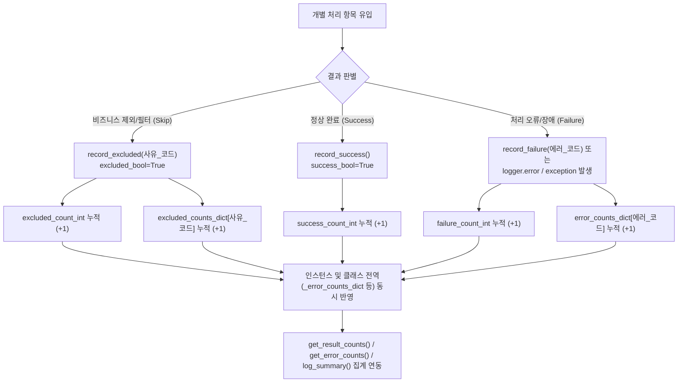

# 2.4. 작업 진행 통계 및 예외/제외 사유별 실시간 집계 (`record_result`, `record_error`, `record_exclusion`)

> **소속 모듈**: `agent_common.logger.ProjectLogger`  
> **핵심 메서드**: `update()`, `record_result()`, `record_success()`, `record_failure()`, `record_excluded()`, `record_error()`, `record_exclusion()`  
> **조회/초기화 메서드**: `get_result_counts()`, `get_error_counts()`, `get_excluded_counts()`, `reset_result_counts()`

---

## 1. 개요 및 엔터프라이즈 배경

대용량 배치 데이터 이관 및 분산 ETL 파이프라인에서는 수십만~수백만 건의 레코드를 멀티스레드나 분산 워커에서 병렬로 처리합니다.

이때 단순히 "성공"과 "실패" 두 가지로만 결과를 나누면 다음과 같은 심각한 운영 문제가 발생합니다:

1. **정상적인 비즈니스 제외와 시스템 장애의 혼동**:
   - 데이터 삭제 플래그(`del_yn == 'Y'`), 만료된 자산 상태 코드, 이미 적재된 중복 PK 등 비즈니스 정책상 **의도적으로 건너뛴(Skip/Exclude) 정상 데이터**가 "실패"로 잡혀 불필요한 장애 알람을 유발함.
2. **원인별 에러 집계 부재**:
   - 수천 건의 에러가 발생했을 때 이것이 일시적인 네트워크 타임아웃인지, 특정 스키마 불일치인지 원인별 건수를 즉시 파악하기 어려움.
3. **멀티스레드/다중 모듈 간 메트릭 파편화**:
   - 여러 서브루틴이나 멀티스레드 워커에서 발생한 통계가 개별 객체에 갇혀 배치 작업 종료 시 전체 종합 통계를 산출하지 못함.

`ProjectLogger`는 **성공(Success), 실패(Failure), 제외(Excluded)**의 명확한 3단계 상태 분류 모델과 **클래스 전역(Global) 및 인스턴스(Instance) 이원화 집계 메커니즘**을 제공하여 이 문제를 완벽히 해결합니다.

---

## 2. 3단계 상태 분류 및 집계 아키텍처



---

## 3. 핵심 메서드 사양 및 동작 원리

### 3.1. 통합 업데이트 메서드 (`update`, `record_result`)

```python
def update(
    self,
    success_bool: bool = True,
    excluded_bool: bool = False,
    count_int: int = 1,
    log_id_str: str = "",
) -> None:
    inc_int: int = max(1, count_int)
    if excluded_bool:
        self.excluded_count_int += inc_int
        ProjectLogger._excluded_count_int += inc_int
        if log_id_str:
            self.record_exclusion(log_id_str, count_int=inc_int)
    elif success_bool:
        self.success_count_int += inc_int
        ProjectLogger._success_count_int += inc_int
    else:
        self.failure_count_int += inc_int
        ProjectLogger._failure_count_int += inc_int
        if log_id_str:
            self.record_error(log_id_str, count_int=inc_int)
```

- `record_result(...)`는 가독성을 위한 명시적 별칭(Alias) 메서드입니다.
- 인스턴스 멤버(`self.*`)와 클래스 전역 변수(`ProjectLogger.*`)에 동시에 가산되므로, 여러 개의 로거 인스턴스를 사용하는 복합 모듈 환경에서도 전사 종합 메트릭을 유실 없이 유지합니다.

### 3.2. 상태별 전용 편의 메서드

- `record_success(count_int=1)`: 성공 건수 누적
- `record_failure(count_int=1, log_id_str="")`: 실패 건수 및 발생 원인(에러 코드/식별자) 누적
- `record_excluded(log_id_or_count="", count_int=1)`: 제외 건수 및 제외 사유 식별자 누적

### 3.3. 자동 에러 누적 연동
`logger.error(...)`, `logger.critical(...)`, `logger.exception(...)`이 호출되면, 수동으로 `record_failure`를 호출하지 않아도 내부에서 **자동으로 실패 건수와 에러 식별 코드(`log_id_str` 또는 예외 클래스명)를 누적 기록**합니다.

---

## 4. 실전 사용 코드

```python
from agent_common.logger import ProjectLogger

logger = ProjectLogger("DataPipeline")

# 샘플 데이터셋 처리 시뮬레이션
records = [
    {"id": "A101", "status": "ACTIVE", "score": 95},
    {"id": "A102", "status": "DELETED", "score": 80},     # 제외 대상
    {"id": "A103", "status": "ACTIVE", "score": "INVALID"}, # 에러 대상
    {"id": "A104", "status": "EXPIRED", "score": 70},     # 제외 대상
    {"id": "A105", "status": "ACTIVE", "score": 100},
]

for item in records:
    # 1. 비즈니스 정책상 제외 조건 검사
    if item["status"] == "DELETED":
        logger.record_excluded("deleted_record_skipped")
        continue
    if item["status"] == "EXPIRED":
        logger.record_excluded("db_deleted_status_skipped")
        continue

    # 2. 데이터 처리 및 유효성 검증
    try:
        score_int = int(item["score"])
        # 정상 비즈니스 로직 수행...
        logger.record_success()
    except (ValueError, TypeError) as e:
        logger.record_failure(log_id_str="invalid_data_type")
        logger.exception("invalid_data_format", record_id=item["id"], error=str(e))

# 3. 누적 결과 통계 조회
result_counts = logger.get_result_counts()
print(f"처리 결과: {result_counts}")
# ➔ {'success': 2, 'failure': 1, 'excluded': 2}

# 4. 에러 및 제외 세부 발생 내역 조회
error_breakdown = logger.get_error_counts()
print(f"에러 내역: {error_breakdown}")
# ➔ {'invalid_data_type': 1, 'invalid_data_format': 1}

excluded_breakdown = logger.get_excluded_counts()
print(f"제외 내역: {excluded_breakdown}")
# ➔ {'deleted_record_skipped': 1, 'db_deleted_status_skipped': 1}
```

---

## 5. 멀티스레드 및 모듈 간 통합 통계 활용

여러 워커 스레드나 모듈에서 개별적으로 `ProjectLogger`를 생성하여 작업하더라도 클래스 전역 통계를 통해 한곳에서 일괄 조회가 가능합니다:

```python
from agent_common.logger import ProjectLogger

# 모듈 A에서 로깅
logger_a = ProjectLogger("Worker-1")
logger_a.record_success(10)
logger_a.record_error("network_timeout", 2)

# 모듈 B에서 로깅
logger_b = ProjectLogger("Worker-2")
logger_b.record_success(15)
logger_b.record_error("network_timeout", 1)
logger_b.record_error("auth_failed", 1)

# 전역 집계 조회
global_errors = ProjectLogger.get_global_error_counts()
print(f"전역 에러 집계: {global_errors}")
# ➔ {'network_timeout': 3, 'auth_failed': 1}

# 배치 작업 완료 후 초기화
logger_a.reset_result_counts()
```

---

## 6. 운영 베스트 프랙티스

1. **식별 코드(`log_id_str`)의 소문자 스네이크 케이스 규격 준수**:
   - 에러 및 제외 사유 코드는 반드시 **소문자 스네이크 케이스(`snake_case`)**(예: `db_deleted_status_skipped`, `db_duplicate_pk_skipped`, `network_timeout`, `schema_mismatch`) 형태로 일관되게 명명하십시오.
   - 메시지 사전(`logging_messages_*.yml`)에 등록된 템플릿 키가 모두 소문자 `snake_case`로 관리되므로, 사전에 정의된 직관적인 한글/영문 설명문이 `log_summary()` 시 자동으로 매핑(`get_log_id_description`)되려면 소문자 일치가 필수적입니다.
2. **`log_summary()`와의 연계**:
   - `record_error` 및 `record_exclusion`으로 누적된 사유별 건수는 `logger.log_summary()` 실행 시 **자동으로 순위별 정렬되어 최종 리포트에 출력**되므로, 별도의 집계 코드를 작성할 필요가 없습니다.
