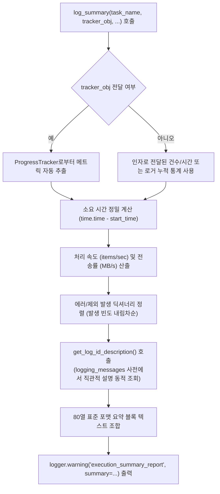

# 2.5. 작업 결과 요약 리포트 자동 생성 (`log_summary`)

> **소속 모듈**: `agent_common.logger.ProjectLogger`  
> **핵심 메서드**: `ProjectLogger.log_summary()`, `ProjectLogger.get_log_id_description()`  
> **연계 모듈**: `agent_common.utils.ProgressTracker`

---

## 1. 개요 및 엔터프라이즈 배경

엔터프라이즈 데이터 파이프라인(Airflow DAG, 배치 프로세스)이나 대규모 데이터 마이그레이션이 완료되었을 때, 엔지니어와 운영팀은 다음과 같은 핵심 질문에 즉시 답할 수 있어야 합니다:

1. **전체 작업 소요 시간과 처리 속도(Throughput)는 얼마인가?**
2. **성공/실패/제외(Skip) 건수가 각각 몇 건인가?**
3. **실패가 발생했다면 구체적으로 어떤 오류 코드가 몇 건씩 발생했는가?**
4. **전송/적재된 총 데이터 용량(MB)과 평균 네트워크 전송률(MB/s)은 적정 수준인가?**

과거에는 각 배치 스크립트마다 `print()`나 로그를 제각각 구성하여 포맷이 통일되지 않았고, 에러 코드만 암호처럼 출력되어 즉각적인 원인 파악이 어려웠습니다.

`ProjectLogger.log_summary()`는 이러한 요구사항을 완벽히 충족하도록 **시인성 높은 80열 표준 요약 리포트 블록**을 생성하여 `WARNING` 레벨로 출력합니다.

---

## 2. 요약 리포트 생성 아키텍처



---

## 3. 핵심 기능 및 상세 동작

### 3.1. 에러 및 제외 사유 설명 동적 조회 (`get_log_id_description`)
에러 및 제외 식별 코드(예: `db_deleted_status_skipped`, `network_timeout`)가 주어지면, 다국어 메시지 템플릿(`logging_messages_*.yml`)에서 해당 정의를 동적으로 역추적하고 미치환 템플릿 변수를 정제하여 **직관적인 한글/영문 설명문을 자동으로 결합**합니다:

- 코드: `db_deleted_status_skipped`
- 출력: `* db_deleted_status_skipped (삭제 상태코드로 인한 적재 대상 제외): 120 건`

### 3.2. 정밀한 처리 속도 및 전송 대역폭 분석
- **총 소요 시간**: `분 초 (초)` 정밀 계산
- **평균 처리 속도**: `items/sec` 단위 자동 계산
- **전송 데이터량**: 바이트(`bytes`)를 메가바이트(`MB`)로 자동 변환하고 초당 전송 속도(`MB/s`)를 산출

### 3.3. `ProgressTracker`와의 심리스(Seamless) 연동
`ProgressTracker` 인스턴스를 `tracker_obj` 인자로 넘기면 전체 건수, 성공/실패/제외 건수, 시작 일시, 전송 바이트 수 등을 자동으로 감지하여 코드를 최소화합니다.

---

## 4. 표준 요약 리포트 출력 포맷 예시

```text
================================================================================
                    [데이터 파이프라인 동기화 작업 결과 요약]
================================================================================
- 작업 시작 / 종료 시간 : 2026-09-04 22:00:00 ~ 2026-09-04 22:05:30
- 총 소요 시간          : 5분 30.0초 (330.00초)
--------------------------------------------------------------------------------
- 총 처리 대상 건수     : 100,000 건
- 처리 성공 / 실패      : 99,500 건 / 300 건
- 처리 제외 (Skip)      : 200 건
- 예외/오류 발생 세부 내역 (총 300건):
  * network_timeout (네트워크 연결 시간 초과): 250 건
  * schema_mismatch (필수 컬럼 누락 또는 타입 불일치): 50 건
- 처리 제외 세부 내역 (총 200건):
  * db_deleted_status_skipped (삭제 상태코드로 인한 적재 대상 제외): 150 건
  * db_duplicate_pk_skipped (이미 존재하거나 중복된 기본키 제외): 50 건
- 총 전송 데이터 용량   : 1,024.50 MB (평균 3.10 MB/s)
- 평균 처리 속도        : 303.03 items/sec
- [사용자 추가 정보] 파이프라인 배치 실행자: Airflow_Worker_03
================================================================================
```

---

## 5. 실전 사용 코드

### 5.1. 직접 메트릭을 전달하여 요약 리포트 출력하기

```python
import time
from agent_common.logger import ProjectLogger

logger = ProjectLogger("BatchMigrator")
start_ts = time.time()

# 비즈니스 로직 수행
logger.record_success(count_int=950)
logger.record_failure(count_int=30, log_id_str="network_timeout")
logger.record_failure(count_int=20, log_id_str="schema_mismatch")
logger.record_excluded("db_deleted_status_skipped", count_int=50)

# 최종 요약 리포트 출력
logger.log_summary(
    task_name_str="고객 데이터 동기화",
    total_items_int=1050,
    start_time_float=start_ts,
    total_bytes_int=1024 * 1024 * 150,  # 150 MB
    extra_lines_list=[
        "대상 데이터셋: customer_dw.activity_logs",
        "타겟 분석 테이블: analytics_dw.daily_snapshot",
    ]
)
```

### 5.2. `ProgressTracker`와 연동하여 원라인(One-line) 요약 리포트 출력하기

```python
from agent_common.logger import ProjectLogger
from agent_common.utils import ProgressTracker

logger = ProjectLogger("DataPipeline")
tracker = ProgressTracker(total_items_int=50000, logger_obj=logger, item_name_str="레코드")

for item in data_items:
    try:
        # 처리 로직...
        tracker.increment_success(bytes_int=len(item))
    except Exception as e:
        tracker.increment_failure(error_msg_str=str(e))

# 작업 종료 후 ProgressTracker가 자동으로 logger.log_summary()를 호출
tracker.log_summary(extra_lines_list=["배치 버전: v1.2.0"])
```

---

## 6. 운영 베스트 프랙티스

1. **`WARNING` 레벨 로깅의 목적**:
   - `log_summary()`는 의도적으로 `WARNING` 레벨로 출력됩니다. 이는 정보성 로그(`INFO`)가 비활성화된 프로덕션 환경(`logging.level: WARNING`)에서도 작업 완료 요약 블록만큼은 운영자가 반드시 확인할 수 있도록 보장하기 위함입니다.
2. **`extra_lines_list`의 적극 활용**:
   - 실행 호스트, 파티션 일자, 데이터 소스 URI 등 사후 장애 분석 및 감사에 필요한 핵심 비즈니스 메타데이터를 `extra_lines_list`에 담아 출력하십시오.
