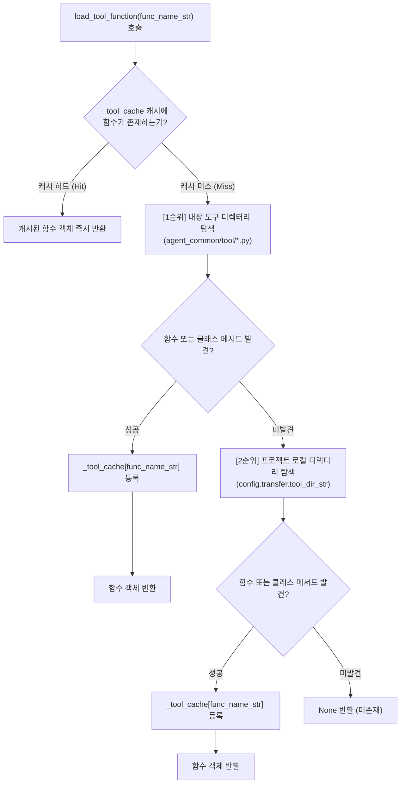

# 4.1. 이원화된 Tool 디렉터리 계층 탐색 및 동적 로딩 (`ToolParser`)

> **소속 모듈**: `agent_common.tool_parser.ToolParser`  
> **핵심 메서드**: `load_tool_function()`, `scan_rules_for_tool_functions()`  
> **의존 모듈**: `importlib`, `inspect`, `pathlib`, `agent_common.logger.ProjectLogger`, `agent_common.config_loader.ConfigLoader`

---

## 1. 개요 및 엔터프라이즈 배경

엔터프라이즈 데이터 이관 및 메달리온 아키텍처 파이프라인에서는 소스 시스템(예: Dell ECS, 데이터베이스, 외부 API)의 원천 데이터를 표준화된 비즈니스 규격으로 변환하기 위해 다양한 도구 함수(Tool)를 적용합니다.

하지만 도구 함수들을 단일 위치에 강제로 결합하면 다음과 같은 문제점이 발생합니다:
1. **전사 표준 vs 도메인 특화 로직의 충돌**: 전사 공통으로 사용되는 표준 일시 생성(`DateTimeUtils`)이나 포매터와, 특정 도메인/파이프라인 전용 비즈니스 코드(예: 폐지 코드 변환, 프로젝트별 키 해싱)가 뒤섞여 공통 패키지의 독립성과 재사용성이 저하됩니다.
2. **배포 마찰**: 도메인 전용 함수 하나를 수정하기 위해 전사 공통 패키지(`agent_common`) 전체를 재배포해야 하는 비효율이 발생합니다.

`ToolParser`는 이를 해결하기 위해 **이원화된 2단계 Tool 계층 탐색 구조**를 채택합니다:
- **1순위 (전사 표준 내장 도구)**: `agent_common` 패키지 자체에 포함된 표준 도구(`agent_common/tool/`)를 우선적으로 탐색합니다.
- **2순위 (프로젝트 로컬 도구)**: `config.yml`의 `transfer.tool_dir_str`에 설정된 프로젝트 로컬 디렉터리(예: `medallion/tool/`)를 탐색합니다.

또한 1회 로드된 함수는 인메모리 캐시(`_tool_cache`)에 등록되어 수백만 건의 대용량 배치 처리에서도 중복 I/O 및 모듈 임포트 오버헤드 없이 나노초 단위로 즉시 실행됩니다.

---

## 2. 계층적 탐색 아키텍처 및 동작 원리



---

## 3. 세부 탐색 알고리즘 및 규격

`ToolParser`는 단일 함수명(`func_name_str`)을 전달받았을 때 모듈 내부를 3단계로 정밀 탐색합니다:

1. **모듈 레벨 함수 탐색**:
   - 모듈 최상단에 `def my_tool_func(...)` 형태로 선언된 함수 탐색
2. **`클래스명.메서드명` 명시적 탐색**:
   - `func_name_str`에 점(`.`)이 포함된 경우(예: `DateTimeUtils.get_now_compact`), 해당 클래스 객체를 찾고 클래스 내부의 메서드를 직접 추출
3. **모듈 내 클래스 메서드 자동 탐색**:
   - 함수명만 전달되었더라도(예: `get_now_compact`), 모듈 내부의 모든 클래스 타입을 순회하여 해당 이름의 메서드가 존재하는지 자동 탐색

---

## 4. 주요 메서드 규격

### 4.1. 도구 함수 로드 (`load_tool_function`)
```python
def load_tool_function(self, func_name_str: str) -> Optional[Callable]
```
- **파라미터**:
  - `func_name_str`: 로드할 tool 함수명 (예: `'get_now_compact'`, `'DateTimeUtils.get_now_compact'`, `'convert_abolition_code'`)
- **반환값**: 호출 가능한 파이썬 함수 객체 (`Callable`), 미존재 시 `None`
- **특징**:
  - 로드 성공 시 `self._tool_cache` 딕셔너리에 등록되어 재호출 시 인메모리에서 즉시 반환됩니다.
  - 패키지 내장 도구가 프로젝트 도구보다 우선권을 갖습니다.

### 4.2. 사전 룰 유효성 Fail-Fast 검증 (`scan_rules_for_tool_functions`)
```python
def scan_rules_for_tool_functions(self, rule_node_any: Any, found_funcs_set: Set[str]) -> None
```
- **파라미터**:
  - `rule_node_any`: 룰 데이터 노드 (중첩 `dict`, `list`, `str` 등)
  - `found_funcs_set`: 발견된 도구 함수명을 수집할 집합(`set`) 객체
- **역할 및 배경**:
  - 수천만 건의 대량 데이터 파이프라인 기동 전, YAML 룰셋(`table_rules.yml`, `mapping.yml`) 전체를 재귀적으로 스캔하여 사용된 모든 Tool 함수명을 추출합니다.
  - 배치 파이프라인 중간에 함수 미존재로 작업이 중단되는 참사를 방지하고, **기동 초기 단계에 모든 함수의 존재 여부를 사전 검증(Fail-Fast)**하는 데 활용됩니다.

---

## 5. 실전 코드 예시

### 5.1. 내장 및 로컬 도구 동적 로딩
```python
from agent_common.tool_parser import ToolParser

tool_parser = ToolParser()

# 1. 1순위: 내장 도구 클래스 메서드 로드 (DateTimeUtils)
now_func = tool_parser.load_tool_function("DateTimeUtils.get_now_compact")
print(now_func())  # 예: '20260918203000'

# 2. 메서드명 단독으로도 내장 도구 내부 자동 탐색
today_func = tool_parser.load_tool_function("get_today_yyyymmdd")
print(today_func())  # 예: '20260918'

# 3. 2순위: 프로젝트 로컬 도구 로드 (medallion/tool/ 하위)
custom_func = tool_parser.load_tool_function("custom_code_converter")
if custom_func:
    result = custom_func("AB01")
```

### 5.2. 파이프라인 기동 시 룰 사전 검증 (Fail-Fast)
```python
from agent_common.tool_parser import ToolParser
from agent_common.logger import ProjectLogger

logger = ProjectLogger("PipelineValidator")
tool_parser = ToolParser()

# 파이프라인 매핑 룰 정의
pipeline_rules = {
    "target_table": "dw_users",
    "columns": {
        "created_at": "{DateTimeUtils.get_now_timestamp()}",
        "user_code": "{custom_hasher(user_id)}",
        "legacy_flag": "{check_legacy(status)}",
    }
}

# 1. 룰에 사용된 모든 Tool 함수 사전 수집
used_funcs_set: set[str] = set()
tool_parser.scan_rules_for_tool_functions(pipeline_rules, used_funcs_set)

# 2. 모든 함수가 실제 로드 가능한지 기동 초기에 검증
missing_funcs = [fn for fn in used_funcs_set if tool_parser.load_tool_function(fn) is None]

if missing_funcs:
    logger.error("missing_tools_detected", missing_list=missing_funcs)
    raise RuntimeError(f"필수 Tool 함수가 누락되었습니다: {missing_funcs}")
```

---

## 6. 주의사항 및 모범 사례

1. **내장 도구 우선권**: 내장 도구(`agent_common/tool/`)와 로컬 프로젝트 도구(`medallion/tool/`)에 동일한 함수명이 존재하는 경우, 전사 표준을 유지하기 위해 **내장 도구가 항상 우선 로드**됩니다. 프로젝트별 특화 함수는 고유한 네이밍(예: `biz_`, `project_` 접두사)을 권장합니다.
2. **설정 디렉터리 동기화**: 프로젝트 로컬 도구 경로는 `config.yml`의 `transfer.tool_dir_str` 설정을 따릅니다. 기본값은 `"medallion/tool"`이며, 프로젝트 구조에 맞게 변경할 수 있습니다.
3. **Fail-Fast 사전 검증 준수**: 대량 배치 작업 실행 전 반드시 `scan_rules_for_tool_functions`를 실행하여 룰 파일 내 오타나 미구현 함수로 인한 런타임 중단을 방지하십시오.
