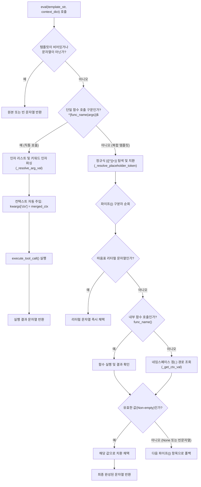

# 4.2. 선언적 템플릿 치환 및 표현식 평가 (`ToolParser.eval`)

> **소속 모듈**: `agent_common.tool_parser.ToolParser`  
> **핵심 메서드**: `eval()`, `execute_tool_call()`  
> **의존 모듈**: `re`, `inspect`, `agent_common.logger.ProjectLogger`, `agent_common.config_loader.ConfigLoader`

---

## 1. 개요 및 엔터프라이즈 배경

엔터프라이즈 데이터 파이프라인에서 입력 원천 데이터(S3/ECS 오브젝트 키, 메타데이터, JSON 본문 등)를 목표 데이터베이스(BigQuery, GCS 등) 스키마로 적재할 때, 하드코딩된 변환 로직 대신 **선언적 템플릿(Declarative Template)**을 사용하면 비즈니스 규칙 변경 시 코드 수정 및 재배포 없이 YAML 설정만으로 대응할 수 있습니다.

`ToolParser.eval()`은 다음과 같은 다양한 템플릿 구문을 통합 해석하고 평가하는 고성능 엔진을 제공합니다:
1. **단일 도구 함수 직통 호출**: `"{DateTimeUtils.get_now_compact()}"`, `"{calc_age(json.birth_year)}"`
2. **네임스페이스 점(.) 접근 변수 치환**: `"{ecs.key}"`, `"{sys.today}"`, `"{json.user.name}"`
3. **파이프(`|`) 우선순위 폴백**: `"{meta.title|json.header.title|'UNTITLED'}"`
4. **지능형 인자 매핑 및 컨텍스트 자동 주입**: 대상 함수의 파라미터 시그니처(`inspect.signature`)를 분석하여 필요한 인자만 정확히 바인딩하고, 컨텍스트 전체(`ctx=merged_ctx`)를 자동 전달합니다.

---

## 2. 템플릿 평가 엔진 아키텍처 및 파이프라인



---

## 3. 주요 문법 및 지원 표현식 규격

| 문법 형태 | 작성 예시 | 동작 설명 |
| :--- | :--- | :--- |
| **단일 함수 호출** | `"{get_today_yyyymmdd()}"`<br/>`"{DateTimeUtils.get_now_timestamp()}"` | 도구 함수를 직접 호출하여 반환값을 문자열로 변환합니다. |
| **인자가 있는 함수** | `"{code_lookup('STATUS', json.status_cd)}"` | 리터럴 따옴표 인자 및 컨텍스트 변수 인자를 해석하여 함수에 전달합니다. |
| **네임스페이스 변수** | `"{ecs.key}"`<br/>`"{json.user.address.city}"` | 점(`.`) 표기법으로 중첩 딕셔너리를 탐색하여 값을 추출합니다. |
| **파이프 폴백** | `"{ecs.title\|json.title\|'무제'}"` | 왼쪽부터 순서대로 평가하여 `None`이나 빈 문자열(`""`)이 아닌 최초의 유효한 값을 반환합니다. |
| **복합 조합 템플릿** | `"events/{sys.today}/{ecs.filename}.json"` | 텍스트와 여러 개의 중괄호 `{}` 변수를 자연스럽게 합성합니다. |

---

## 4. 주요 메서드 규격

### 4.1. 템플릿 평가 (`eval`)
```python
def eval(
    self,
    template_str: Optional[str],
    context_dict: Optional[Dict[str, Any]] = None,
) -> Optional[str]
```
- **파라미터**:
  - `template_str`: 평가할 템플릿 표현식 문자열 (예: `'{sys.today}_{ecs.key}'`, `'{get_now_compact()}'`)
  - `context_dict`: 변수 탐색에 사용할 컨텍스트 딕셔너리 (`ecs`, `sys`, `json` 등 네임스페이스 포함)
- **반환값**: 평가 및 치환 완료된 최종 문자열. 입력이 `None`이면 `None` 반환.

### 4.2. 도구 안전 실행 (`execute_tool_call`)
```python
def execute_tool_call(
    self,
    func_name_str: str,
    args_list: list[Any],
    kwargs_dict: Dict[str, Any],
) -> Any
```
- **파라미터**:
  - `func_name_str`: 실행 대상 함수/메서드 명칭
  - `args_list`: 위치 인자 목록
  - `kwargs_dict`: 키워드 인자 딕셔너리 (`ctx` 컨텍스트 포함)
- **지능형 바인딩 규칙**:
  - `inspect.signature(tool_func)`를 통해 함수의 매개변수 목록을 조사합니다.
  - 함수가 `**kwargs`를 수용하지 않는 경우, 선언된 파라미터 이름에 해당하는 키워드 인자만 필터링(`bound_kwargs`)하여 `TypeError: unexpected keyword argument` 에러를 원천 방지합니다.

---

## 5. 실전 코드 예시

### 5.1. 다양한 템플릿 평가 실전
```python
from agent_common.tool_parser import ToolParser

tool_parser = ToolParser()

# 컨텍스트 준비
context = {
    "ecs": {
        "key": "raw/media/2026/sample_video.mp4",
        "size": 1048576,
    },
    "meta": {
        "category": "broadcast",
        # title 누락 상황 가정
    },
    "json": {
        "title": "저녁 메인 뉴스",
    },
    "sys": {
        "today": "20260918",
    }
}

# 1. 단일 내장 도구 함수 호출
res1 = tool_parser.eval("{DateTimeUtils.get_now_compact()}", context)
print(res1)  # '20260918203000'

# 2. 점(.) 네임스페이스 및 파이프(|) 기본값 폴백
# meta.title이 없으므로 json.title 채택
res2 = tool_parser.eval("{meta.title|json.title|'기본제목'}", context)
print(res2)  # '저녁 메인 뉴스'

# 3. 복합 경로 합성
res3 = tool_parser.eval("archive/{sys.today}/{ecs.key}", context)
print(res3)  # 'archive/20260918/raw/media/2026/sample_video.mp4'

# 4. 리터럴 기본값 폴백
res4 = tool_parser.eval("{meta.author|'관리자'}", context)
print(res4)  # '관리자'
```

### 5.2. 커스텀 함수에 컨텍스트 자동 주입 활용
```python
# 프로젝트 로컬 Tool 예시: medallion/tool/calc_retention.py
def calculate_retention(days: int = 30, ctx: dict = None) -> str:
    """컨텍스트의 sys.today를 참조하여 보관 만료일 계산"""
    today_str = ctx.get("sys", {}).get("today", "20260101")
    # 비즈니스 계산 수행 ...
    return f"{today_str}_expire_in_{days}d"

# 템플릿 호출 시 컨텍스트가 자동으로 주입됨
res = tool_parser.eval("{calculate_retention(days=90)}", context)
print(res)  # '20260918_expire_in_90d'
```

---

## 6. 주의사항 및 모범 사례

1. **파이프(`|`) 기본값의 따옴표 표기**: 파이프라인의 최종 대체값으로 순수 문자열 상수를 지정할 때는 반드시 작은따옴표(`'...'`)나 큰따옴표(`"..."`)로 감싸주어야 합니다. 따옴표가 없으면 컨텍스트의 변수 키로 간주되어 빈 문자열로 평가될 수 있습니다.
2. **Fail-Fast 예외 처리**: 도구 함수 내부에서 처리되지 않은 런타임 예외가 발생하면 `execute_tool_call`은 침묵하지 않고 `logger.exception`을 남긴 후 즉시 상위로 전파(Raise)합니다.
3. **네임스페이스 일관성**: 컨텍스트 딕셔너리를 구성할 때는 `{ecs.*}`, `{sys.*}`, `{json.*}`, `{meta.*}` 등 표준 네임스페이스 규격을 준수하여 템플릿 가독성과 유지보수성을 극대화하십시오.
