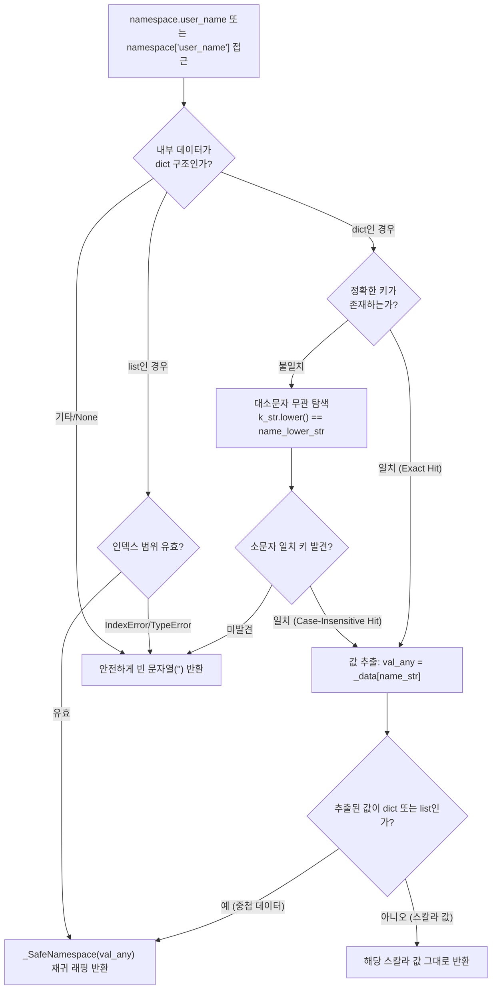

# 4.3. 안전한 네임스페이스 탐색 (`_SafeNamespace`)

> **소속 모듈**: `agent_common.tool_parser._SafeNamespace`  
> **핵심 메서드**: `__getattr__()`, `__getitem__()`, `__str__()`, `__bool__()`  
> **의존 모듈**: 파이썬 표준 라이브러리 (Zero-dependency)

---

## 1. 개요 및 엔터프라이즈 배경

외부 데이터 소스(Dell ECS 메타데이터, 다양한 레거시 RDBMS 덤프, 서드파티 REST API JSON 응답)는 필드명의 대소문자 표기(`userId` vs `USERID` vs `userid`)가 일관되지 않거나, 일부 레코드에서 특정 키가 통째로 누락되는 현상이 빈번합니다.

파이썬의 기본 딕셔너리(`dict`)나 일반 객체 속성 접근 방식(`data['user']['name']` 또는 `data.user.name`)을 그대로 사용할 경우 다음과 같은 런타임 문제가 발생합니다:
1. **`KeyError` 및 `AttributeError`로 인한 파이프라인 급단**: 대용량 배치 처리 중 1,000,000번째 레코드에서 특정 선택적 필드가 없다는 이유로 전체 작업이 중단됩니다.
2. **방어 코드(Defensive Code)의 범람**: `data.get('user', {}).get('name', '')`와 같은 복잡하고 번잡한 방어 코드가 코드 전반에 확산되어 가독성을 심각하게 해칩니다.

`_SafeNamespace`는 점(.) 표기법 속성 접근과 대괄호(`[]`) 인덱싱을 지원하면서, **대소문자 무관 탐색**과 **키 누락 시 안전한 빈 문자열(`""`) 반환**을 보장하는 고성능 안전 래퍼(Safe Wrapper) 객체입니다.

---

## 2. 안전 탐색 아키텍처 및 래핑 매커니즘



---

## 3. 핵심 동작 규격 및 특징

### 3.1. 점(.) 속성 및 딕셔너리 인덱싱 통합
`_SafeNamespace`로 감싸진 객체는 객체 속성 점 표기법(`ns.user.name`)과 딕셔너리 키 접근(`ns['user']['name']`)을 자유롭게 혼용할 수 있습니다.

### 3.2. 대소문자 무관(Case-Insensitive) 유연한 탐색
원본 데이터의 키가 `{"CreatedAt": "2026-09-18"}`로 들어오더라도, `ns.createdat`, `ns.CREATED_AT`, `ns.createdAt` 모두 원본 키를 자동으로 찾아 값을 안전하게 반환합니다.

### 3.3. 무결점 침묵 방지 및 안전한 기본값 (`""`)
존재하지 않는 키를 10단계 깊이로 조회(`ns.non_existing.deep.nested.field`)하더라도 중간에 `NoneType error`나 `KeyError`가 발생하지 않고 최종적으로 안전하게 빈 문자열(`""`)을 반환합니다.

### 3.4. 문자열 및 불리언 평가 지원
- `__str__()`: 감싸진 원본 데이터를 문자열로 변환하여 출력합니다. (`None`인 경우 `""`)
- `__bool__()`: 원본 데이터의 진위형 평가를 따릅니다. 값이 없거나 빈 문자열/빈 딕셔너리인 경우 `False`로 판정됩니다.

---

## 4. 실전 코드 예시

### 4.1. 점 표기법 및 대소문자 무관 안전 접근
```python
from agent_common.tool_parser import _SafeNamespace

# 외부에서 유입된 불규칙한 원천 데이터
raw_data = {
    "Header": {
        "TRANSACTION_ID": "TX-998823",
        "Sender": "System-A"
    },
    "Payload": {
        "items": [
            {"ItemCode": "P001", "Qty": 10},
            {"ItemCode": "P002", "Qty": 5}
        ]
    }
}

ns = _SafeNamespace(raw_data)

# 1. 대소문자 혼합 점 표기법 접근
tx_id = ns.header.transaction_id
print(tx_id)  # 'TX-998823'

sender = ns.Header.sender
print(sender)  # 'System-A'

# 2. 리스트 및 딕셔너리 혼합 중첩 탐색
first_item = ns.payload.items[0].itemcode
print(first_item)  # 'P001'

# 3. 존재하지 않는 깊은 경로 탐색 시 에러 없이 빈 문자열 반환
missing_val = ns.payload.metadata.author.email
print(f"결과: '{missing_val}'")  # 결과: ''
print(bool(missing_val))          # False

# 4. 리스트 범위를 벗어난 인덱스 안전 조회
out_of_bounds = ns.payload.items[999].itemcode
print(f"결과: '{out_of_bounds}'")  # 결과: ''
```

---

## 5. 주의사항 및 모범 사례

1. **템플릿 평가 엔진과의 연계**: `_SafeNamespace`는 `ToolParser.eval()` 내부에서 네임스페이스 바인딩 시 핵심 메커니즘으로 동작하여, 템플릿 작성자가 원천 데이터의 키 대소문자 차이나 필드 누락 걱정 없이 안심하고 수식을 작성할 수 있도록 보장합니다.
2. **값 미존재 여부 판별**: 누락된 키는 `""`를 반환하므로, 값이 실제로 유효한지 검사할 때는 `if ns.target_key:` 구문을 사용하면 간결하고 안전합니다.
3. **불필요한 수동 방어 코드 제거**: `_SafeNamespace`를 활용하면 코드 내 지저분한 `try-except KeyError` 블록이나 연쇄 `dict.get()` 호출을 완전히 제거할 수 있어 비즈니스 로직의 가독성이 획기적으로 향상됩니다.
