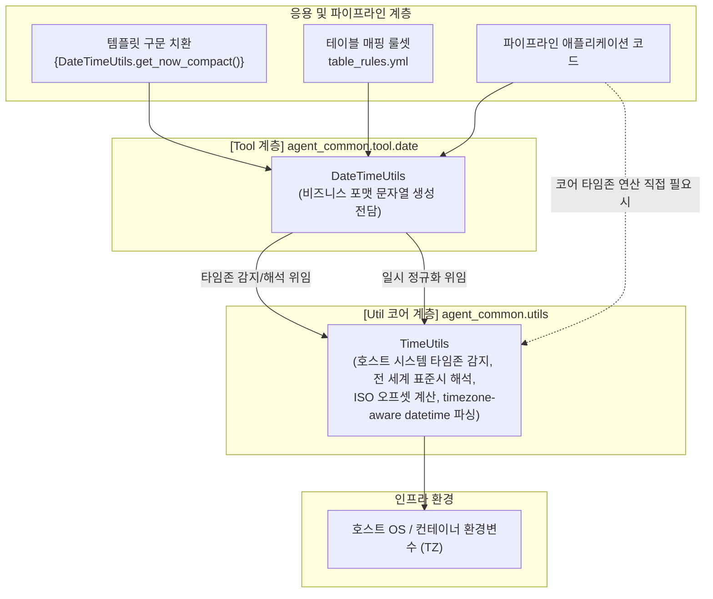

# 4.4. 내장 공통 일시 도구 (`DateTimeUtils`)

> **소속 모듈**: `agent_common.tool.date.DateTimeUtils`  
> **핵심 메서드**: `get_today_yyyymmdd()`, `get_now_timestamp()`, `get_now_no_tz()`, `get_now_compact()`, `parse_datetime()`  
> **기반 코어 유틸리티**: `agent_common.utils.TimeUtils` (시스템 타임존 감지 및 일시 파싱 전담)

---

## 1. 개요 및 엔터프라이즈 배경

엔터프라이즈 데이터 파이프라인과 메달리온(Medallion) 적재 파이프라인에서는 테이블 변환 룰(`table_rules.yml`)이나 GCS/BigQuery 적재 경로 템플릿에서 현재 날짜와 시각을 표준화된 규격으로 표현해야 하는 요구사항이 매우 빈번합니다.

예를 들어:
- **BigQuery TIMESTAMP 컬럼 적재**: 타임존 오프셋이 포함된 표준 ISO 8601 타임스탬프(`YYYY-MM-DD HH:MM:SS+09:00`) 필요
- **파티션 폴더 분기**: 새벽 배치 작업 시 날짜 역전 없이 정확한 `YYYYMMDD` 8자리 일자 필요
- **로그 및 요약 리포트**: 타임존 없는 깔끔한 가독성의 `YYYY-MM-DD HH:MM:SS` 필요
- **고유 파일명/배치 식별자**: 14자리 압축 일시(`YYYYMMDDHHMMSS`) 필요

`DateTimeUtils`는 `agent_common` 패키지의 **1순위 내장 도구(Built-in Tool)**로서, 선언적 템플릿(`{DateTimeUtils.get_today_yyyymmdd}`) 및 파이썬 코드에서 즉시 사용할 수 있는 표준 날짜/시간 생성 기능을 제공합니다.

---

## 2. 시간 모듈 이원화 아키텍처: `DateTimeUtils` vs `TimeUtils`

`agent_common` 패키지는 시간 관련 로직을 **코어 인프라 계층(`TimeUtils`)**과 **도구/표현 계층(`DateTimeUtils`)**으로 명확히 분리하여 설계했습니다:



### 💡 두 모듈 간의 명확한 역할 분담
1. **`TimeUtils` (코어 인프라)**:
   - OS 및 컨테이너(Kubernetes 파드)의 실제 시스템 타임존 자동 감지
   - 전 세계 주요 타임존 약어(KST, UTC, JST, CST, EST 등) 및 ISO 8601 오프셋 파싱
   - naive/aware datetime 및 ISO 문자열을 timezone-aware datetime으로 정규화
2. **`DateTimeUtils` (도구 및 포맷팅)**:
   - `TimeUtils`의 엔진을 기반으로 비즈니스 파이프라인에서 실제 적재/출력에 필요한 규격화된 문자열을 고속 생성
   - `ToolParser`의 템플릿 치환식(`{DateTimeUtils.*}`)에서 손쉽게 호출 가능

---

## 3. 주요 메서드 및 기능 규격

### 3.1. 당일 일자 8자리 반환 (`get_today_yyyymmdd`)
```python
@classmethod
def get_today_yyyymmdd(cls, tz_obj: Optional[timezone] = None) -> str
```
- **형식**: `YYYYMMDD` (예: `'20260918'`)
- **용도**: 일자별 파티션 디렉터리 경로 생성, 일일 배치 파티션 키
- **특징**: `tz_obj` 미지정 시 시스템 타임존(한국 환경: KST)을 자동 반영하므로, 새벽 0시~9시 사이 배치 수행 시 UTC 기준 날짜로 역전되는 문제를 원천 차단합니다.

### 3.2. 표준 ISO 8601 타임스탬프 반환 (`get_now_timestamp`)
```python
@classmethod
def get_now_timestamp(cls, tz_obj: Optional[timezone] = None) -> str
```
- **형식**: `YYYY-MM-DD HH:MM:SS+09:00` 또는 `+00:00` (예: `'2026-09-18 20:30:15+09:00'`)
- **용도**: BigQuery `TIMESTAMP` 컬럼 적재, DB 이력 관리 표준 타임스탬프

### 3.3. 타임존 없는 일시 문자열 반환 (`get_now_no_tz`)
```python
@classmethod
def get_now_no_tz(cls, tz_obj: Optional[timezone] = None) -> str
```
- **형식**: `YYYY-MM-DD HH:MM:SS` (예: `'2026-09-18 20:30:15'`)
- **용도**: 터미널 콘솔 로그, 마크다운 결과 요약표, 80열 보고서 출력 등 화면 가독성 중심 표기

### 3.4. 14자리 압축 일시 반환 (`get_now_compact`)
```python
@classmethod
def get_now_compact(cls, tz_obj: Optional[timezone] = None) -> str
```
- **형식**: `YYYYMMDDHHMMSS` (예: `'20260918203015'`)
- **용도**: 백업 파일명, 아카이브 접미사, 배치 실행 Transaction ID

### 3.5. timezone-aware 일시 객체 정규화 (`parse_datetime`)
```python
@classmethod
def parse_datetime(cls, dt_input_any: Any, default_tz_obj: Optional[timezone] = None) -> Optional[datetime]
```
- **파라미터**:
  - `dt_input_any`: datetime 객체, ISO 8601 문자열, 타임스탬프 등
  - `default_tz_obj`: 타임존 정보 누락 시 적용할 기본 타임존 (미지정 시 자동 감지)
- **반환값**: 정규화된 timezone-aware `datetime` 객체 (실패 시 `None`)
- **구현**: 실제 파싱 및 타임존 보정 로직은 `TimeUtils.parse_datetime`에 위임하여 일관성을 보장합니다.

---

## 4. 실전 코드 예시

### 4.1. 파이썬 코드에서 직접 호출
```python
from agent_common.tool.date import DateTimeUtils
from agent_common.utils import TimeUtils

# 1. 시스템 타임존 기준 문자열 생성
today_str = DateTimeUtils.get_today_yyyymmdd()
print(f"오늘 일자: {today_str}")  # 예: '20260918'

ts_str = DateTimeUtils.get_now_timestamp()
print(f"BigQuery 적재용 타임스탬프: {ts_str}")  # 예: '2026-09-18 20:30:15+09:00'

compact_str = DateTimeUtils.get_now_compact()
print(f"압축 일시: {compact_str}")  # 예: '20260918203015'

# 2. 특정 타임존(UTC)을 명시하여 호출
utc_tz = TimeUtils.resolve_timezone("UTC")
utc_ts = DateTimeUtils.get_now_timestamp(tz_obj=utc_tz)
print(f"UTC 타임스탬프: {utc_ts}")  # 예: '2026-09-18 11:30:15+00:00'

# 3. 다양한 원천 일시의 timezone-aware 정규화
raw_iso = "2026-08-15T12:00:00Z"
normalized_dt = DateTimeUtils.parse_datetime(raw_iso)
print(normalized_dt)  # 2026-08-15 12:00:00+00:00
```

### 4.2. ToolParser 템플릿 및 룰 파일과 연동
```python
from agent_common.tool_parser import ToolParser

tool_parser = ToolParser()

# 룰셋 템플릿 정의
template_path = "lake/events/{DateTimeUtils.get_today_yyyymmdd()}/{DateTimeUtils.get_now_compact()}_event.json"

# 템플릿 평가
evaluated_path = tool_parser.eval(template_path)
print(evaluated_path)
# 출력: lake/events/20260918/20260918203015_event.json
```

---

## 5. 주의사항 및 모범 사례

1. **저수준 연산과 고수준 포맷팅의 구분**:
   - 시스템 타임존 오프셋 계산, 전 세계 시간대 변환, 수학적 일시 연산이 필요한 경우 `TimeUtils`를 직접 사용하십시오.
   - 템플릿 치환, 파일 경로 생성, DB 적재용 포맷 문자열 조립에는 `DateTimeUtils`를 사용하십시오.
2. **새벽 배치 작업 시 날짜 주의**:
   - 글로벌 클라우드(AWS/GCP) 기본 파드 환경은 UTC로 동작하는 경우가 많습니다. `DateTimeUtils`는 `TimeUtils.resolve_timezone()`을 통해 호스트 및 환경변수(TZ)를 올바르게 해석하므로 KST 설정 환경에서 새벽 시간대 일자 왜곡을 방지합니다.
