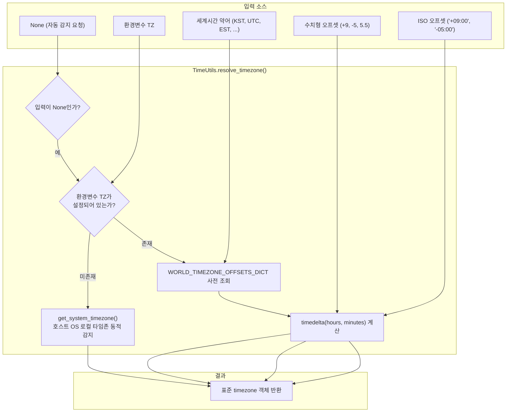

# 5.1. 호스트 시스템 타임존 감지, 전 세계 표준시 해석 및 일시 정규화 (`TimeUtils`)

> **소속 모듈**: `agent_common.utils.TimeUtils`  
> **핵심 메서드**: `get_system_timezone()`, `get_system_timezone_offset_str()`, `resolve_timezone()`, `format_timezone_offset()`, `parse_datetime()`  
> **핵심 데이터**: `WORLD_TIMEZONE_OFFSETS_DICT` (전 세계 30여 개 주요 표준 타임존 오프셋 사전)  
> **도입 버전**: `v0.4.69` (코어 유틸 분리), `v0.4.74` (`parse_datetime` 지원)

---

## 1. 개요 및 엔터프라이즈 배경

엔터프라이즈 하이브리드 클라우드 환경에서는 동일한 데이터 파이프라인이 여러 다른 인프라 환경에서 실행됩니다:
- **온프레미스 레거시 배치 서버**: 호스트 OS가 한국 표준시(`KST`, UTC+9)로 구성됨
- **Kubernetes 기반 Airflow / Cloud Run 파드**: 컨테이너 기본 타임존이 협정 세계시(`UTC`, UTC+0)로 구동됨

만약 시간 처리 로직이 특정 타임존을 정적으로 가정하거나 단순히 `datetime.now()`(naive datetime)를 사용하면 다음과 같은 치명적 장애가 발생합니다:
1. **새벽 배치 날짜 역전 현상**: 새벽 01시~08시 사이에 실행된 파드가 UTC 기준 전날 날짜로 파티션 디렉터리를 생성하여 데이터가 엉뚱한 폴더로 유실됩니다.
2. **BigQuery TIMESTAMP 오차**: 타임존 오프셋이 누락된 채 적재되어 9시간의 시차 왜곡이 발생합니다.
3. **글로벌 리전 데이터 수집 혼선**: 미국(EST/EDT), 유럽(CET/CEST), 아시아(KST/JST) 등 다양한 리전에서 유입되는 일시 데이터를 단일 기준시로 일관되게 정규화하지 못합니다.

`TimeUtils`는 호스트 OS의 실제 타임존을 런타임에 동적으로 자동 감지하고, 전 세계 표준 타임존 약어 및 임의의 오프셋을 표준 `timezone` 객체로 변환하며, 모든 형태의 일시 데이터를 **`timezone-aware datetime`으로 정규화하는 코어 시간 인프라 유틸리티**입니다.

---

## 2. 시간 인프라 아키텍처 및 정규화 파이프라인



---

## 3. 전 세계 주요 표준 타임존 사전 (`WORLD_TIMEZONE_OFFSETS_DICT`)

`TimeUtils`는 서머타임(DST)을 포함한 전 세계 주요 표준 타임존 약어를 자체 내장하고 있습니다:

| 지역 / 권역 | 지원 타임존 약어 | UTC 기준 오프셋 | 주요 도시 / 비고 |
| :--- | :--- | :---: | :--- |
| **표준시** | `UTC`, `GMT`, `Z` | UTC+0 | 협정 세계시, 그리니치 표준시 |
| **아시아 / 오세아니아** | `KST`, `JST` | UTC+9 | 서울, 도쿄 (한국/일본 표준시) |
| | `CST_ASIA`, `HKT`, `SGT` | UTC+8 | 베이징, 상하이, 홍콩, 싱가포르 |
| | `IST` | UTC+5:30 | 뉴델리 (인도 표준시, 30분 오프셋) |
| | `ICT` | UTC+7 | 방콕, 하노이 (인도차이나 표준시) |
| | `AEST` / `AEDT` | UTC+10 / UTC+11 | 시드니 (호주 동부 표준시 / 서머타임) |
| | `NZST` / `NZDT` | UTC+12 / UTC+13 | 오클랜드 (뉴질랜드 표준시 / 서머타임) |
| **유럽** | `CET` / `CEST` | UTC+1 / UTC+2 | 파리, 베를린 (중앙유럽 표준시 / 서머타임) |
| | `WET` / `WEST` | UTC+0 / UTC+1 | 리스본, 런던 (서유럽 표준시 / 서머타임) |
| | `BST` | UTC+1 | 런던 (영국 서머타임) |
| | `MSK` | UTC+3 | 모스크바 표준시 |
| **북미** | `EST` / `EDT` | UTC-5 / UTC-4 | 뉴욕, 워싱턴 (동부 표준시 / 서머타임) |
| | `CST` / `CDT` | UTC-6 / UTC-5 | 시카고 (중부 표준시 / 서머타임) |
| | `MST` / `MDT` | UTC-7 / UTC-6 | 덴버 (산악 표준시 / 서머타임) |
| | `PST` / `PDT` | UTC-8 / UTC-7 | LA, 샌프란시스코 (태평양 표준시 / 서머타임) |
| | `AKST` / `AKDT` | UTC-9 / UTC-8 | 알래스카 표준시 / 서머타임 |
| | `HST` | UTC-10 | 하와이 표준시 |

---

## 4. 주요 메서드 및 기능 규격

### 4.1. 호스트 시스템 타임존 동적 감지 (`get_system_timezone`)
```python
@classmethod
def get_system_timezone(cls) -> timezone
```
- **동작**: `datetime.now().astimezone().utcoffset()`을 통해 현재 파이썬 프로세스가 실행 중인 OS 커널/컨테이너의 실제 로컬 타임존을 동적으로 추출합니다.
- **반환값**: 호스트 로컬 타임존 `timezone` 객체 (감지 실패 시 `timezone.utc`)

### 4.2. 시스템 타임존 오프셋 문자열 반환 (`get_system_timezone_offset_str`)
```python
@classmethod
def get_system_timezone_offset_str(cls) -> str
```
- **반환값**: 현재 호스트 환경의 ISO 8601 콜론 구분 오프셋 문자열 (예: `'+09:00'`, `'+00:00'`, `'-05:00'`)

### 4.3. 범용 타임존 해석기 (`resolve_timezone`)
```python
@classmethod
def resolve_timezone(cls, tz_input_any: Optional[timezone | str | int | float] = None) -> timezone
```
- **입력 지원 형식**:
  - `None`: `TZ` 환경변수 확인 ➔ 미지정 시 `get_system_timezone()` 자동 감지
  - `timezone` 객체: 전달된 객체 그대로 반환
  - 문자열(`str`):
    - `"SYSTEM"`, `"LOCAL"`, `"AUTO"`: 시스템 타임존 자동 반환
    - 세계시간 약어(`"KST"`, `"UTC"`, `"EST"` 등): 사전 매핑 변환
    - 숫자 오프셋 문자열(`"+09:00"`, `"+0900"`, `"+9"`, `"-5"` 등)
  - 수치형(`int`, `float`): 시간 단위 수치 (예: `9` ➔ `+09:00`, `5.5` ➔ `+05:30`)
- **Fail-Fast**: 해석 불가능한 규격 외 형식 유입 시 명확한 사유와 함께 `ValueError` 발생

### 4.4. 일시 정규화 및 timezone-aware 변환 (`parse_datetime`)
```python
@classmethod
def parse_datetime(cls, dt_input_any: Any, default_tz_obj: Optional[timezone] = None) -> Optional[datetime]
```
- **특징**:
  - naive `datetime` 객체: `default_tz_obj`(미지정 시 기본 타임존)를 주입하여 timezone-aware 객체로 승격
  - aware `datetime` 객체: 기존 타임존 정보 유지
  - ISO 8601 문자열(`"2026-09-18T20:30:00+09:00"`): 표준 파싱 수행
  - 문자열 끝의 `"Z"`: `"+00:00"`(UTC)으로 안전하게 치환 후 파싱
  - 빈 값/None/오류 문자열: 에러를 발생시키지 않고 안전하게 `None` 반환

---

## 5. 실전 코드 예시

### 5.1. 다양한 형식의 타임존 해석 및 오프셋 변환
```python
from agent_common.utils import TimeUtils

# 1. 자동 감지 (None 전달 시 호스트 OS 타임존 반영)
sys_tz = TimeUtils.resolve_timezone()
print(f"시스템 타임존: {sys_tz}")  # datetime.timezone(datetime.timedelta(seconds=32400)) (KST 환경)
print(f"시스템 오프셋: {TimeUtils.get_system_timezone_offset_str()}")  # '+09:00'

# 2. 전 세계 표준시 약어 해석
kst_tz = TimeUtils.resolve_timezone("KST")
est_tz = TimeUtils.resolve_timezone("EST")
ist_tz = TimeUtils.resolve_timezone("IST")  # 인도 (+05:30)

print(f"KST: {kst_tz}")  # UTC+09:00
print(f"EST: {est_tz}")  # UTC-05:00
print(f"IST: {ist_tz}")  # UTC+05:30

# 3. 수치 및 콜론 문자열 오프셋 해석
num_tz = TimeUtils.resolve_timezone(9)       # +09:00
iso_tz = TimeUtils.resolve_timezone("-04:00") # EDT
```

### 5.2. 다양한 형식의 일시를 timezone-aware 객체로 일괄 정규화
```python
from agent_common.utils import TimeUtils
from datetime import datetime

# 다양한 소스에서 들어온 일시 데이터
inputs = [
    "2026-09-18T20:30:00Z",            # UTC ISO 표기
    "2026-09-18 20:30:00+09:00",       # KST ISO 표기
    datetime(2026, 9, 18, 20, 30, 0),  # Naive datetime 객체
    None,                               # 결측치
    "INVALID_DATE_STRING"               # 잘못된 데이터
]

for item in inputs:
    normalized_dt = TimeUtils.parse_datetime(item)
    print(f"입력: {str(item):<25} ➔ 정규화: {normalized_dt}")

# 출력:
# 입력: 2026-09-18T20:30:00Z      ➔ 정규화: 2026-09-18 20:30:00+00:00
# 입력: 2026-09-18 20:30:00+09:00 ➔ 정규화: 2026-09-18 20:30:00+09:00
# 입력: 2026-09-18 20:30:00       ➔ 정규화: 2026-09-18 20:30:00+09:00 (시스템 KST 자동 부여)
# 입력: None                      ➔ 정규화: None
# 입력: INVALID_DATE_STRING       ➔ 정규화: None
```

---

## 6. `DateTimeUtils`와의 상호 협력 및 모범 사례

1. **상하위 계층 분리**:
   - `TimeUtils`는 타임존 연산과 파싱을 책임지는 **기반 엔진**입니다.
   - `DateTimeUtils`는 `TimeUtils`를 임포트하여 템플릿과 비즈니스 룰에서 쓰이는 **표준 문자열(`YYYYMMDD`, `YYYYMMDDHHMMSS` 등)을 생성하는 도구**입니다.
   - 따라서 새로운 날짜 포맷 규칙이나 템플릿 함수는 `DateTimeUtils`에 추가하고, 새로운 타임존 처리나 수학적 시간 정규화는 `TimeUtils`에 추가하는 것이 아키텍처 원칙입니다.
2. **컨테이너 환경(TZ) 권장사항**:
   - Dockerfile 및 Kubernetes Pod spec에 `ENV TZ=Asia/Seoul`을 명시하면, `TimeUtils`가 이를 최우선 반영하여 새벽 시간대 일자 왜곡을 완전히 방지할 수 있습니다.
