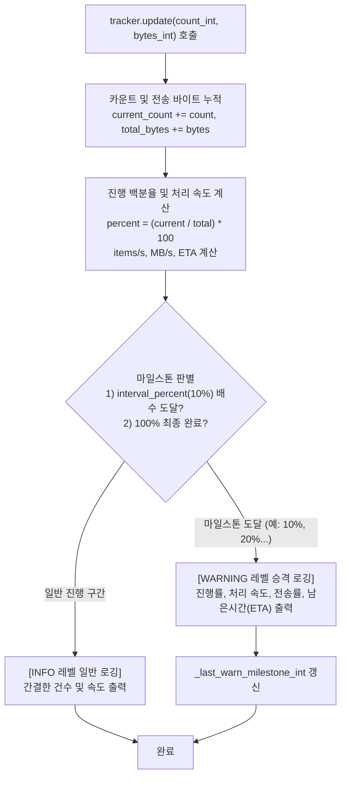

# 5.2. 멀티스레드 실시간 진행률 추적 및 마일스톤 경고 (`ProgressTracker`)

> **소속 모듈**: `agent_common.utils.ProgressTracker`  
> **핵심 메서드**: `update()`  
> **연동 모듈**: `agent_common.logger.ProjectLogger`, `agent_common.config_loader.config`

---

## 1. 개요 및 엔터프라이즈 배경

수만~수백만 건의 대용량 오브젝트 파일(S3/ECS)을 처리하거나 BigQuery 대량 데이터를 이관하는 엔터프라이즈 배치 파이프라인에서는 **실시간 처리 진행률 모니터링**과 **예상 잔여 시간(ETA)**의 정확한 파악이 필수적입니다.

하지만 단순 루프 카운팅 방식은 다음과 같은 한계가 있습니다:
1. **로그 폭발(Log Flooding)**: 1,000,000건 처리 시 매 건마다 로그를 남기면 로그 저장소 비용이 급증하고 가독성이 마비됩니다.
2. **진행 상태 파악의 모호함**: 10분 동안 아무 로그가 없다가 작업이 끝나는 방식은 프로세스가 정상 작동 중인지 행(Hang) 상태인지 구별할 수 없습니다.
3. **가시성 부족**: 수천 줄의 로그 속에서 작업이 10%, 20%, 50% 등 주요 마일스톤에 도달했는지 한눈에 파악하기 어렵습니다.

`ProgressTracker`는 처리 건수 및 전송 바이트를 실시간으로 누적 추적하며, **일반 진행은 `INFO` 레벨**로 기록하고 **설정된 % 배수(예: 10% 단위 마일스톤) 및 최종 완료 시점은 `WARNING` 레벨로 자동 승격**하여 운영 관제 화면에서 핵심 마일스톤을 즉시 식별할 수 있도록 지원합니다.

---

## 2. 진행률 추적 및 마일스톤 승격 메커니즘



---

## 3. 주요 설정 스키마 및 규격

`ProgressTracker`는 `config.yml`의 `progress_tracker` 네임스페이스를 통해 동작 매개변수를 제어합니다:

```yaml
progress_tracker:
  interval_percent_int: 10       # 진행률 마일스톤 경고 간격 (단위: %)
  default_task_name_str: "작업"  # 기본 작업 명칭 문자열
```

### 3.1. 생성자 (`__init__`)
```python
def __init__(
    self,
    total_items_int: int,
    logger_obj: Any = None,
    task_name_str: Optional[str] = None,
    start_time_float: Optional[float] = None,
) -> None
```
- **파라미터**:
  - `total_items_int`: 전체 처리 대상 총 건수
  - `logger_obj`: `ProjectLogger` 또는 표준 `logging.Logger` 인스턴스
  - `task_name_str`: 로그 접두사에 표기될 작업명 (미지정 시 `config.progress_tracker.default_task_name_str` 적용)
  - `start_time_float`: 작업 시작 타임스탬프 (미지정 시 현재 시각)

### 3.2. 상태 갱신 및 차등 로깅 (`update`)
```python
def update(
    self,
    count_int: int = 1,
    bytes_int: int = 0,
    details_str: str = "",
) -> None
```
- **파라미터**:
  - `count_int`: 이번 호출에서 처리 완료된 아이템 수 (기본값: 1)
  - `bytes_int`: 이번 호출에서 처리/전송된 데이터 바이트 크기 (옵션)
  - `details_str`: 로그 끝에 덧붙일 부가 설명 문자열 (예: `'테이블명'`, `'에러 없음'`)
- **로그 메시지 포맷**:
  - **마일스톤 (`WARNING`)**:  
    `[작업명 진행률 마일스톤] 진행: 500/1,000 (50%) | 속도: 25.4건/s 12.30 MB/s | 남은시간(ETA): 0m 19s`
  - **일반 진행 (`INFO`)**:  
    `[작업명] 123/1,000 (12%) | 24.8건/s (11.80 MB/s)`

---

## 4. 실전 코드 예시

### 4.1. 대용량 파일 전송 루프에서의 진행률 추적
```python
from agent_common.utils import ProgressTracker
from agent_common.logger import ProjectLogger
import time

logger = ProjectLogger("MigrationService")
file_list = [{"name": f"file_{i}.dat", "size": 1024 * 512} for i in range(100)]

# ProgressTracker 초기화
tracker = ProgressTracker(
    total_items_int=len(file_list),
    logger_obj=logger,
    task_name_str="GCS 파일 이관"
)

for file_info in file_list:
    # 파일 전송 로직 수행 (가정)
    time.sleep(0.05)
    
    # 처리 완료 시 update 호출
    tracker.update(
        count_int=1,
        bytes_int=file_info["size"],
        details_str=file_info["name"]
    )
```

### 4.2. 멀티스레드 환경에서의 배치 청크 추적
```python
from concurrent.futures import ThreadPoolExecutor
from agent_common.utils import ProgressTracker
from agent_common.logger import ProjectLogger

logger = ProjectLogger("BatchWorker")
chunks = [range(i, i + 50) for i in range(0, 1000, 50)]

tracker = ProgressTracker(
    total_items_int=1000,
    logger_obj=logger,
    task_name_str="병렬 청크 처리"
)

def process_chunk(chunk_items):
    # 청크 일괄 처리
    processed_count = len(chunk_items)
    tracker.update(count_int=processed_count)

with ThreadPoolExecutor(max_workers=4) as executor:
    executor.map(process_chunk, chunks)
```

---

## 5. 주의사항 및 모범 사례

1. **마일스톤 승격 로깅의 운영상 이점**:
   - 운영 모니터링 도구(Grafana, Datadog, CloudWatch)에서 `WARNING` 레벨만 필터링하면 작업의 10% 단위 진행 경과와 ETA를 노이즈 없이 명확하게 추적할 수 있습니다.
2. **총 건수(`total_items_int`) 0건 대응**:
   - `total_items_int`가 0으로 유입되어도 `ZeroDivisionError`가 발생하지 않도록 내부적으로 `divisor_int = max(1, total_items_int)`로 안전 처리됩니다.
3. **전송량(`bytes_int`) 표기**:
   - 파일 이관이나 네트워크 스트리밍 작업 시 `bytes_int`를 전달하면 초당 전송 속도(`MB/s`)가 자동으로 계산 및 출력되므로 네트워크 병목을 즉시 진단할 수 있습니다.
