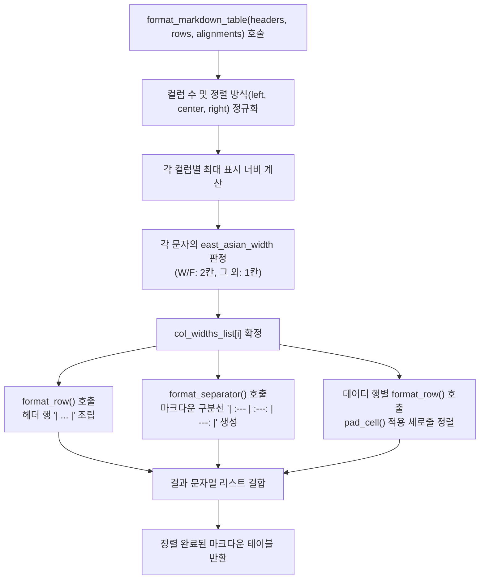

# 5.3. 유니코드 전각 문자 폭 계산 및 마크다운/콘솔 테이블 칼맞춤 포매터 (`TableFormatter`)

> **소속 모듈**: `agent_common.utils.TableFormatter`  
> **핵심 메서드**: `calculate_display_width()`, `format_markdown_table()`, `format_row()`, `format_separator()`, `pad_cell()`  
> **의존 모듈**: `unicodedata` (파이썬 표준 라이브러리), `agent_common.config_loader.config`  
> **도입 버전**: `v0.4.63`

---

## 1. 개요 및 엔터프라이즈 배경

배치 작업 완료 후 콘솔 터미널 및 GitHub/Slack 마크다운 보고서에 실행 결과 요약표(Summary Table)를 출력할 때 다음과 같은 고질적인 서식 붕괴가 발생합니다:

```text
# 단순 len() 기준 공백 패딩 시 발생하는 표 깨짐 현상
| 파일명 | 상태 | 소요시간 |
| sample_file.json | 성공 | 1.2s |
| 한국어_데이터_파일.json | 성공 | 2.5s |   <-- 한글이 2칸을 차지하여 오른쪽 세로선(|)이 심각하게 어긋남!
```

파이썬의 기본 `len("한글")`은 문자 개수인 `2`를 반환하지만, 모노스페이스(Monospace) 콘솔이나 마크다운 뷰어에서 **동아시아 전각 문자(한글, 한자, 일본어, 전각 기호)는 영문/숫자의 2배에 해당하는 2칸(Display Width = 2)을 차지**합니다.

`TableFormatter`는 표준 라이브러리 `unicodedata.east_asian_width`를 활용하여 텍스트의 실제 시각적 표시 너비(Display Width)를 나노초 단위로 정밀 계산하고, 컬럼별 정렬 옵션(좌측, 중앙, 우측)에 맞추어 **모든 행의 세로선(`|`)을 오차 없이 완벽하게 정렬(칼맞춤)해주는 전문 포매터 유틸리티**입니다.

---

## 2. 동아시아 문자 폭 판정 및 포매팅 파이프라인



---

## 3. 동아시아 문자 분류 기준 (`unicodedata.east_asian_width`)

| 분류 코드 | 분류 명칭 (Category) | 해당 문자 예시 | 시각적 표시 너비 (Display Width) |
| :---: | :--- | :--- | :---: |
| **`W`** | **Wide (전각 문자)** | 한글 완성형(`가`, `나`), 한자(`漢`, `字`), 일본어 히라가나/가타카나 | **2칸** |
| **`F`** | **Fullwidth (전각 영숫자/기호)** | 전각 영문(`Ａ`, `Ｂ`), 전각 기호(`！`, `？`) | **2칸** |
| **`Na`** | Narrow (반각 문자) | 기본 ASCII 영문(`A`, `b`), 숫자(`0`~`9`), 기본 기호 | 1칸 |
| **`H`** | Halfwidth (반각 카타카나) | 반각 가타카나 문자 | 1칸 |
| **`N`** | Neutral (중립 문자) | 아랍 문자, 히브리어, 특수 제어 문자 등 | 1칸 |
| **`A`** | Ambiguous (모호한 문자) | 일부 그리스 문자, 키릴 문자, 로마자 기호 | 1칸 |

---

## 4. 주요 메서드 및 기능 규격

### 4.1. 시각적 컬럼 폭 계산 (`calculate_display_width`)
```python
@classmethod
def calculate_display_width(cls, text_str: str) -> int
```
- **파라미터**: `text_str`: 너비를 측정할 문자열
- **반환값**: 터미널 및 마크다운에서 차지하는 실제 칸 수 (`int`)
- **특징**: `unicodedata.east_asian_width(c) in ("W", "F")` 조건을 통해 한글/한자는 정확히 2칸으로 누적 계산합니다.

### 4.2. 마크다운 테이블 생성 (`format_markdown_table`)
```python
@classmethod
def format_markdown_table(
    cls,
    headers_list: list[str],
    rows_list: list[list[str]],
    alignments_list: Optional[list[str]] = None,
) -> list[str]
```
- **파라미터**:
  - `headers_list`: 헤더 열 텍스트 목록 (예: `["작업 단계", "처리 건수", "성공 여부"]`)
  - `rows_list`: 데이터 행 목록
  - `alignments_list`: 열별 정렬 옵션 목록 (`'left'`, `'center'`, `'right'` 또는 마크다운 기호 `':---'`, `':---:'`, `'---:'`)
- **반환값**: 세로줄 정렬이 완료된 마크다운 행 문자열들의 리스트

### 4.3. 개별 셀 패딩 조립 (`pad_cell`)
```python
@classmethod
def pad_cell(
    cls,
    cell_text_str: str,
    target_width_int: int,
    align_mode_str: str = "left",
) -> str
```
- **정렬 방식**:
  - `'left'`: 우측에 부족한 칸 수만큼 공백 패딩
  - `'right'`: 좌측에 부족한 칸 수만큼 공백 패딩
  - `'center'`: 좌우로 공백을 균등 분할 패딩 (홀수 잔여 시 우측에 1칸 추가)

---

## 5. 실전 코드 예시

### 5.1. 한글/영문 혼합 마크다운 테이블 자동 포매팅
```python
from agent_common.utils import TableFormatter

headers = ["작업 단계", "파일명", "전송 건수", "소요 시간", "상태"]
rows = [
    ["원천 추출", "ecs_export_20260918.csv", "12,500", "1.4s", "완료"],
    ["데이터 정제 및 변환", "cleaned_dataset.parquet", "12,498", "3.8s", "성공"],
    ["BigQuery 적재 (MERGE)", "analytics.tb_sales_log", "12,498", "2.1s", "성공"],
]
alignments = ["left", "left", "right", "right", "center"]

table_lines = TableFormatter.format_markdown_table(
    headers_list=headers,
    rows_list=rows,
    alignments_list=alignments
)

print("\n".join(table_lines))
```

**출력 결과 (모노스페이스 폰트에서 모든 세로줄이 완벽히 일치)**:
```text
| 작업 단계             | 파일명                  | 전송 건수 | 소요 시간 | 상태 |
| :-------------------- | :---------------------- | --------: | --------: | :--: |
| 원천 추출             | ecs_export_20260918.csv |    12,500 |      1.4s | 완료 |
| 데이터 정제 및 변환   | cleaned_dataset.parquet |    12,498 |      3.8s | 성공 |
| BigQuery 적재 (MERGE) | analytics.tb_sales_log  |    12,498 |      2.1s | 성공 |
```

---

## 6. 주의사항 및 모범 사례

1. **설정값 외부화**:
   - 마크다운 구분선 최소 너비(`min_center_width_int: 5`, `min_default_width_int: 4`)와 콜론 패딩 등은 `config.table_formatter`에 정의되어 있어 코드 변경 없이 설정을 조정할 수 있습니다.
2. **ProjectLogger.log_summary()와의 결합**:
   - `agent_common.logger.ProjectLogger`의 최종 작업 요약 리포트(`log_summary()`) 역시 내부적으로 `TableFormatter`를 사용하여 표를 렌더링하므로, 전사 로그 시스템 어디서든 일관된 고품질 마크다운 표가 보장됩니다.
