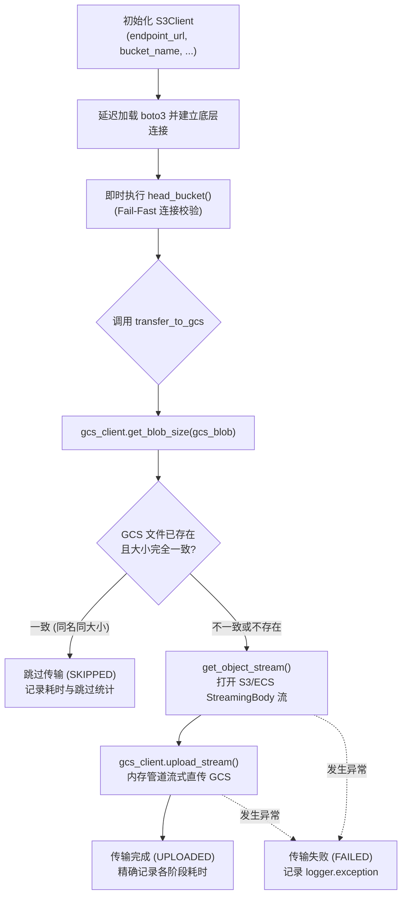

# 3.1. AWS S3 与 Dell ECS 对象存储客户端 (`S3Client`)

> **所属模块**: `agent_common.clients.S3Client`  
> **核心方法**: `list_objects()`, `get_object_stream()`, `get_object_size()`, `transfer_to_gcs()`  
> **依赖组件**: `boto3>=1.26.0`, `botocore`

---

## 1. 概述与企业级应用背景

在企业混合云架构中，通常同时使用公有云存储 **AWS S3** 与本地数据中心的高性能对象存储 **Dell ECS (Elastic Cloud Storage)** 来存储和迁移海量数据。

`agent_common.clients.S3Client` 是一个遵循 AWS S3 标准 API 规范、统一纳管所有兼容对象存储系统的通用客户端。

其专为满足以下企业级诉求而设计：
1. **第三方 SDK 延迟加载 (Lazy Loading)**: `boto3` 模块仅在首次使用时按需导入，避免无存储依赖的服务因导入重量级 SDK 产生额外的内存占用。
2. **连接与权限早期快速失败 (Fail-Fast)**: 客户端实例化时立即发起 `head_bucket()` 校验，在程序启动阶段迅速截获网络不可达或存储桶权限（403）错误。
3. **海量对象流式分页生成器**: 借助 Python `yield` 迭代器流式遍历数百万对象，从根源上杜绝内存溢出 (OOM)。
4. **GCS 零磁盘拷贝流式直传与智能跳过**: 在 S3/ECS 与 GCS 之间建立内存流式管道直接上传，无需本地磁盘中转，且在目标端已存在同大小同名文件时智能跳过（Smart Skip），极大节约网络带宽与传输耗时。

---

## 2. 核心架构与数据传输管道



---

## 3. 核心方法与接口规范

### 3.1. 构造函数 (`__init__`)
```python
def __init__(
    self,
    endpoint_url_str: str | None = None,
    access_key_str: str | None = None,
    secret_key_str: str | None = None,
    bucket_name_str: str = "",
    timeout_seconds_int: int | None = None,
    region_name_str: str | None = None,
) -> None
```
- **入参说明**:
  - `endpoint_url_str`: Dell ECS 等私有对象存储的 Endpoint URL（若直接使用 AWS S3 则留空或设为 `None`）
  - `access_key_str`: S3 Access Key ID（AWS IAM Role 角色鉴权环境下可留空）
  - `secret_key_str`: S3 Secret Access Key
  - `bucket_name_str`: 目标存储桶名称 (**必填**)
  - `timeout_seconds_int`: 网络 Socket 连接与读取超时秒数（缺省时读取 `config.transfer.timeout_seconds_int`）
  - `region_name_str`: AWS 区域标识（例如 `'ap-northeast-2'`）
- **Fail-Fast 行为**: 构造函数内部触发 `head_bucket`，若存储桶不存在或密钥不匹配立即抛出 `ConnectionError`。

### 3.2. 分页流式遍历对象 (`list_objects`)
```python
def list_objects(self, prefix_str: str = "") -> Generator[Dict[str, Any], None, None]
```
- 基于 `boto3` 的 `list_objects_v2` Paginator 实现，以迭代器生成器逐条 `yield` 对象元数据字典，支持无上限海量文件安全读取。

### 3.3. 获取对象内容数据流 (`get_object_stream`)
```python
def get_object_stream(self, key_str: str = "") -> Any
```
- 返回目标对象的 S3/ECS `StreamingBody` 字节流，可直接接入下游加密解密、压缩或外部云上传流水线，无需中转磁盘。

### 3.4. 极速查询对象文件大小 (`get_object_size`)
```python
def get_object_size(self, key_str: str = "") -> int | None
```
- 通过 `head_object` 仅拉取对象 HTTP 响应头元数据（`ContentLength`），毫秒级获取文件大小。

### 3.5. GCS 管道流式直传与智能跳过 (`transfer_to_gcs`)
```python
def transfer_to_gcs(
    self,
    gcs_client_obj: GcsClient,
    s3_key_str: str = "",
    gcs_blob_name_str: str = "",
    size_int: int = 0,
) -> str
```
- **执行逻辑**:
  1. 探测 GCS 目标端同名文件的物理大小。
  2. 若大小完全一致，跳过传输，返回 `"SKIPPED"`。
  3. 若文件不存在或大小不符，打开 S3 `StreamingBody` 直接流式传输至 GCS，返回 `"UPLOADED"`。
  4. 遇到网络或鉴权中断时记录异常日志，返回 `"FAILED"`。
- **细粒度耗时追踪**: 单行格式化日志中包含 `CheckTime`、`S3StreamTime`、`GCSUploadTime`、`TotalElapsed` 完整延时链条。

---

## 4. 实战代码示例

### 4.1. 初始化客户端

```python
from agent_common.clients import S3Client

# 1) 连接本地私有 Dell ECS
ecs_client = S3Client(
    endpoint_url_str="https://ecs.mycorp.internal:9021",
    access_key_str="MY_ECS_ACCESS_KEY",
    secret_key_str="MY_ECS_SECRET_KEY",
    bucket_name_str="raw-lake-bucket",
    timeout_seconds_int=60,
)

# 2) 连接公有云 AWS S3 (基于 IAM Role)
s3_client = S3Client(
    bucket_name_str="my-aws-s3-bucket",
    region_name_str="ap-northeast-2",
)
```

### 4.2. 遍历对象并流式直传 GCS

```python
from agent_common.clients import S3Client, GcsClient

s3_client = S3Client(
    endpoint_url_str="https://ecs.company.com:9021",
    access_key_str="ACCESS_KEY",
    secret_key_str="SECRET_KEY",
    bucket_name_str="source-bucket",
)

gcs_client = GcsClient(
    bucket_name_str="target-gcs-bucket",
    credentials_path_str="secrets/gcp_sa_key.json",
)

# 遍历某日前缀下的所有数据文件
target_prefix_str = "raw/events/2026/08/24/"

for obj_dict in s3_client.list_objects(prefix_str=target_prefix_str):
    s3_key_str: str = obj_dict["Key"]
    size_int: int = obj_dict["Size"]
    gcs_blob_str: str = f"lake/{s3_key_str.lstrip('/')}"
    
    # 智能流式上传 (同大小自动跳过，新文件内存直传)
    result_status_str = s3_client.transfer_to_gcs(
        gcs_client_obj=gcs_client,
        s3_key_str=s3_key_str,
        gcs_blob_name_str=gcs_blob_str,
        size_int=size_int,
    )
    print(f"[{result_status_str}] {s3_key_str} -> {gcs_blob_str} ({size_int:,} bytes)")
```

---

## 5. 常见异常与排障指南

| 捕获异常 | 常见诱发原因 | 推荐解决排查步骤 |
| :--- | :--- | :--- |
| `ImportError: 'boto3' 패키지가 필요합니다` | Python 环境未安装 `boto3` 依赖 | 执行 `pip install agent_common[clients]` 或 `pip install boto3` |
| `ValueError: S3/ECS 버킷명은 필수 입력 항목입니다` | 未传递 `bucket_name_str` 或入参为空字符串 | 确保传入有效的目标 Bucket 标识 |
| `ConnectionError: connection_failed` | Endpoint 域名错误、防火墙拦截或 Bucket 访问受阻 (403) | 使用 `curl -k` 测试网络通断，校验 AccessKey/SecretKey 权限配置 |
| `RuntimeError: list_failed` | 遍历过程中网络偶发超时或会话断连 | 调大 `timeout_seconds_int`，确认网络代理及网关设置 |
| `RuntimeError: transfer_failed` | 读取 S3 流或上传 GCS 中途 Socket 意外断开 | 检查数据源文件完整性，启用管道级自动重试重试机制 |
