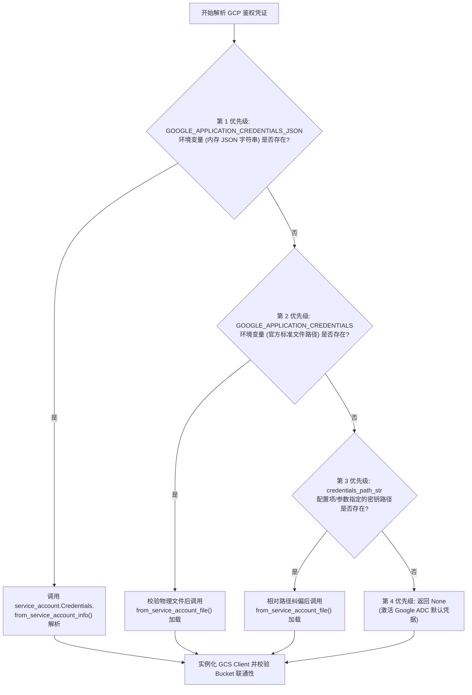

# 3.2. Google Cloud Storage 流式客户端与多层级鉴权 (`GcsClient`)

> **所属模块**: `agent_common.clients.GcsClient`  
> **核心方法**: `get_blob_size()`, `upload_stream()`, `GcpCredentialResolver.resolve()`  
> **依赖组件**: `google-cloud-storage>=2.10.0`, `google-auth`

---

## 1. 概述与企业级应用背景

Google Cloud Storage (GCS) 是云端大数据湖与 BigQuery 数仓入库的核心中转存储枢纽。

在企业级数据工程中，代码往往运行在异构的基础设施中（如本地开发机、私有云 Airflow 机器、GCP Compute Engine、GKE 容器群等），不同环境对于 GCP 服务账号凭据（Credentials）的注入方式大相径庭。此外，若在传输数十 GB 的海量数据时直接在本地磁盘或内存中完整缓冲，势必造成严重的磁盘写满或内存溢出 (OOM)。

`agent_common.clients.GcsClient` 提供**基于 4 级优先级的灵活 GCP 认证体系**以及**纯流式直传架构**，为云存储交互提供稳健支撑。

---

## 2. 4 阶段服务账号鉴权优先级架构

`GcsClient` 底层通过 `GcpCredentialResolver.resolve()` 按照以下 4 级优先级顺次解析 GCP 鉴权凭证 (`google.auth.credentials.Credentials`)：



### 鉴权级别规则:
1. **第 1 优先级 (`GOOGLE_APPLICATION_CREDENTIALS_JSON`)**:
   - 在严格合规的无盘容器或 CI/CD 流水线中，无需在本地磁盘落地敏感密钥文件，直接从注入环境变量的原始 JSON 字符串构建内存认证凭据。
2. **第 2 优先级 (`GOOGLE_APPLICATION_CREDENTIALS`)**:
   - 读取 Google 官方标准环境变量所指向的服务账号 `.json` 密钥文件。
3. **第 3 优先级 (`credentials_path_str`)**:
   - 读取 `config.yml` 配置或代码显式传入的文件路径。若为相对路径，则自动以项目根目录 (`ConfigLoader.project_path`) 为基准进行安全纠偏。
4. **第 4 优先级 (Google ADC - Application Default Credentials)**:
   - 自动获取 GKE Workload Identity、GCE Metadata Server 或本地 `gcloud auth application-default login` 凭据。

---

## 3. 核心方法与规范

### 3.1. 构造函数 (`__init__`)
```python
def __init__(
    self,
    bucket_name_str: str = "",
    credentials_path_str: str = "",
    timeout_seconds_int: int | None = None,
) -> None
```
- **入参说明**:
  - `bucket_name_str`: 目标 GCS 存储桶名称 (**必填**)
  - `credentials_path_str`: 服务账号私钥文件路径（留空则自动按环境变量或 ADC 解析）
  - `timeout_seconds_int`: 网络连接与写入超时秒数（未指定时读取 `config.transfer.timeout_seconds_int`）
- **Fail-Fast 行为**: 实例化过程中即调用 `client.get_bucket(bucket_name, timeout=...)` 快速验证桶的存在性与访问权限。

### 3.2. 查询文件是否存在与大小 (`get_blob_size`)
```python
def get_blob_size(self, destination_blob_name_str: str = "") -> int | None
```
- 查询目标 GCS Blob 的元数据并返回物理字节大小（`int`）。若文件不存在则安全返回 `None`。

### 3.3. 管道流式直传 (`upload_stream`)
```python
def upload_stream(
    self,
    stream_any: Any = None,
    destination_blob_name_str: str = "",
    size_int: int = 0,
    timeout_int: int | None = None,
) -> None
```
- 将上游数据流（S3 StreamingBody、HTTP 流、内存缓冲对象等）直接写入 GCS Blob。
- 底层采用 `blob.upload_from_file(stream, size=size_int, timeout=...)`，避免全量缓冲，按 Chunk 边读边传。

---

## 4. 实战代码示例

### 4.1. 基于密钥文件初始化

```python
from agent_common.clients import GcsClient

gcs_client = GcsClient(
    bucket_name_str="my-enterprise-data-lake",
    credentials_path_str="config/secrets/gcp_sa_key.json",
    timeout_seconds_int=120,
)
```

### 4.2. 基于环境变量/内存 JSON 初始化 (Kubernetes 推荐)

```bash
export GOOGLE_APPLICATION_CREDENTIALS_JSON='{"type": "service_account", "project_id": "my-project", ...}'
```

```python
from agent_common.clients import GcsClient

# 留空 credentials_path_str 即可自动读取环境变量中的凭证
gcs_client = GcsClient(bucket_name_str="my-enterprise-data-lake")
```

### 4.3. 内存流或文件流直接上传

```python
import io
from agent_common.clients import GcsClient

gcs_client = GcsClient(bucket_name_str="analytics-bucket")

# 1) 内存字节流直传
raw_data_bytes = b'{"event_id": "EVT_1001", "status": "SUCCESS"}\n'
stream_obj = io.BytesIO(raw_data_bytes)
target_blob_str = "events/2026/08/24/event_1001.json"

gcs_client.upload_stream(
    stream_any=stream_obj,
    destination_blob_name_str=target_blob_str,
    size_int=len(raw_data_bytes),
)

# 2) 校验上传后的文件大小
uploaded_size_int = gcs_client.get_blob_size(target_blob_str)
print(f"上传验证成功: {target_blob_str} ({uploaded_size_int} bytes)")
```

---

## 5. 常见异常与排障指南

| 捕获异常 | 常见诱发原因 | 推荐解决排查步骤 |
| :--- | :--- | :--- |
| `ImportError: 'google-cloud-storage' 패키지가 필요합니다` | 缺少 GCS SDK 依赖 | 执行 `pip install agent_common[clients]` 或 `pip install google-cloud-storage` |
| `ValueError: GCS 버킷명은 필수 입력 항목입니다` | `bucket_name_str` 为空 | 传入有效的目标 Bucket 标识 |
| `FileNotFoundError: 인증키 파일을 찾을 수 없습니다` | 指定的 JSON 密钥物理文件不存在 | 检查路径拼写，确认是否基于项目根目录正确放置 |
| `ValueError: 인메모리 JSON 인증 객체 생성 실패` | 环境变量中配置的 JSON 字符串非法 | 检查 `GOOGLE_APPLICATION_CREDENTIALS_JSON` 是否包含转义错误或截断 |
| `ConnectionError: connection_failed (403 Forbidden)` | 服务账号缺少该 Bucket 的权限 | 在 GCP IAM 界面为该服务账号分配 Storage Object Admin 或 Creator 角色 |
| `RuntimeError: transfer_failed` | 大文件直传超时或外网连接断连 | 调大 `timeout_seconds_int`，排查出网代理及防火墙设置 |
