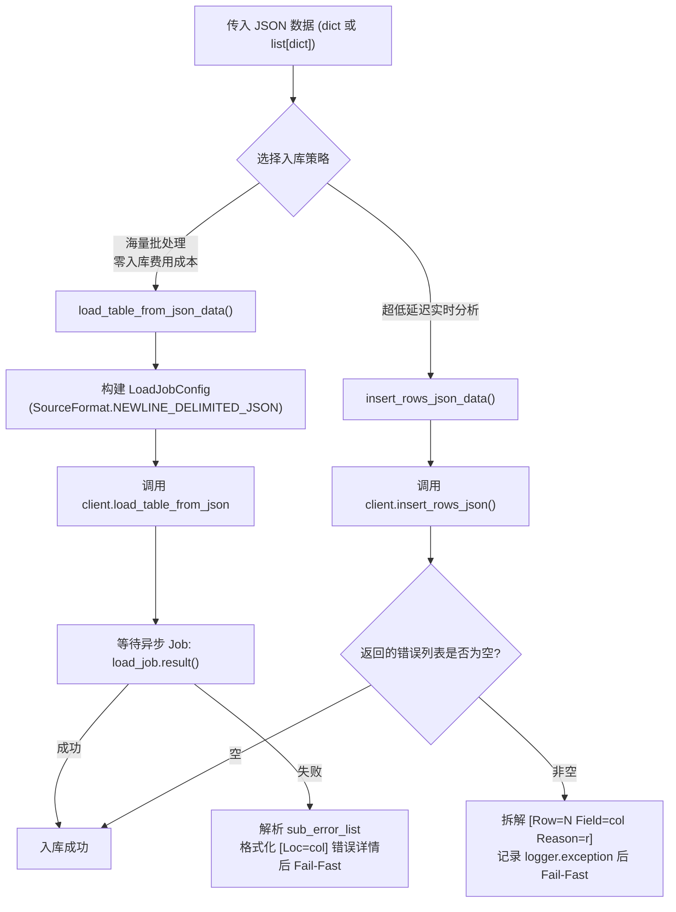

# 3.3. BigQuery 批量与流式写入客户端 (`BigQueryClient`)

> **所属模块**: `agent_common.clients.BigQueryClient`  
> **核心方法**: `load_table_from_json_data()`, `insert_rows_json_data()`, `query()`, `get_existing_keys()`  
> **依赖组件**: `google-cloud-bigquery>=3.10.0`, `google-auth`

---

## 1. 概述与企业级应用背景

Google Cloud BigQuery 是能够对 PB 级别结构化及半结构化数据进行实时分析的无服务器企业级数据仓库 (DW)。

针对不同场景的数据入库需求，BigQuery 提供了两类写入策略：
1. **批量加载 (Batch Load - `load_table_from_json_data`)**: 将大批量 JSON 数据以文件或块的方式加载，利用 BigQuery 提供的免费入库配额实现零额外计算成本的高速加载。
2. **流式插入 (Streaming Ingestion - `insert_rows_json_data`)**: 毫秒级将单条或微批次数据实时写入，数据写入后即刻立即可查。

`agent_common.clients.BigQueryClient` 深度封装了这两种写入机制，并在发生入库失败时，将 BigQuery 底层难以直接排查的嵌套异常（`errors` 列表、出错字段 `location`、失败原因 `reason`）自动拆解为单行清晰的结构化日志。此外，还提供了快速提取已有主键集合（Set）的去重工具方法。

---

## 2. 批量写入 vs 流式插入对比



| 维度 | 批量加载 (`load_table_from_json_data`) | 流式插入 (`insert_rows_json_data`) |
| :--- | :--- | :--- |
| **底层 API** | `client.load_table_from_json()` (基于 Job) | `client.insert_rows_json()` (Streaming API) |
| **费用成本** | 免费（消耗 BigQuery 免费入库配额） | 按流式传输量（MB）产生额外计费 |
| **数据可见性** | Job 完成后立即可见（通常数秒） | 毫秒级写入并立即可查 |
| **写入模式** | 支持 `WRITE_TRUNCATE`（全量覆盖）与 `WRITE_APPEND`（增量追加） | 仅支持追加模式 (`WRITE_APPEND`) |
| **推荐适用场景** | 小时/天级定时批处理 ETL、大规模历史数据迁移 | 实时用户行为追踪、IoT 设备实时数据上报 |

---

## 3. 核心方法与接口规范

### 3.1. 构造函数 (`__init__`)
```python
def __init__(
    self,
    project_id_str: str = "",
    dataset_id_str: str = "",
    table_id_str: str = "",
    credentials_path_str: str = "",
    timeout_seconds_int: int | None = None,
    ignore_unknown_values_bool: bool | None = None,
) -> None
```
- **初始化与元数据缓存 (Fail-Fast)**:
  - 自动通过 `_resolve_gcp_credentials()` 解析 4 级认证。
  - 若配置了 `GOOGLE_CLOUD_PROJECT` 环境变量则自动覆盖 Project ID。
  - 构造时即调用 `client.get_table()` 预热并缓存目标表的字段 Schema（`self.table_obj`），提前拦截表不存在或权限异常。

### 3.2. 批量 JSON 表加载 (`load_table_from_json_data`)
```python
def load_table_from_json_data(
    self,
    json_data_any: Any,
    timeout_int: int | None = None,
    ignore_unknown_values_bool: bool | None = None,
    write_disposition_str: str | None = None,
) -> None
```
- 接收单个 `dict` 或 `list[dict]` 批量数据。
- 支持 `write_disposition_str`: `'WRITE_APPEND'`（默认）或 `'WRITE_TRUNCATE'`。
- 失败时将 `load_exc.errors` 拆解为 `[Loc=字段名] 详细原因`，便于准确定位违规数据行。

### 3.3. 实时流式插入 (`insert_rows_json_data`)
```python
def insert_rows_json_data(
    self,
    json_data_any: Any,
    timeout_int: int | None = None,
    ignore_unknown_values_bool: bool | None = None,
) -> None
```
- 通过 BigQuery Streaming API 实时写入行数据。
- 校验响应状态，若有写入拒绝则格式化输出 `[Row=第N行 Field=字段名 Reason=原因]`。

### 3.4. 执行通用 SQL 语句 (`query`)
```python
def query(self, query_str: str, timeout_int: int | None = None) -> list[dict[str, Any]]
```
- 同步执行标准 BigQuery SQL 语句，并将查询结果自动序列化为 Python 原生字典列表（`list[dict]`）。

### 3.5. 快速获取已入库主键集合 (`get_existing_keys`)
```python
def get_existing_keys(self, field_name_str: str = "recvPath") -> set[str]
```
- 高性能提取指定字段（如源端路径 `recvPath` 或 S3 Key）的值集合（`set[str]`），支持在内存中以 `O(1)` 时间复杂度过滤重复数据。

---

## 4. 实战代码示例

### 4.1. 初始化客户端并执行批量入库

```python
from agent_common.clients import BigQueryClient

# 1) 初始化客户端 (自动验证连接并缓存 Schema)
bq_client = BigQueryClient(
    project_id_str="my-gcp-project",
    dataset_id_str="analytics_dw",
    table_id_str="tb_daily_active_users",
    credentials_path_str="config/secrets/gcp_sa_key.json",
)

# 2) 准备批处理 JSON 列表
user_events_list = [
    {"user_id": "U1001", "event_type": "LOGIN", "event_time": "2026-08-24 09:00:00+09:00"},
    {"user_id": "U1002", "event_type": "PURCHASE", "event_time": "2026-08-24 09:05:00+09:00"},
]

# 3) 执行批量追加写入
bq_client.load_table_from_json_data(
    json_data_any=user_events_list,
    write_disposition_str="WRITE_APPEND",
)
print("批量数据入库完成")
```

### 4.2. 利用 `get_existing_keys` 避免重复写入

```python
from agent_common.clients import BigQueryClient

bq_client = BigQueryClient(
    project_id_str="my-gcp-project",
    dataset_id_str="lake_raw",
    table_id_str="tb_s3_transferred_files",
)

# 1) 提取数仓中已记录的源端 S3 Key 集合
existing_keys_set = bq_client.get_existing_keys(field_name_str="s3_key")
print(f"当前已入库文件数: {len(existing_keys_set):,} 条")

# 2) 仅对尚未入库的文件执行流式上报
incoming_file_str = "raw/events/20260824/data_01.json"
if incoming_file_str not in existing_keys_set:
    bq_client.insert_rows_json_data([
        {
            "s3_key": incoming_file_str,
            "transferred_at": "2026-08-24 10:00:00+09:00",
            "status": "SUCCESS",
        }
    ])
    print(f"新增文件元数据流式写入完成: {incoming_file_str}")
```

### 4.3. 执行通用 SQL 查询

```python
from agent_common.clients import BigQueryClient

bq_client = BigQueryClient(
    project_id_str="my-gcp-project",
    dataset_id_str="master_code",
    table_id_str="tb_codes",
)

query_sql_str = """
SELECT code_id, code_name, category
FROM `my-gcp-project.master_code.tb_codes`
WHERE is_active = TRUE
"""

code_rows_list = bq_client.query(query_sql_str)
for row in code_rows_list:
    print(f"代码: {row['code_id']} -> {row['code_name']}")
```

---

## 5. 异常处理与排障手册

| 捕获异常 | 常见诱发原因 | 推荐解决排查步骤 |
| :--- | :--- | :--- |
| `ConnectionError: connection_failed` | 表不存在、Dataset ID 错误或服务账号缺少 BigQuery 访问权限 | 校验 Dataset/Table 拼写，检查是否分配了 BigQuery Data Editor 角色 |
| `RuntimeError: load_table_from_json_failed` | 数据字段类型与数仓 Schema 冲突（例如向 STRING 字段写入复杂字典） | 根据单行日志中的 `[Loc=field_name]` 定位异常字段并清洗数据源 |
| `RuntimeError: BigQuery API insert 반환 상세 에러` | 流式插入时遇到未定义字段且未允许忽略未知字段 | 检查日志打印的 `[Row=N Field=col Reason=r]`，核实表 Schema 字段定义 |
| `RuntimeError: query_execution_failed` | SQL 语法不合规、引用不存在的列或查询超时 | 检查 SQL 语句中的反引号(`` ` ``)保护，适当提高 `timeout_int` |
