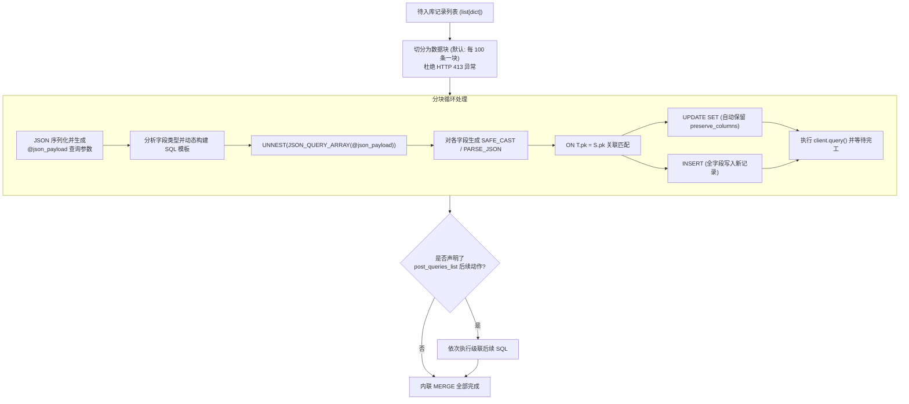

# 3.4. BigQuery 高性能内联 MERGE (Upsert) 引擎 (`merge_table_from_json_data`)

> **所属模块**: `agent_common.clients.BigQueryClient`  
> **核心方法**: `merge_table_from_json_data()`  
> **依赖组件**: `google-cloud-bigquery>=3.10.0`

---

## 1. 概述与企业级应用背景

在向现代数据仓库写入捕获变更数据 (CDC) 或最新快照记录时，为了避免脏数据重复并维持最新状态，**MERGE INTO (Upsert)** 操作不可或缺。

以往在 BigQuery 中执行 MERGE 往往面临诸多痛点：
1. **必须创建临时中间表**: 必须先将数据上传至 Staging 临时表，再执行跨表 MERGE SQL，产生显著的 IO 读写与临时表建删开销。
2. **HTTP 413 请求体与参数大小限制**: 将大批量 JSON 数据作为单个查询参数传递时，容易触发 BigQuery API 的 Payload 上限（10MB/100MB）导致任务中断。
3. **保留字与特殊字符字段名报错**: 字段名若包含 BigQuery 关键字或特殊字符，若未做转义容易导致 SQL 语法编译失败。
4. **严格的字段类型不一致校验**: 在对 JSON 数组进行 UNNEST 展开时，若未显式指定转换类型，常被 BigQuery 类型检查拦截拒绝。

`BigQueryClient.merge_table_from_json_data` 是一个无需 Staging 临时表、直接通过一条参数化 SQL 即可完成内存级 MERGE 的**高性能纯内联 MERGE 引擎**。

---

## 2. 内联 MERGE 引擎核心架构



---

## 3. 核心功能与参数说明

### 3.1. 方法签名
```python
def merge_table_from_json_data(
    self,
    json_data_any: Any,
    pk_key_str: str = "id",
    preserve_columns_list: list[str] | None = None,
    column_types_dict: dict[str, str] | None = None,
    matched_condition_str: str | None = None,
    not_matched_condition_str: str | None = None,
    post_queries_list: list[dict[str, Any]] | None = None,
    chunk_size_int: int = 100,
    timeout_int: int | None = None,
) -> None
```

### 3.2. 核心参数细节
- `json_data_any`: 待 Upsert 的单个 `dict` 或批量 `list[dict]`。
- `pk_key_str`: 用于记录关联与匹配的主键 (Primary Key) 字段名（默认: `'id'`）。
- `preserve_columns_list`: 当记录已存在触发 UPDATE 时，**禁止覆盖、必须保留数仓历史原值的字段列表**（如初次创建时间 `created_at` 等）。
- `column_types_dict`: 字段与 BigQuery SQL 显式类型映射表（如 `{"price": "NUMERIC", "meta": "JSON", "reg_dt": "TIMESTAMP"}`）。未声明的列将根据 Python 原生类型自动推导：
  - `dict`, `list` -> `PARSE_JSON(JSON_QUERY(item, '$.\"col\"'))`
  - `bool` -> `SAFE_CAST(JSON_VALUE(...) AS BOOL)`
  - `int` -> `SAFE_CAST(JSON_VALUE(...) AS INT64)`
  - `float` -> `SAFE_CAST(JSON_VALUE(...) AS FLOAT64)`
  - `str` 等 -> `JSON_VALUE(...)`
- `matched_condition_str`: 附加在 `WHEN MATCHED` 后的补充过滤条件（例如 `"AND S.updated_at > T.updated_at"`）。
- `not_matched_condition_str`: 附加在 `WHEN NOT MATCHED` 后的补充过滤条件（例如 `"AND S.is_deleted = FALSE"`）。
- `post_queries_list`: MERGE 成功后紧接着执行的一组连带 SQL 语句列表（`[{"sql": "...", "params": [...]}, ...]`）。
- `chunk_size_int`: 拆分批次条数，防止 Payload 超限（默认: `100` 条）。

---

## 4. 实战代码示例

### 4.1. 基础 Upsert（基于主键插入与更新，保护创建时间）

```python
from agent_common.clients import BigQueryClient

bq_client = BigQueryClient(
    project_id_str="my-gcp-project",
    dataset_id_str="service_db",
    table_id_str="tb_member_profile",
)

members_data_list = [
    {
        "member_id": "M001",
        "name": "张三",
        "login_count": 42,
        "is_vip": True,
        "created_at": "2026-01-01 00:00:00+09:00",
        "last_login_at": "2026-08-24 15:30:00+09:00",
    },
    {
        "member_id": "M002",
        "name": "李四",
        "login_count": 1,
        "is_vip": False,
        "created_at": "2026-08-24 15:35:00+09:00",
        "last_login_at": "2026-08-24 15:35:00+09:00",
    },
]

# created_at 为初次注册时间，更新时不予覆盖
bq_client.merge_table_from_json_data(
    json_data_any=members_data_list,
    pk_key_str="member_id",
    preserve_columns_list=["created_at"],
    chunk_size_int=100,
)
print("内联 MERGE 执行完毕")
```

### 4.2. 显式声明列类型与条件过滤 MERGE

```python
from agent_common.clients import BigQueryClient

bq_client = BigQueryClient(
    project_id_str="my-gcp-project",
    dataset_id_str="iot_lake",
    table_id_str="tb_device_telemetry",
)

telemetry_data_list = [
    {
        "device_id": "DEV-9901",
        "sensor_metrics": {"temp": 26.5, "humidity": 60},
        "event_time": "2026-08-24 16:00:00+09:00",
        "status": "NORMAL",
    }
]

bq_client.merge_table_from_json_data(
    json_data_any=telemetry_data_list,
    pk_key_str="device_id",
    column_types_dict={
        "sensor_metrics": "JSON",
        "event_time": "TIMESTAMP",
    },
    # 仅当新数据的时间戳更新时才触发覆盖更新
    matched_condition_str="AND S.event_time > T.event_time",
)
```

---

## 5. 底层生成的动态 MERGE SQL 原理解析

内部自动拼接并发送至 BigQuery 的纯参数化 SQL 架构如下：

```sql
MERGE `my-gcp-project.service_db.tb_member_profile` T
USING (
    SELECT
      JSON_VALUE(item, '$."member_id"') AS `member_id`,
      JSON_VALUE(item, '$."name"') AS `name`,
      SAFE_CAST(JSON_VALUE(item, '$."login_count"') AS INT64) AS `login_count`,
      SAFE_CAST(JSON_VALUE(item, '$."is_vip"') AS BOOL) AS `is_vip`,
      TIMESTAMP(JSON_VALUE(item, '$."created_at"')) AS `created_at`,
      TIMESTAMP(JSON_VALUE(item, '$."last_login_at"')) AS `last_login_at`
    FROM UNNEST(JSON_QUERY_ARRAY(@json_payload)) AS item
) S
ON T.`member_id` = S.`member_id`
WHEN MATCHED THEN
  UPDATE SET
    T.`name` = S.`name`,
    T.`login_count` = S.`login_count`,
    T.`is_vip` = S.`is_vip`,
    T.`last_login_at` = S.`last_login_at`
WHEN NOT MATCHED THEN
  INSERT (`member_id`, `name`, `login_count`, `is_vip`, `created_at`, `last_login_at`)
  VALUES (S.`member_id`, S.`name`, S.`login_count`, S.`is_vip`, S.`created_at`, S.`last_login_at`)
```

- 所有列名均由反引号 (`` ` ``) 保护，杜绝关键字碰撞。
- 在 `preserve_columns_list` 中指定的列（如 `created_at`）会自动从 `UPDATE SET` 中剔除，仅保留在 `INSERT` 列表中。

---

## 6. 异常排障手册

| 捕获异常 | 常见诱发原因 | 推荐解决排查步骤 |
| :--- | :--- | :--- |
| `ValueError: 지원하지 않는 JSON 데이터 포맷 구조입니다` | `json_data_any` 传入了非 dict / list 类型的非法对象 | 校验数据载荷结构 |
| `RuntimeError: db_table_merge_failed (Invalid JSON)` | JSON 中包含未转义的控制字符或损坏的编码 | 检查输入源的 UTF-8 编码与 JSON 格式合法性 |
| `RuntimeError: Type mismatch` | 自动推导类型与 BigQuery 既有物理列类型不一致 | 在 `column_types_dict` 中显式指定该字段对应的标准类型（如 `NUMERIC`, `TIMESTAMP`） |
| `RuntimeError: Payload too large (413)` | 单条数据过大或单块条数过多导致请求体超限 | 将 `chunk_size_int` 从默认 100 下调为 50 或 20 |
