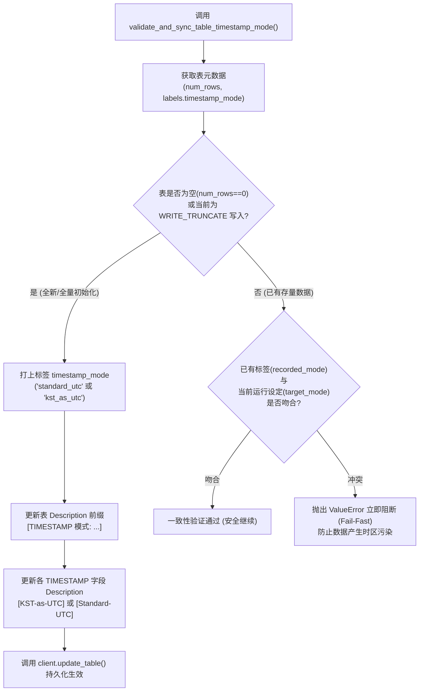

# 3.5. BigQuery 时区偏移量转换与表时区模式校验·同步

> **所属模块**: `agent_common.clients.BigQueryClient`  
> **核心方法**: `convert_to_bigquery_timestamp()`, `validate_and_sync_table_timestamp_mode()`  
> **关联配置**: `config.bigquery.timezone_offset_str`, `config.bigquery.kst_as_utc_timestamp_bool`

---

## 1. 概述与企业级应用背景

Google Cloud BigQuery 的 `TIMESTAMP` 数据类型在底层**始终以微秒级 UTC (+00:00) 统一存储**。但在实际业务与分析场景中，往往存在两种截然不同的诉求：

1. **标准 UTC 模式 (`Standard-UTC`)**:
   - 遵循全球统一时间规范，保留绝对时间点。在业务查询时通过 `DATETIME(timestamp_col, 'Asia/Shanghai')` 等函数动态转换为本地时间。
2. **本地时间直接展示模式 (`Local-as-UTC`)**:
   - 为使 BigQuery 控制台 Web 界面、Looker Studio 报表或第三方 BI 工具无需配置时区函数即可直接“裸眼”查看到当地时间数值，强制给本地时间附加 `+00:00` 偏移量进行写入的特殊模式。

若在同一张数据表内混杂写入上述两种模式的数据，将导致数小时的时间偏差，严重扭曲日终结算与指标统计。

`BigQueryClient` 提供了**将多形态源端时间字符串标准化为规范时间戳**，以及**通过元数据（标签与字段说明）对齐防冲突、不一致时立即阻断（Fail-Fast）**的严密防护机制。

---

## 2. 时区模式校验与同步架构



---

## 3. 核心方法与规范

### 3.1. 时间字符串规范化 (`convert_to_bigquery_timestamp`)
```python
def convert_to_bigquery_timestamp(
    self,
    val_any: Any,
    default_tz_offset_str: Optional[str] = None,
) -> Optional[str]
```
- **支持输入格式**:
  - `ISO 8601` (`2026-08-24T15:30:00+09:00`, `2026-08-24 15:30:00Z` 等)
  - 空格/斜杠分隔 (`2026/08/24 15:30:00`)
  - 14 位压缩时间字符串 (`20260824153000`)
  - 8 位纯日期 (`20260824` ➔ `2026-08-24 00:00:00`)
- **时区偏移优先级**:
  1. 字符串本身内嵌的偏移量 (`Z`, `+09:00`, `+08:00` 等)
  2. 函数实参 `default_tz_offset_str`
  3. 配置文件中的 `config.bigquery.timezone_offset_str`
  4. 宿主机操作系统的本地时区
- **Local-as-UTC 转换逻辑**:
  - 当 `kst_as_utc_timestamp_bool = True` 时，保留源字符串中的时间数字，直接附加 `+00:00` 偏移量返回。

### 3.2. 表时区模式校验与元数据同步 (`validate_and_sync_table_timestamp_mode`)
```python
def validate_and_sync_table_timestamp_mode(
    self,
    write_disposition_str: str = "WRITE_APPEND",
) -> None
```
- **校验逻辑**:
  1. 查询表的行数 (`num_rows`) 及标签 (`labels["timestamp_mode"]`)。
  2. **空表或覆盖写入 (`WRITE_TRUNCATE`)**: 将当前模式打上表标签，并自动同步表及各时间戳字段的注释说明。
  3. **已有数据表 (`num_rows > 0`)**: 若表上记录的模式与当前进程设定的模式冲突，立即抛出 `ValueError` 并终止运行（Fail-Fast）。

---

## 4. 实战代码示例

### 4.1. 时间规范化解析

```python
from agent_common.clients import BigQueryClient

bq_client = BigQueryClient(
    project_id_str="my-project",
    dataset_id_str="analytics",
    table_id_str="tb_events",
)

# 1) 14 位压缩字符串解析 -> "2026-08-24 15:30:00+09:00"
ts_1 = bq_client.convert_to_bigquery_timestamp("20260824153000")

# 2) 8 位纯日期解析 -> "2026-08-24 00:00:00+09:00"
ts_2 = bq_client.convert_to_bigquery_timestamp("20260824")

# 3) ISO 8601 标准解析
ts_3 = bq_client.convert_to_bigquery_timestamp("2026-08-24T15:30:00Z")

print(ts_1, ts_2, ts_3)
```

### 4.2. 批处理任务启动时校验时区一致性

```python
from agent_common.clients import BigQueryClient

bq_client = BigQueryClient(
    project_id_str="my-project",
    dataset_id_str="analytics",
    table_id_str="tb_daily_settlement",
)

# 在追加写入数据前校验表时区标签，模式冲突时直接终止，避免污染
bq_client.validate_and_sync_table_timestamp_mode(write_disposition_str="WRITE_APPEND")

# 校验通过后安全写入
bq_client.load_table_from_json_data(
    json_data_any=[{"settle_id": "S100", "settle_time": "2026-08-24 18:00:00+09:00"}],
    write_disposition_str="WRITE_APPEND",
)
```

---

## 5. 表元数据标准对应表

| 属性项 | Standard-UTC 模式 (`False`) | Local-as-UTC 模式 (`True`) |
| :--- | :--- | :--- |
| **表标签 (Label)** | `timestamp_mode: "standard_utc"` | `timestamp_mode: "kst_as_utc"` |
| **表注释 (Description)** | `[TIMESTAMP 模式: Standard-UTC] 遵循标准 UTC 时间存储的物理表。` | `[TIMESTAMP 模式: KST-as-UTC] 本地业务时间以 UTC(+00:00) 直接记录的物理表。` |
| **字段注释 (Description)** | `[Standard-UTC] 事件发生标准时间` | `[KST-as-UTC] 事件发生本地时间` |

---

## 6. 异常排障手册

| 捕获异常 | 常见诱发原因 | 推荐解决排查步骤 |
| :--- | :--- | :--- |
| `ValueError: 데이터 혼란 방지(Fail-Fast)` | 表中已存在存量数据，且该表打上的时区模式标签与当前程序的 `kst_as_utc_timestamp_bool` 冲突 | 1) 使用 `WRITE_TRUNCATE` 清空并重新初始化表，或<br/>2) 调整 `config.yml` 中的时区配置以与现有表对齐 |
| `RuntimeError: BigQuery 테이블 메타데이터 갱신 실패` | 服务账号缺少 `bigquery.tables.update` 权限 | 在 GCP IAM 界面为主账号授予 BigQuery Data Editor 权限 |
