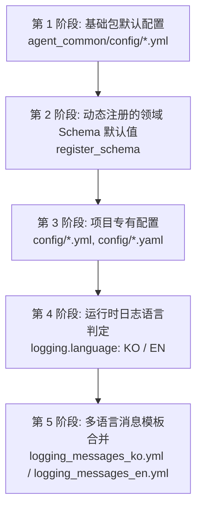

# 1.1. 分层 YAML 配置解析与深度合并 (Deep Merge)

> **所属模块**: `agent_common.config_loader.ConfigLoader`  
> **核心相关方法**: `ConfigLoader.get_settings()`, `ConfigLoader._deep_merge()`

---

## 1. 概述与设计目的

在大型分布式数据流水线与智能体（Agent）服务环境中，消除跨共享库与各个专用应用之间的重复配置至关重要。`agent_common` 提供了**分层 YAML 解析与递归深度合并（Deep Merge）**架构，能够将全公司通用标准配置与单个应用程序的专有配置灵活结合。

标准的字典 `update()` 仅替换第一层级的键，会导致下层嵌套字典（Nested Dict）完全丢失。`ConfigLoader` 采用原地递归遍历算法，相同键进行安全覆盖，新键予以保留，实现细粒度的深度合并。

---

## 2. 5 阶段分层合并优先级

调用 `ConfigLoader.get_settings()` 时，配置将按照以下 5 个阶段累积合并，后一阶段的配置会覆盖前一阶段的同名配置：



1. **第 1 阶段（基础包默认配置）**:
   - 按文件名首字母顺序加载 `agent_common/config/` 目录下的 `default_agent_common.yml`、`llmpool.yml` 等包基础默认配置。
   - 注意：`logging_messages*.yml` 文件会延迟到第 4 阶段判定语言后再行加载。
2. **第 2 阶段（动态注册的领域 Schema）**:
   - 合并上层应用在启动时通过 `ConfigLoader.register_schema()` 注册的领域默认 Schema 字典。
3. **第 3 阶段（项目专有配置覆盖）**:
   - 依次读取并合并项目根目录 `config/` 目录下的所有 `.yml` 与 `.yaml` 文件。
   - 项目级配置文件（`config.yml`）中的配置项优先覆盖包默认值。
4. **第 4 阶段（日志语言判定）**:
   - 根据环境变量（`AGENT_LOG_LANGUAGE`, `LOGGING_LANGUAGE`）、`logging.language` 配置项或运行时强制设置（`ConfigLoader.set_language()`）确定当前激活的消息语言（`KO` 或 `EN`）。
5. **第 5 阶段（消息模板字典合并）**:
   - 加载对应语言的包基础消息字典（`logging_messages_ko.yml` 或 `logging_messages_en.yml`），若项目 `config/` 目录下存在项目自定义消息文件，则执行最终覆盖。

---

## 3. 递归深度合并 (Deep Merge) 算法

`ConfigLoader._deep_merge` 的内部实现机制如下：

```python
@staticmethod
def _deep_merge(target: dict[str, Any], incoming: dict[str, Any]) -> None:
    for key, value in incoming.items():
        if isinstance(value, dict) and isinstance(target.get(key), dict):
            ConfigLoader._deep_merge(target[key], value)
        else:
            target[key] = value
```

- **两端均为字典时**：递归深入子键，逐项合并各层级属性，不破坏同级其它键。
- **任一端为标量或类型不同时**：`incoming` 的新值直接覆盖 `target` 中的旧值。
- **值为列表（List）时**：采取整块替换（Replacement）策略，避免不明确的列表追加产生隐患。

---

## 4. 实战使用示例

### 4.1. 配置文件组成

**包基础配置 (`agent_common/config/default_agent_common.yml`)**:
```yaml
ecs:
  endpoint_url: "https://storage.example.com"
  max_retries_int: 3
  timeout_int: 30

logging:
  level_str: "INFO"
  language: "KO"
```

**项目专有配置 (`config/config.yml`)**:
```yaml
ecs:
  # 保留 endpoint_url 默认值，仅重写 max_retries_int
  max_retries_int: 5

# 添加项目独有的新配置节点
transfer:
  max_workers_int: 8
```

### 4.2. Python 代码中读取

```python
from agent_common.config_loader import config

# 1) 获取融合包默认值与项目重写后的最终配置
print(config.ecs.endpoint_url)     # "https://storage.example.com" (保留包默认值)
print(config.ecs.max_retries_int)   # 5 (被项目配置成功覆盖)
print(config.ecs.timeout_int)       # 30 (保留包默认值)
print(config.transfer.max_workers_int) # 8 (成功加载项目新增配置)
```

---

## 5. 项目根目录自动探测 (`_find_project_root`)

`ConfigLoader` 无需显式传递路径参数，即可通过以下 3 重回退策略自动探测包含 `config/config.yml` 的项目根目录：

1. **当前工作目录 (CWD)**: 检索 `os.getcwd()` 及其逐级父目录。
2. **入口脚本位置**: 检索 `sys.argv[0]` 所在父目录及其上层路径。
3. **agent_common 包安装位置**: 检索本包代码安装路径的上层目录。

这保证了无论在 Airflow DAG 定时调度、单元测试执行还是本地 CLI 命令启动等各种运行上下文中，均能可靠稳定地定位并加载配置文件。
