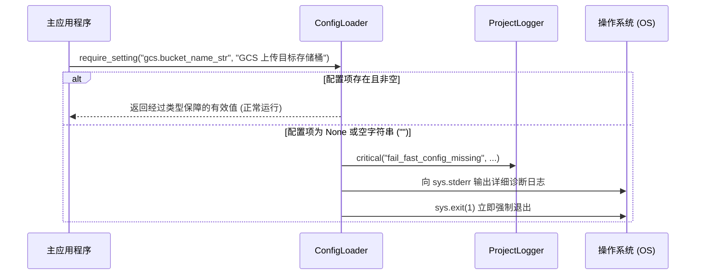

# 1.4. Fail-Fast 必选配置校验 (`require_setting`)

> **所属模块**: `agent_common.config_loader.ConfigLoader`  
> **核心方法**: `ConfigLoader.require_setting(path, message="", config_file=None)`  
> **关联准则**: `AGENTS.md` 第 1.3 条 (Fail-Fast & Program Stability)

---

## 1. 概述与原则

在分布式数据流水线或后台工作进程中，若数据库连接信息、存储桶路径、鉴权凭据等**必选配置项缺失**，程序可能在处理了数小时数据后才报错中断，甚至导致数据丢失或污染。

`ConfigLoader.require_setting()` 严格践行**“快速失败 (Fail-Fast)”**的系统架构原则。当必选配置缺失或为空时，在**程序启动阶段 (Startup Phase)** 立即终止进程 (`sys.exit(1)`) 并输出诊断日志，杜绝程序在不完整状态下带病运行。

---

## 2. 方法签名与参数说明

```python
def require_setting(
    self, 
    path: str, 
    message: str = "", 
    config_file: str | Path | None = None
) -> Any:
```

- **`path` (str, 必选)**: 点记法表示的配置项路径 (例如 `"ecs.endpoint_url"`, `"bigquery.dataset_id"`)
- **`message` (str, 可选)**: 配置缺失时展示给运维/开发人员的补充诊断说明
- **`config_file` (str | Path | None, 可选)**: 指定仅在某个特定配置文件中校验（未指定时则在所有合并后的配置中检索）
- **返回值 (`Any`)**: 校验成功的有效配置值（根据键后缀 `_int`, `_str` 等完成自动类型转换与保障）

---

## 3. 运行机制与校验流程



### 判定缺失的标准:
1. 字典中根本不存在该路径的键
2. 对应键的值为 `None`
3. 值为字符串且清除首尾空格 (`.strip()`) 后为空字符串 (`""`)

---

## 4. 诊断输出与错误日志

发生配置缺失时，控制台标准错误 (`sys.stderr`) 和结构化日志器 (`logger.critical`) 会输出单行清晰的诊断信息，涵盖：

- **缺失的配置键路径**: `path`
- **用户自定义错误说明**: `message`
- **目标配置文件及物理存在状态**: `config_file` 与 `[文件存在]` / `[文件不存在]`
- **目标文件中实际解析出的键列表**: `(已读取的文件键: ['ecs', 'logging'])`

这使得运维人员能够迅速定位是键名拼写错误、配置文件遗漏还是配置结构不匹配。

---

## 5. 实战应用示例

### 5.1. CLI 与启动入口早期校验

```python
import sys
from agent_common.config_loader import ConfigLoader

loader = ConfigLoader()

# 1. 核心基础设施连接信息校验 (缺失时立即退出)
ecs_endpoint: str = loader.require_setting(
    "ecs.endpoint_url", 
    message="Dell ECS 对象存储连接必选 Endpoint URL。"
)

bq_table: str = loader.require_setting(
    "bigquery.table_id", 
    message="数据写入的目标 BigQuery 表 ID。"
)

# 2. 结合类型后缀自动保障
max_retry: int = loader.require_setting(
    "transfer.max_retries_int",
    message="数据传输失败时的最大重试次数。"
)

print(f"所有必选配置校验通过: ECS={ecs_endpoint}, BQ={bq_table}, Retry={max_retry}")
```

### 5.2. 指定专用配置文件校验

除了项目全局合并配置外，亦可直接校验特定的独立规则文件（如 `table_rules.yml`）：

```python
# 校验 table_rules.yml 中是否定义了主键列表 pk_columns_list
pk_cols: list = loader.require_setting(
    "schema.pk_columns_list",
    message="用于执行 Upsert 逻辑的主键 (Primary Key) 列表未定义。",
    config_file="config/table_rules.yml"
)
```

---

## 6. 与 AGENTS.md 规范的一致性

- **规则 1.3.1**: 必选配置缺失时严禁在代码中私自降级为硬编码常量，必须立即 Fail-Fast 终止。
- **规则 1.3.2**: 必须在程序启动初期（Startup Phase）完成所有必要配置校验，防止在处理海量数据的核心循环中途发生异常中断。
