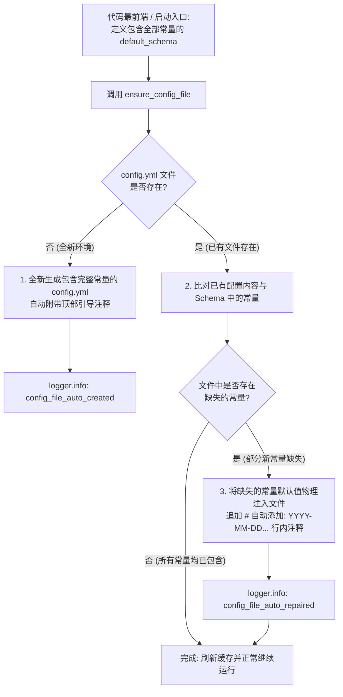

# 1.6. 全部常量的配置文件化与模板自动补全 (`ensure_config_file`)

> **所属模块**: `agent_common.config_loader.ConfigLoader`  
> **核心方法**: `ConfigLoader.ensure_config_file()`, `ConfigLoader.register_schema()`  
> **关联准则**: `AGENTS.md` 第 1.1 条 (No Hardcoding & 配置与密钥分离原则)

---

## 1. 核心设计哲学: 为何需要该功能？

> **“‘自愈 (Self-healing)’ 只是其运行表现，其核心本质与首要目标是：‘将代码中隐藏的所有常量全部配置文件化（外部化）与透明呈现’。”**

在许多项目中，开发者习惯将默认常量（如超时时间、批处理行数、重试次数、并发数等）硬编码散落在源码各处，当配置文件未显式提供时，便在代码内部悄悄读取默认值 (fallback)。  
然而，这种做法会导致严重的维护与可控性问题：

- **配置项黑盒化**: 除非运维或下游开发人员逐行翻阅源码，否则根本无法知晓**“该程序到底存在哪些可调优的常量”**，以及**“默认究竟设置了多少秒、多少条”**。
- **违背零硬编码原则**: 如 `AGENTS.md` 第 1.1 条 (No Hardcoding) 所明确规范，控制系统运行行为的所有常量与参数必须彻底外部化至配置文件中。

### 本功能的核心目标与实现逻辑

1. **所有常量的配置文件化 (核心目标)**:
   - 将深埋在代码内部的所有常量强制外部化至配置文件（`config.yml`），向运维和开发人员 100% 透明呈现。
2. **在代码最顶层/最前端声明 Schema**:
   - 为了使全部常量能够配置文件化，在**代码最顶层与启动入口 (Entry Point)** 处统一定义包含系统所需全部常量及初始默认值的**配置 Schema (`default_schema`)**。
3. **强制注入常量值 (所谓“自愈”，实质即“常量的强制物理注入”)**:
   - 当配置文件缺失某项配置时，不再在代码底层悄悄进行静默回退 (Silent Fallback)，而是将缺失常量的默认值**物理强制写入配置文件中**。
   - 通过强制将常量补全至文件中，运维与开发人员只需打开生成或补齐后的配置文件，便能一目了然地获悉**“系统存在哪些常量、当前值是多少”**，并可直接原地修改调优。

> [!CAUTION]
> ### ⚠️ 关键红线: 若在代码中间另行定义常量，本功能将彻底丧失意义！
> `ensure_config_file()` 存在的唯一理由是**“将代码中的所有常量汇集至启动入口 Schema 中，并强制暴露在配置文件内”**。  
> 若在使用本功能的同时，仍出现以下编码方式，**本功能的价值将完全归零**：
> 
> - **在函数内部、类内部或代码中途硬编码私有常量**
> - **未在 `default_schema` 中注册，而是在其它模块中分散定义独立常量**
> 
> 未在 Schema 中注册的常量无法被 `ensure_config_file()` 感知，因而不会自动写入 `config.yml`，**它们依然是被深埋在源码中的“黑盒常量”**。  
> 因此，必须严格遵循单一真实源 (Single Source of Truth) 原则：**“所有常量只能在启动入口的 `default_schema` 单一位置声明，业务逻辑代码内部只允许通过全局 `config` 对象访问”**。

---

## 2. 方法签名与参数说明

```python
def ensure_config_file(
    self, 
    config_file_name: str = "config.yml", 
    default_schema: Optional[dict[str, Any]] = None
) -> Path:
```

- **`config_file_name` (str)**: 待校验、注入并补全常量的目标配置文件名（默认值: `"config.yml"`）
- **`default_schema` (dict | None)**: 启动入口处定义的默认常量 Schema 字典（若未指定，则使用通过 `register_schema` 注册的 Schema）
- **返回值 (`Path`)**: 常量已完整写入并补全的目标配置文件绝对路径 `Path` 对象

---

## 3. 常量物理注入与配置补全流程



### 3.1. 情况 1: 文件完全不存在时（全新自动创建并写入完整常量）
- 目标 `config/` 目录若不存在则自动递归创建。
- 生成包含 Schema 中所有常量及引导注释的全新 `config.yml`。
- 用户可直接打开该文件查看所有常量配置并根据需要修改。

### 3.2. 情况 2: 文件已存在但缺少新常量时（强制补全并添加时间戳注释）
- 100% 完整保留用户既有配置值与历史注释。
- 探测未包含在当前文件中的新增/缺失常量，将其默认值**物理追加写入**文件中。
- 在补全的代码行末自动标注形如 `# [自动添加: 2026-09-04 14:30:00+09:00]` 的**行内时间戳注释**，方便运维人员快速察觉配置变更。

---

## 4. 实战使用示例

### 4.1. 应用程序启动入口 (Entry Point) 编写范式

```python
from agent_common.config_loader import ConfigLoader

loader = ConfigLoader()

# ==============================================================================
# [核心准则] 在代码最前端/启动入口处将系统所有常量汇聚为 Schema
# 杜绝源码内部硬编码，显式声明需在配置文件中透明公开的全部常量。
# ==============================================================================
APP_DEFAULT_SCHEMA_DICT = {
    "transfer": {
        "max_workers_int": 4,          # 并发传输 Worker 数常量
        "batch_size_int": 500,         # 单批次处理行数常量
        "timeout_seconds_int": 30,     # 网络超时秒数常量
        "enable_metrics_bool": True    # 是否采集指标
    },
    "logging": {
        "level_str": "INFO",           # 基础日志级别常量
        "language_str": "KO"           # 日志输出语言常量
    }
}

# 1. 注册 Schema (作为运行时底座常驻)
loader.register_schema(APP_DEFAULT_SCHEMA_DICT)

# 2. 执行常量配置文件化 (若 config.yml 缺失任何常量，将自动物理写入补全)
config_path = loader.ensure_config_file("config.yml", default_schema=APP_DEFAULT_SCHEMA_DICT)
print(f"配置文件已自动校验并补齐: {config_path}")
```

### 4.2. 多服务协同环境中的常量共享与 Schema 组合模式 (`app_schema.py`)

在微服务与分布式数据管道中，往往由**共享底层数据库与存储基础设施的多个独立执行程序（Web API 服务、定时批处理 Worker、流式消费程序等）**协同构成：

> 典型多程序架构组成：
> 1. `api_server.py`: 处理用户实时请求的 Web API 服务
> 2. `batch_worker.py`: 定期采集与清洗大批量数据的后台批处理 Worker
> 3. `stream_consumer.py`: 消费 Kafka 等消息队列事件的流式消费者

此时数据库连接信息 (`database`)、存储桶基础路径 (`storage`)、通用日志输出 (`logging`) 等系统级常量需要在各程序间**完全一致地共享**；而端口号 (`port_int`)、批处理条数 (`batch_size_int`)、缓冲上限 (`buffer_limit_int`) 等则为**各自特有常量**。

通过**专用 Schema 模块 (`app/app_schema.py`) 的组合 (Composition) 模式**，可以完美实现常量的集中管理与去重：

#### 1) 集中声明公共及专属 Schema (`app/app_schema.py`)

```python
# app/app_schema.py
"""
应用程序公共及各子服务默认配置 Schema 集中声明模块。
"""

from typing import Any, Dict


# ==============================================================================
# 1. 公共基础配置块声明 (严格遵循 DRY 原则)
# ==============================================================================
_BASE_DATABASE_SCHEMA: Dict[str, Any] = {
    "host_str": "127.0.0.1",
    "port_int": 5432,
    "pool_size_int": 10,
    "timeout_seconds_int": 30,
    "auto_reconnect_bool": True,
}

_BASE_STORAGE_SCHEMA: Dict[str, Any] = {
    "base_path_str": "/var/data/app",
    "temp_dir_str": "temp",
    "chunk_size_int": 1048576,  # 1MB
    "max_retries_int": 3,
}

_BASE_LOGGING_SCHEMA: Dict[str, Any] = {
    "language": "KO",
    "file_logging": False,
    "level": {
        "api": "INFO",
        "batch": "WARNING",
        "consumer": "INFO",
    },
}


# ==============================================================================
# 2. 各程序专属 Schema (继承公共基底 + 专属节点覆盖)
# ==============================================================================

# 服务 1: Web API 服务
API_SERVER_SCHEMA: Dict[str, Any] = {
    "database": _BASE_DATABASE_SCHEMA,
    "server": {
        "port_int": 8080,
        "max_connections_int": 500,
        "enable_cors_bool": True,
    },
    "logging": _BASE_LOGGING_SCHEMA,
}

# 服务 2: 后台批处理 Worker
BATCH_WORKER_SCHEMA: Dict[str, Any] = {
    "database": _BASE_DATABASE_SCHEMA,
    "storage": _BASE_STORAGE_SCHEMA,
    "batch": {
        "batch_size_int": 500,
        "max_workers_int": 4,
        "cron_schedule_str": "0 2 * * *",
    },
    "logging": _BASE_LOGGING_SCHEMA,
}

# 服务 3: 消息流消费者
STREAM_CONSUMER_SCHEMA: Dict[str, Any] = {
    "database": _BASE_DATABASE_SCHEMA,
    "storage": _BASE_STORAGE_SCHEMA,
    "consumer": {
        "group_id_str": "events-consumer-group",
        "buffer_limit_int": 100,
        "flush_interval_seconds_int": 5,
    },
    "logging": _BASE_LOGGING_SCHEMA,
}
```

#### 2) 在各独立入口中引入与应用

```python
# bin/run_api_server.py
from agent_common.config_loader import ConfigLoader, config
from app.app_schema import API_SERVER_SCHEMA

loader = ConfigLoader()
loader.register_schema(API_SERVER_SCHEMA)
loader.ensure_config_file("config.yml", default_schema=API_SERVER_SCHEMA)

port = config.server.port_int
db_host = config.database.host_str
```

```python
# bin/run_batch_worker.py
from agent_common.config_loader import ConfigLoader, config
from app.app_schema import BATCH_WORKER_SCHEMA

loader = ConfigLoader()
loader.register_schema(BATCH_WORKER_SCHEMA)
loader.ensure_config_file("config.yml", default_schema=BATCH_WORKER_SCHEMA)

batch_size = config.batch.batch_size_int
max_workers = config.batch.max_workers_int
```

#### 3) 多服务 Schema 组合的核心收益
- **渐进式无损自愈补齐 (Progressive Reconciliation)**:  
  先启动 `run_api_server.py` 时，会在 `config.yml` 中生成 `database` 与 `server` 节点；随后启动 `run_batch_worker.py` 时，既有配置完全保留，缺失的 `storage` 与 `batch` 节点会被**物理补写进同一个文件**。
- **杜绝常量散乱重复 (DRY)**: 数据库连接端口、超时时间等系统级常量在 `app_schema.py` 统一定义，调优底座参数无需排查多个脚本。
- **单配置文件 (`config.yml`) 和谐共存**: 统一通过单一配置文件集中管控整个系统簇。

---

### 4.3. 补全后的文件呈现 (`config/config.yml`)

若用户原本仅手动配置了 `max_workers_int: 8`，执行启动后缺失的常量会被**自动强制补全**：

```yaml
transfer:
  max_workers_int: 8
  batch_size_int: 500  # [自动添加: 2026-09-04 14:35:10+09:00]
  timeout_seconds_int: 30  # [自动添加: 2026-09-04 14:35:10+09:00]
  enable_metrics_bool: true  # [自动添加: 2026-09-04 14:35:10+09:00]
logging:
  level_str: "INFO"  # [自动添加: 2026-09-04 14:35:10+09:00]
  language: "KO"  # [自动添加: 2026-09-04 14:35:10+09:00]
```

### 4.4. ⚠️ 反模式对比：在代码中途私自定义常量

```python
# ==============================================================================
# ❌ [致命反模式] 使用了 ensure_config_file 却依然在业务代码深处硬编码常量
# ==============================================================================
def process_batches():
    # 未在 Schema 中登记，直接在函数内部硬编码：
    # 无法被写入 config.yml，运维人员完全无法在配置文件中调优！
    DEFAULT_TIMEOUT_SECONDS = 60    # ❌ 依然是深藏在代码里的黑盒常量！
    MAX_BATCH_ROWS = 1000           # ❌ 运维无法在配置中进行调优！
    ...


# ==============================================================================
# ⭕ [标准规范] 所有常量汇聚至入口 Schema，业务逻辑中仅通过 config 读取
# ==============================================================================
# 1) 在入口处 (如 app_schema.py) 统一定义并注册
APP_DEFAULT_SCHEMA = {
    "transfer": {
        "timeout_seconds_int": 60,  # ⭕ 单一真实源声明
        "batch_rows_int": 1000,     # ⭕ 缺失时自动补全进 config.yml
    }
}
loader.ensure_config_file("config.yml", default_schema=APP_DEFAULT_SCHEMA)

# 2) 在业务逻辑（函数/类）中只读取 config 属性
def process_batches():
    timeout = config.transfer.timeout_seconds_int  # ⭕ 与 config.yml 实时同步
    batch_rows = config.transfer.batch_rows_int    # ⭕ 无需修改代码，通过配置文件直接调优
    ...
```

---

## 5. 架构意义与预期收益

1. **彻底消除硬编码**: 将散落在代码各处的魔数 (Magic Number) 彻底消除，统一收拢至配置文件单一入口。
2. **极大提升配置能见度 (Visibility)**: 运维与开发人员无需检索代码，打开 `config.yml` 即可获知所有可调节常量及默认值。
3. **杜绝静默回退 (Silent Fallback)**: 缺失配置时不再私自静默降级，而是显式写入文件，保证配置与运行时逻辑的高度一致。
4. **自动化版本平滑迁移**: 系统升级新增配置常量时，无缝自动写入存量环境的 `config.yml`，避免人工迁移的失误。
5. **单一真实源 (Single Source of Truth)**: 确立“Schema 统管初始声明，`config.yml` 统管持久化配置”的规范治理架构。
