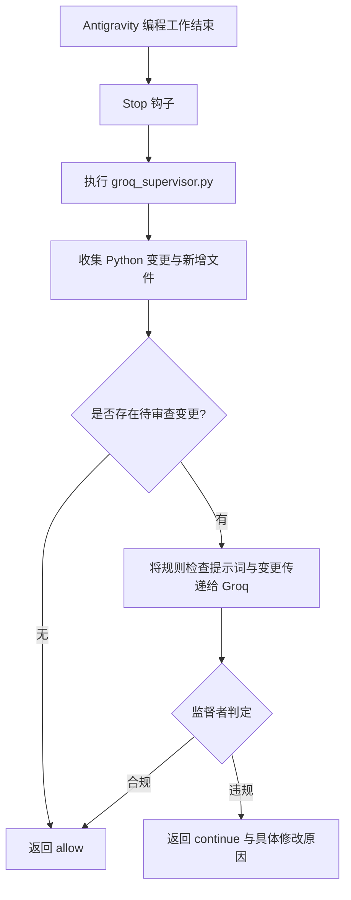

# 7.6. Groq 监督者 AI 与 Antigravity Stop 钩子

[LLM 手册总览](01_unified_llm_client_zh.md)

> 配置准备与基础调用请首先参阅 [7.1 模型配置管理与文本生成](01_model_profiles_and_generation_zh.md)。

## 1. 应用案例：审查编程 AI 的 Groq 监督者 AI

### 实际使用目的与对接架构

在 Antigravity 中，通过独立的监督者 AI 来审查编程 AI 编写的代码失误及对 `AGENTS.md` 规则的违反情况。当编程 AI 完成工作时，将 Python 变更内容传递给 Groq 的 `openai/gpt-oss-120b` 模型；如果符合规则则放行（allow），存在违规时则返回具体的修改原因。这种方式分离了生成模型与审查模型的职责，且不依赖于生成模型的具体类型。

所引用的工作区文件为 `.agents/hooks.json` 与 `scripts/groq_supervisor.py`。这些文件属于使用者项目的特定配置，并非安装 `agent-common` 时自带的文件。当前的监督脚本使用 `urllib.request` 直接调用 Groq API，并未直接使用 `LlmClient`。以下将区分实际案例与使用通用客户端实现时的适用范围。



### 项目的 Stop 钩子配置示例

使用中的 `.agents/hooks.json` 配置如下所示。`venv313` 与 `scripts/groq_supervisor.py` 路径是针对本项目的部署结构配置的。在其他项目中，需要根据对应的虚拟环境、脚本位置及钩子的工作目录进行相应调整。此示例仅为该项目的配置，并不意味着所有编辑器都支持相同的钩子格式。

```json
{
  "groq-agents-supervisor": {
    "enabled": true,
    "Stop": [
      {
        "type": "command",
        "command": "cmd /c \"if exist .\\venv313\\Scripts\\python.exe ( .\\venv313\\Scripts\\python.exe scripts\\groq_supervisor.py ) else ( cd .. && .\\venv313\\Scripts\\python.exe scripts\\groq_supervisor.py )\"",
        "timeout": 60
      }
    ]
  }
}
```

### 监督者检查的核心内容

当前脚本通过 `git diff HEAD -- *.py` 获取受跟踪的 Python 变更，并补充未跟踪的 Python 文件内容。因此，输入不仅限于当前轮次的变更，而是涵盖 **HEAD 之后尚未提交的所有变更**。在收集新增文件时，会排除监督脚本本身。

系统提示词中包含从 `AGENTS.md` 整理出的以下审查要点：

- 变量、参数、日志键名的强制类型后缀
- 新增 Python 文件的标准文件头与模块说明
- 类与函数的 docstring 以及参数、返回值、异常说明
- 严禁使用 `print()`，统一使用通用日志记录器
- 配置值、路径、URL、认证信息的硬编码检查
- 嵌套函数的使用检查
- HTTP 调用中优先使用标准库

为了避免将局部 diff 中未显示的已有文件头误判为缺失，同时避免误报官方特殊变量、合法的对象引用与默认配置 schema，提示词中也包含了例外判定基准。目前的实现方式并非每次读取 `AGENTS.md` 原文，而是采用**代码中硬编码的核心规则提示词**。当规则发生变更时，需要同步更新该提示词。

### 返回结果与实际检查范围

```json
{"decision": "allow", "reason": "AGENTS.md 规则验证通过"}
```

```json
{"decision": "continue", "reason": "修改的文件中函数参数缺失类型后缀。请修正该参数及所有调用点。"}
```

`continue` 表示发出修改请求的判定，脚本本身不会直接修改文件。判定 JSON 输出到钩子的 stdout 中。这是独立于一般运行日志的钩子结果传递通道。

当前脚本在缺失 API Key、通信失败或响应解析失败时，也会返回 `allow` 并附带跳过检查的原因。因此，不能仅凭 `allow` 就断定实际通过了审查，还必须确认 `reason` 内容。输入消息若超过 4,000 字符会被截断，因此可能无法完整审查超大规模的变更。Markdown、YAML 等非 Python 文件也不在检查范围内。

对于部分 API 错误，脚本会尝试使用其他外部候选模型进行重试。这是监督脚本单独实现的逻辑，不同于 `LlmClient` 的 `auto` 模式。钩子的超时时间为 60 秒，单次 API 调用的限制也是 60 秒，因此无法保证多次模型重试能在钩子超时时间内完成。

### 使用 `agent_common.llm` 实现时

若要重新构建相同的监督器，可按以下职责拆分：**收集变更 → 组装规则提示词 → 调用 `LlmClient.generate()` → 校验判定 JSON → 返回钩子结果**。包中内置的 `groq_gpt_oss` 配置指定了 Groq API、`GROQ_API_KEY` 与 `openai/gpt-oss-120b`。可以通过使用者项目的配置对该 profile 进行调整。

```yaml
llm:
  router_model_str: groq_gpt_oss

supervisor:
  purpose_str: router
```

以下是监督器中负责调用 LLM 的核心代码片段。`review_prompt_str` 与 `review_system_prompt_str` 是由前序步骤从代码变更与规则组装出的字符串。

```python
from agent_common.config_loader import config
from agent_common.llm import LlmClient

supervisor_client_obj = LlmClient(purpose_str=config.supervisor.purpose_str)
review_response_str = supervisor_client_obj.generate(
    prompt_str=review_prompt_str,
    system_prompt_str=review_system_prompt_str,
)
```

`LlmClient` 返回的是普通字符串。目前的客户端不具备监督脚本中的 `response_format: {"type": "json_object"}` 选项或外部候选模型轮询重试功能。由于仅依靠提示词指示无法百分之百保证 JSON 格式，调用方应用程序必须自行进行 JSON 解析，并对 `decision` 与 `reason` 的类型及合法取值进行严格校验。对于 `None`、非法 JSON 或 API 失败，是视为放行还是重新审查，也需要显式定义策略。

建议首先使用单个模型验证单条小型 diff 的判定结果，然后再逐步扩展对接钩子、接入完整规则、处理大型变更分片及重试机制。切勿假定直接替换现有监督脚本的调用代码就能获得完全一致的运行行为。现有脚本中的证书验证禁用配置也不是 `LlmClient` 所提供的功能。

## 2. 向 AI 发起开发请求的 Prompt 示例

```text
请帮我构建一个 Groq 监督者 AI，用于检查编程 AI 提交的 Python 变更是否符合 AGENTS.md 规范。
https://pypi.org/project/agent-common/
https://github.com/kampores/agent_common

请参考 README 7.1, 7.2, 7.5, 7.6 及各章节的详细手册。
请参考本手册中的 Antigravity Stop 钩子应用案例。
首先基于单个 Groq 模型实现最小可行功能：传递小型 diff 与规则，并获取判定结果响应。
查阅详细手册与实际 API 调用方式，若有遗漏的需求请先提问确认。
对判定 JSON 的 decision 与 reason 进行校验，并事先明确审查失败时的处理策略。
验证最小功能无误后，再分阶段接入 Stop 钩子并扩展必要的附加能力。
```
