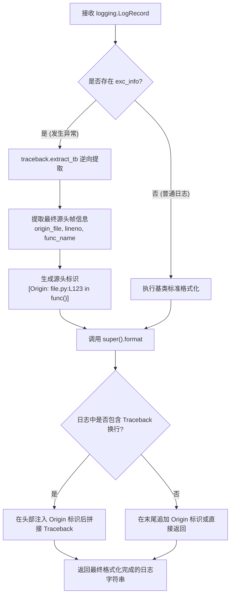

# 2.1. 单行扁平化格式化器与异常源头追踪 (`SingleLineFlattenFormatter`)

> **所属模块**: `agent_common.logger.SingleLineFlattenFormatter`  
> **基类**: `logging.Formatter`  
> **核心方法**: `SingleLineFlattenFormatter.format(record)`, `SingleLineFlattenFormatter.flatten_to_single_line(text)`

---

## 1. 概述与企业级应用背景

在云原生、Kubernetes (K8s) 以及分布式数据管道（Airflow、Kafka、Spark 等）环境中，系统通常借助 **Logstash**、**Fluentd**、**AWS CloudWatch**、**GCP Cloud Logging** 等集中式日志收集器对海量容器与主机的日志进行归集。

绝大部分日志收集代理依据标准输出 (stdout) 或日志文件中的**换行符 (`\n`) 切分独立的日志记录**。当 Python 程序抛出包含多行堆栈追踪 (Traceback) 的异常时，会引发一系列严重问题：

1. **日志碎片化 (Log Fragmentation)**: 单个异常堆栈被硬生生切分为数十条毫无关联的零散日志行，使得日志检索、统计分析与报警规则完全失效。
2. **根因定位滞后**: 抛出异常的真实业务代码文件名与行号 (`Origin`) 深埋在数十行堆栈追踪末尾，延误快速排障响应。
3. **集中存储索引成本飙升**: 被切碎的每一行均被附加独立的时间戳与采集元数据，造成存储空间与检索索引成本激增。

`SingleLineFlattenFormatter` 正是为打破分布式日志收集限制而设计的专用定制格式化器。

---

## 2. 核心架构与运行机制



### 关键处理步骤:

1. **异常源头定位 (Origin) 逆向提取与标记**:
   - 当 `record.exc_info` 存在时，通过 `traceback.extract_tb()` 提取调用栈的最深一帧（即触发实际异常的文件名、行号与函数名）。
   - 将其组织为形如 `[Origin: {origin_file}:L{lineno} in {func_name}()]` 的高可读性前缀，紧跟在日志主消息或首行头部。
2. **多行结构完整保留与安全拼接**:
   - 兼顾日志的可读性与规范性，确保日志监控与检索系统即便只截取首行预览，也能即时获知异常发生的精准代码行。
3. **提供单行扁平化工具**:
   - 提供 `flatten_to_single_line(text)` 工具方法，按需将文本中的换行符 (`\n`, `\r`) 替换为空格，生成严格的单行字符流。

---

## 3. 核心实现代码剖析

```python
class SingleLineFlattenFormatter(logging.Formatter):
    """
    负责对日志记录及异常堆栈追踪 (Traceback) 进行规范化格式化的公共日志格式化器。
    （兼顾支持多行日志采集器环境，保留异常堆栈的完整层级。）
    """

    def flatten_to_single_line(self, text: str) -> str:
        """将文本内部的换行符 (\n, \r) 替换为空格（保留向后兼容性）。"""
        return text.replace("\n", " ").replace("\r", " ")

    def format(self, record: logging.LogRecord) -> str:
        # 0. 提取异常 (Traceback) 触发源头定位 ([Origin: filename:Llineno in funcName()])
        origin_prefix = ""
        if record.exc_info and len(record.exc_info) >= 3 and record.exc_info[2]:
            try:
                import traceback
                tb_list = traceback.extract_tb(record.exc_info[2])
                if tb_list:
                    last_frame = tb_list[-1]
                    origin_file = Path(last_frame.filename).name
                    origin_prefix = f"[Origin: {origin_file}:L{last_frame.lineno} in {last_frame.name}()] "
            except Exception:
                pass

        # 1. 调用父类基线格式化（保留多行及堆栈原本结构）
        s = super().format(record)

        # 2. 将 Origin 源头信息前置合并到主行
        if origin_prefix:
            if "\nTraceback" in s:
                head, tail = s.split("\nTraceback", 1)
                s = f"{head} {origin_prefix}\nTraceback{tail}"
            elif "\n" in s:
                head, tail = s.split("\n", 1)
                s = f"{head} {origin_prefix}\n{tail}"
            else:
                s = f"{s} {origin_prefix}"

        return s
```

---

## 4. 实战使用示例

### 4.1. 手动绑定至 Handler 使用

```python
import logging
from agent_common.logger import SingleLineFlattenFormatter

# 1. 创建格式化器实例 (配置日志模板与日期格式)
log_format = "[%(asctime)s][%(levelname)s][%(filename)s:%(lineno)d %(funcName)s()] %(message)s"
date_fmt = "%Y-%m-%d %H:%M:%S"
formatter = SingleLineFlattenFormatter(fmt=log_format, datefmt=date_fmt)

# 2. 创建 StreamHandler 并装配格式化器
console_handler = logging.StreamHandler()
console_handler.setFormatter(formatter)

# 3. 注册到 Logger
logger = logging.getLogger("MyService")
logger.setLevel(logging.INFO)
logger.addHandler(console_handler)

# 4. 触发异常测试
def process_data(data_dict: dict) -> None:
    try:
        val = data_dict["missing_key"]
    except KeyError as e:
        logger.exception("数据处理过程捕获异常")

process_data({})
```

**输出示例**:
```text
[2026-09-04 22:30:00][ERROR][data_service.py:45 process_data()] 数据处理过程捕获异常 [Origin: data_service.py:43 in process_data()] 
Traceback (most recent call last):
  File "data_service.py", line 43, in process_data
    val = data_dict["missing_key"]
KeyError: 'missing_key'
```

> 💡 **核心优势**: 日志首行直接显式标出 `[Origin: data_service.py:43 in process_data()]`，在 Kibana、Datadog 等大盘的首行概览中无需展开堆栈即可直接定位出错源头。

---

## 5. 运维最佳实践

1. **推荐使用 `ProjectLogger.configure()` 集中装配**:
   - 相比手动组装 Handler 与 Formatter，直接使用 `ProjectLogger.configure()` 能够自动联动 `config.yml` 中的 `logging.format` 与 `logging.datefmt`，保持全局统一。
2. **配合 JSON 集中日志采集**:
   - 在严格要求单行 JSON 输入的 ELK/Loki 场景中，可通过 `formatter.flatten_to_single_line()` 消除换行，或在 Fluentd 收集端开启 multiline 解析规则。
