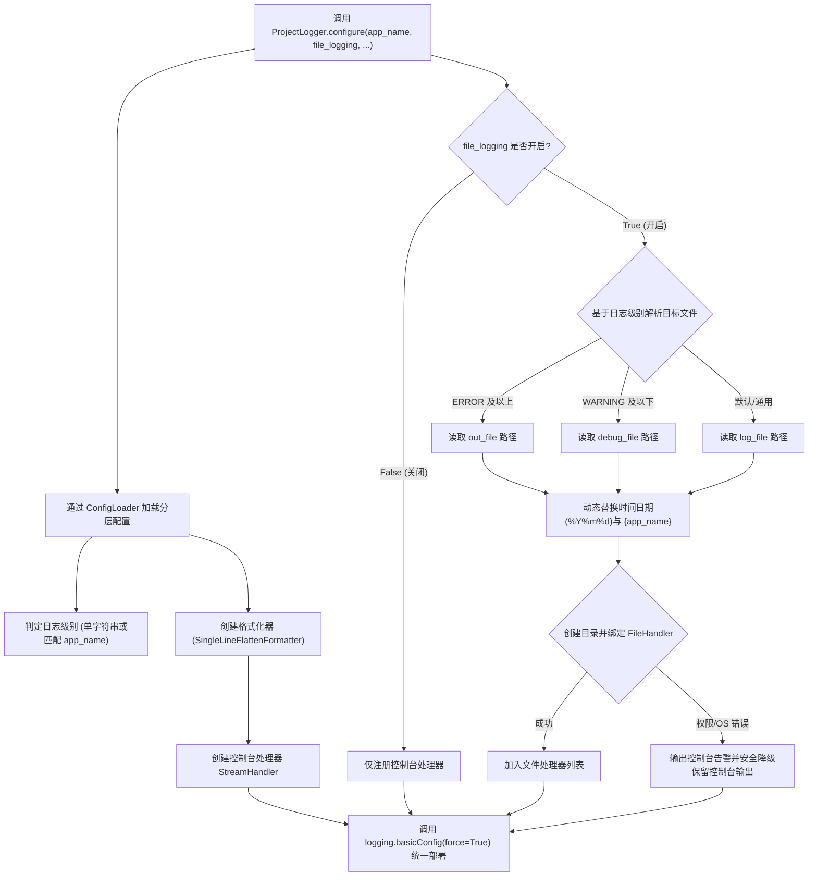

# 2.2. 日志环境集中配置与处理器管控 (`ProjectLogger.configure`)

> **所属模块**: `agent_common.logger.ProjectLogger`  
> **核心方法**: `ProjectLogger.configure(config_dir=None, default_log_file_str="logs/app.log", app_name_str=None, file_logging_bool=None)`

---

## 1. 概述与企业级应用背景

Python 原生 `logging` 模块在分布式服务及企业级环境中直接使用时存在诸多痛点：

1. **重复注册处理器导致日志多倍输出**: 多个业务模块随意调用 `addHandler()`，导致同一条日志在控制台或文件中被重复打印 2 次甚至 3 次。
2. **控制台与文件配置割裂碎片化**: 本地开发环境需要控制台高亮输出，而在生产运维环境（批处理容器、K8s Pod、Airflow Worker）则需按需开关文件落地或将标准输出交给日志采集器。
3. **第三方库产生大量 DEBUG 日志干扰**: `urllib3`、`httpx`、`botocore` 等底层外部包动辄抛出海量 DEBUG 噪音，掩盖真实核心业务异常。
4. **日志目录权限缺失引发进程崩溃**: 容器挂载或多租户共享文件系统中若缺少日志目录写权限，易导致整个应用程序因 IO 错误异常中断退出。

`ProjectLogger.configure()` 是一个专为解决上述痛点而设计的**全局标准化日志工厂（Factory）方法**，仅需一次调用即可统一纳管全局日志系统。

---

## 2. 核心架构与运行流程



---

## 3. 核心功能与详细机制

### 3.1. 基于应用名称 (`app_name`) 动态分发日志级别
在 `config.yml` 的 `logging.level` 节点下，除了使用单一字符串（如 `"INFO"`）外，亦可声明细分字典，实现依据脚本名或 `app_name` 自动装配差异化日志级别：

```yaml
logging:
  level:
    default: "INFO"
    migration_worker: "DEBUG"
    api_gateway: "WARNING"
```

### 3.2. 基于日志级别的目录自动路由与隔离（基于 `{log_level}` 统一 `log_file`）

`ProjectLogger.configure()` 摒弃了容易引起混淆的多元化路径配置（`out_file` vs `debug_file`），转而通过统一标准的 `logging.log_file` 路径模板，支持 **`{log_level}`（小写）或 `{LOG_LEVEL}`（大写）** 动态占位符，实现按运行级别自动创建子目录并隔离落盘：

- **日志级别目录自动生成 (`{log_level}`)**:
  - 若 `logging.level` 为 `WARNING`，日志自动落盘至 `logs/pipeline/2026/09/08/warning/` 目录。
  - 若 `logging.level` 为 `ERROR`，日志自动落盘至 `logs/pipeline/2026/09/08/error/` 目录。
- **向后兼容回退保证**:
  - 若旧版配置中未声明 `log_file`，仍会自动兼容旧版的 `out_file` 与 `debug_file` 条件路由。

#### 企业级数据流水线实战配置范例:
```yaml
logging:
  level:
    data_extractor: "WARNING"
    stream_processor: "WARNING"
    db_loader: "ERROR"
    
  # 利用 {log_level} 占位符实现的统一定制文件落盘路径
  log_file: "logs/pipeline/%Y/%m/%d/{log_level}/{app_name}_out_%Y%m%dT%H%M%S.log"
```

### 3.3. 动态时间格式化与父级目录自动递归创建

在 `log_file` 路径中支持融合多种动态解析标签：

1. **`{app_name}` 标签**: 自动替换为传入的应用名称或主脚本文件名。
2. **`{log_level}` / `{LOG_LEVEL}` 标签**: 自动替换为当前进程的日志级别（如 `warning`, `error`）。
3. **`%Y/%m/%d` 格式化符号**: 自动通过 `datetime.now().strftime(...)` 解析多层年月日目录。
4. **`%Y%m%dT%H%M%S` ISO 压缩时间戳**: 为每次执行附加唯一起始时间戳，防止同日多次执行日志覆盖。
5. **父目录自动建立 (`mkdir(parents=True, exist_ok=True)`)**: 即使宿主机物理目录不存在，也能安全创建。

#### 实际解析路径示例:
```text
[配置模板]
log_file: "logs/pipeline/%Y/%m/%d/{log_level}/{app_name}_out_%Y%m%dT%H%M%S.log"

[运行时调用入参]
ProjectLogger.configure(app_name_str="data_extractor", file_logging_bool=True)
启动时刻: 2026-09-08 18:30:00

[最终解析生成的落盘路径]
logs/pipeline/2026/09/08/warning/data_extractor_out_20260908T183000.log
```

### 3.4. 优雅降级 (Graceful Degradation)
当容器挂载目录因文件权限 (`PermissionError`) 或磁盘挂载异常 (`OSError`) 无法写入文件时，程序绝不异常崩溃，而是向 `sys.stderr` 打印告警后**自动平滑降级至仅控制台输出模式**，确保数据任务继续执行。

---

## 4. 配置文件示例 (`config/config.yml`)

```yaml
logging:
  # 日志级别配置
  level:
    data_extractor: "WARNING"
    stream_processor: "WARNING"
    db_loader: "WARNING"
    default: "INFO"
  
  # 日志消息模板语言 (KO: 韩语, EN: 英语)
  language: "KO"
  
  # 日志格式与时间显示 (name: 程序名, caller: 调用类.方法() 或普通函数)
  format: "[%(asctime)s][%(levelname)s][%(name)s][%(filename)s:%(lineno)d %(caller)s] %(message)s"
  datefmt: "%Y-%m-%d %H:%M:%S"
  
  # 是否开启文件日志 (True: 控制台+文件, False: 仅控制台)
  file_logging: true
  
  # 统一标准日志文件路径
  log_file: "logs/pipeline/out/%Y/%m/%d/{log_level}/{app_name}_out_%Y%m%dT%H%M%S.log"
```

---

## 5. 实战代码编写规范

### 5.1. 标准入口初始化规范

```python
import sys
from agent_common.logger import ProjectLogger

def main():
    # 1. 在应用程序入口处仅执行一次全局配置初始化
    ProjectLogger.configure(
        app_name_str="data_migrator",
        file_logging_bool=True,              # 传 False 时仅输出到标准输出
        default_log_file_str="logs/migrator.log"
    )

    # 2. 在业务类或函数中获取日志器实例
    logger = ProjectLogger("DataMigrator")
    logger.info("数据迁移流水线初始化就绪")
    
    # 3. 运行业务逻辑
    try:
        logger.info("任务正常运行中...")
    except Exception as e:
        logger.exception("发生致命异常")

if __name__ == "__main__":
    main()
```

### 5.2. Airflow DAG 与 CLI 参数协同 (`--file-log` / `--no-file-log`)

在 Kubernetes Pod 或 Airflow 容器任务中，建议将控制台日志交由容器引擎统一采集：

```python
import argparse
from agent_common.logger import ProjectLogger

parser = argparse.ArgumentParser(description="批处理执行器")
group = parser.add_mutually_exclusive_group()
group.add_argument("--file-log", "-fl", dest="file_log", action="store_true", default=None)
group.add_argument("--no-file-log", "-nfl", dest="file_log", action="store_false")
args = parser.parse_args()

# 直接将 CLI 参数传递给 file_logging_bool (若为 None 则自动遵从 config.yml 的设定)
ProjectLogger.configure(app_name_str="batch_job", file_logging_bool=args.file_log)
```

---

## 6. 运维最佳实践

1. **`configure()` 调用时机**:
   - 必须在程序主入口的最顶层（如 `if __name__ == '__main__':` 之后或 `main()` 首行）首先调用。
2. **容器化生产部署建议**:
   - 在 K8s/Docker 环境中推荐指定 `file_logging: false` 或传入 `--no-file-log`，防止无状态容器内部磁盘被日志填满，统一通过 stdout/stderr 输出由 Fluentbit/Promtail 收集。
3. **`force=True` 兜底**:
   - 底层强制调用 `logging.basicConfig(..., force=True)`，彻底扫清依赖库导入期间擅自注册的无效默认 Handler，确保全局日志配置完全统一。
