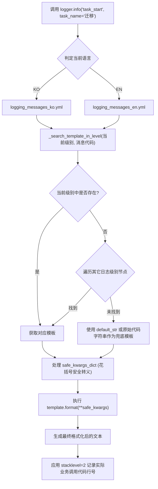

# 2.3. 多语言日志消息模板字典与基于代码的日志记录 (`logging_messages_*.yml`, `log_msg`)

> **所属模块**: `agent_common.logger.ProjectLogger`  
> **核心函数/方法**: `ProjectLogger.get_log_msg()`, `ProjectLogger.log_msg()`, `ProjectLogger.set_language()`, `get_log_msg()`  
> **消息字典文件**: `agent_common/config/logging_messages_ko.yml`, `logging_messages_en.yml`

---

## 1. 概述与企业级应用背景

在企业级服务开发中，若将日志消息直接硬编码在业务源码中，会引发以下严重弊端：

1. **违背规范并增加维护成本**: 违反 AGENTS.md 第一条原则（严禁硬编码），仅仅修改日志文案就必须重新构建并重新部署应用程序。
2. **阻碍全球化多语言运维**: 当海外运维中心 (NOC) 或跨国工程师协同排障时，单一语言的日志会极大降低沟通效率。
3. **缺乏日志分析与指标标准化**: 自由编写的非结构化日志难以归纳同类故障，无法通过代码精准建立聚合监控与报警规则。

`ProjectLogger` 全面支持**基于消息代码的外部模板字典集成**以及**运行时动态多语言切换 (KO ⇄ EN)**，从根源上化解上述难题。

---

## 2. 核心架构与模板解析流水线



---

## 3. 消息字典 YAML 结构

### 3.1. 韩语字典 (`agent_common/config/logging_messages_ko.yml`)

```yaml
logging_messages:
  INFO:
    task_start: "🚀 [{task_name}] 작업이 시작되었습니다. (대상: {target_count:,}건)"
    task_completed: "✅ [{task_name}] 작업이 성공적으로 완료되었습니다."
    data_transfer_progress: "[{task_name}] 처리 진행 중: {processed_count:,}/{total_count:,}건 ({percent:.1f}%)"
  
  WARNING:
    record_skipped: "⚠️ [{task_name}] 제외 조건에 의해 데이터 처리를 건너뜁니다: {reason}"
    retry_attempt: "⚠️ 일시적 연결 실패로 재시도합니다. (시도 횟수: {attempt_count}/{max_retries})"
  
  ERROR:
    connection_failed: "❌ {service_name} 서비스 연결에 실패하였습니다. (사유: {error_msg})"
    schema_validation_failed: "❌ 필수 필드 누락 또는 스키마 검증 실패: {detail}"
```

### 3.2. 英语字典 (`agent_common/config/logging_messages_en.yml`)

```yaml
logging_messages:
  INFO:
    task_start: "🚀 [{task_name}] task has started. (Targets: {target_count:,} items)"
    task_completed: "✅ [{task_name}] task has completed successfully."
    data_transfer_progress: "[{task_name}] Transfer progress: {processed_count:,}/{total_count:,} items ({percent:.1f}%)"
  
  WARNING:
    record_skipped: "⚠️ [{task_name}] Record skipped due to exclusion policy: {reason}"
    retry_attempt: "⚠️ Temporary connection failure. Retrying (Attempt: {attempt_count}/{max_retries})"
  
  ERROR:
    connection_failed: "❌ Failed to connect to {service_name}. (Reason: {error_msg})"
    schema_validation_failed: "❌ Required fields missing or schema validation failed: {detail}"
```

---

## 4. 核心功能与特性

### 4.1. 参数安全转义 (`safe_kwargs_dict`)
当日志参数值中包含花括号（如 JSON 字符串、正则表达式）时，底层自动进行转义保护（`{{`, `}}`），防止 `format()` 抛出 `KeyError` 或 `ValueError`。

```python
safe_kwargs_dict = {
    k: str(v).replace("{", "{{").replace("}", "}}") if isinstance(v, str) else v
    for k, v in kwargs.items()
}
```

### 4.2. 真实调用栈精准追踪 (`stacklevel=2`)
虽然业务代码调用的是 `logger.info()`、`logger.error()` 等包装层，但日志系统内部应用 `stacklevel=2`，确保日志头中准确输出**实际发起调用的业务代码文件名与具体行号**。

### 4.3. 运行时多语言动态切换
无需重启服务进程，即可通过全局类方法或实例方法实时修改输出语言：
- 类方法: `ProjectLogger.set_language("EN")` 或 `ProjectLogger.set_language("KO")`
- 实例方法 (Setter): `logger.language_set("EN")`
- 查询当前语言 (Getter): `logger.language` (➔ `"EN"` 或 `"KO"`)

---

## 5. 实战调用示例

### 5.1. 基于代码的消息日志记录

```python
from agent_common.logger import ProjectLogger

logger = ProjectLogger("MigrationService")

# 1. 传入消息代码及命名关键字实参
logger.info("task_start", task_name="Cloud_Data_Sync", target_count=50000)

# 2. 传输进度更新
logger.info(
    "data_transfer_progress",
    task_name="Cloud_Data_Sync",
    processed_count=25000,
    total_count=50000,
    percent=50.0,
)

# 3. 发生异常时记录 (自动累加失败计数并保留堆栈)
try:
    raise ConnectionTimeoutError("Connection timed out after 30s")
except Exception as e:
    logger.exception("connection_failed", service_name="Cloud_Storage", error_msg=str(e))
```

### 5.2. 运行时动态切换语言范例

```python
from agent_common.logger import ProjectLogger

logger = ProjectLogger("InternationalBatch")

# 默认语言 (KO) 输出
logger.info("task_start", task_name="SyncJob", target_count=100)
# ➔ [INFO] 🚀 [SyncJob] 작업이 시작되었습니다. (대상: 100건)

# 切换为英文模式
ProjectLogger.set_language("EN")

logger.info("task_start", task_name="SyncJob", target_count=100)
# ➔ [INFO] 🚀 [SyncJob] task has started. (Targets: 100 items)
```

### 5.3. 仅获取格式化文本 (`get_log_msg`)

当无需直接写入日志文件，而是需要将文本发送至飞书、企业微信、Slack 或邮件通知时：

```python
from agent_common.logger import get_log_msg

alert_text = get_log_msg("ERROR", "connection_failed", service_name="Kafka", error_msg="Broker unreachable")
print(alert_text)
# ➔ "❌ Failed to connect to Kafka. (Reason: Broker unreachable)"
```

---

## 6. 运维最佳实践

### 6.1. 项目专属消息字典扩展

除 `agent_common` 预置的标准消息字典外，项目专有业务码可在项目根目录下的 `config/logging_messages_ko.yml` 中扩充。`ConfigLoader` 依靠**深度合并 (Deep Merge)** 机制，在无损保留公共消息的前提下实现增量覆盖与扩展：

#### 1) 编写项目专有消息文件 (`<项目根目录>/config/logging_messages_ko.yml`)
```yaml
logging_messages:
  INFO:
    # 覆盖重写包默认的基础消息文案
    task_start: "🔥 [数据管道启动] {task_name} 批处理已启动。(待处理目标: {target_count:,} 条)"
    
    # 扩展项目独有的新业务消息代码
    medallion_step_completed: "🏅 [{stage_name}] 阶段清洗与转换完成: 成功 {success_count:,} 条, 排除 {excluded_count:,} 条"

  ERROR:
    # 扩展专用 API 报错码
    auth_token_expired: "🚫 鉴权服务 ({auth_url}) Token 过期或续约失败 (HTTP 状态码: {status_code})"
```

#### 2) 代码调用与行为验证
```python
from agent_common.logger import ProjectLogger

logger = ProjectLogger("MedallionPipeline")

# 1. 触发被重写的消息代码
logger.info("task_start", task_name="SilverToGold", target_count=10000)

# 2. 触发项目专属新增代码
logger.info(
    "medallion_step_completed",
    stage_name="Gold_Mart",
    success_count=9950,
    excluded_count=50,
)

# 3. 基础包未重写的既有消息依然无缝可用
logger.info("task_completed", task_name="SilverToGold")
```

### 6.2. 消息代码命名规范
- 统一使用小写下划线命名法（`snake_case`），语义明确、主谓分明（例如 `db_query_failed`, `file_not_found`, `invalid_payload`）。
