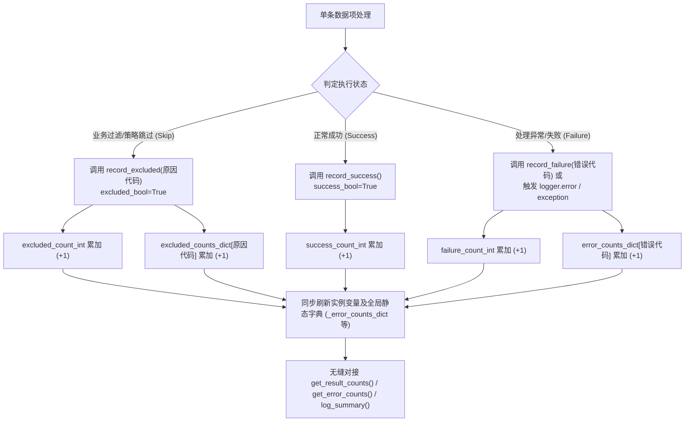

# 2.4. 任务执行统计与异常/排除原因实时聚合 (`record_result`, `record_error`, `record_exclusion`)

> **所属模块**: `agent_common.logger.ProjectLogger`  
> **核心方法**: `update()`, `record_result()`, `record_success()`, `record_failure()`, `record_excluded()`, `record_error()`, `record_exclusion()`  
> **查询/重置方法**: `get_result_counts()`, `get_error_counts()`, `get_excluded_counts()`, `reset_result_counts()`

---

## 1. 概述与企业级应用背景

在大规模数据迁移与分布式 ETL 流水线中，多线程或分布式 Worker 往往并发处理数十万至数百万条记录。

此时若仅仅将结果二元划分为“成功”与“失败”，会造成严重的运维失真：

1. **业务正常过滤与系统故障混淆**:
   - 包含逻辑删除标记（`del_yn == 'Y'`）、过期状态码或已入库的重复主键等属于业务规则允许的**主动跳过（Skip/Exclude）记录**，若被错误归类为“失败”，将触发虚假告警风暴。
2. **缺失按原因细分的故障归因统计**:
   - 产生数千条报错时，无法快速洞察究竟是偶发网络超时还是特定字段的 Schema 校验失败。
3. **多线程/多子模块指标割裂**:
   - 跨线程各组件内部的统计数据散落在各实例内，批处理任务结束时无法直接汇总全局指标。

`ProjectLogger` 通过提供清晰的 **成功 (Success)、失败 (Failure)、排除 (Excluded)** 三态模型，结合**实例级 (Instance) 与全局类级 (Global) 双轨统计架构**，完美解决了上述挑战。

---

## 2. 三态分类与实时聚合架构



---

## 3. 核心方法设计与实现机制

### 3.1. 统一更新入口 (`update`, `record_result`)

```python
def update(
    self,
    success_bool: bool = True,
    excluded_bool: bool = False,
    count_int: int = 1,
    log_id_str: str = "",
) -> None:
    inc_int: int = max(1, count_int)
    if excluded_bool:
        self.excluded_count_int += inc_int
        ProjectLogger._excluded_count_int += inc_int
        if log_id_str:
            self.record_exclusion(log_id_str, count_int=inc_int)
    elif success_bool:
        self.success_count_int += inc_int
        ProjectLogger._success_count_int += inc_int
    else:
        self.failure_count_int += inc_int
        ProjectLogger._failure_count_int += inc_int
        if log_id_str:
            self.record_error(log_id_str, count_int=inc_int)
```

- `record_result(...)` 是更具自解释性的显式别名方法。
- 计数同时累加至实例变量（`self.*`）与类级全局变量（`ProjectLogger.*`），确保在由多个子模块共同构成的复杂数据管道中不丢失宏观全局指标。

### 3.2. 状态专属便捷方法

- `record_success(count_int=1)`: 累加成功条数
- `record_failure(count_int=1, log_id_str="")`: 累加失败条数及错误类型标识
- `record_excluded(log_id_or_count="", count_int=1)`: 累加过滤排除条数及业务原因标识

### 3.3. 日志自动挂钩累加
当调用 `logger.error(...)`、`logger.critical(...)` 或 `logger.exception(...)` 时，无需手动再调用 `record_failure`，底层**自动拦截并累加失败计数与错误标识（`log_id_str` 或异常类名）**。

---

## 4. 实战代码示例

```python
from agent_common.logger import ProjectLogger

logger = ProjectLogger("DataPipeline")

# 模拟批处理数据集
records = [
    {"id": "A101", "status": "ACTIVE", "score": 95},
    {"id": "A102", "status": "DELETED", "score": 80},     # 预期过滤排除
    {"id": "A103", "status": "ACTIVE", "score": "INVALID"}, # 格式错误
    {"id": "A104", "status": "EXPIRED", "score": 70},     # 预期过滤排除
    {"id": "A105", "status": "ACTIVE", "score": 100},
]

for item in records:
    # 1. 业务策略过滤
    if item["status"] == "DELETED":
        logger.record_excluded("deleted_record_skipped")
        continue
    if item["status"] == "EXPIRED":
        logger.record_excluded("db_deleted_status_skipped")
        continue

    # 2. 正常数据处理与入库校验
    try:
        score_int = int(item["score"])
        # 执行正常入库业务...
        logger.record_success()
    except (ValueError, TypeError) as e:
        logger.record_failure(log_id_str="invalid_data_type")
        logger.exception("invalid_data_format", record_id=item["id"], error=str(e))

# 3. 查看整体结果计数
result_counts = logger.get_result_counts()
print(f"执行结果总览: {result_counts}")
# ➔ {'success': 2, 'failure': 1, 'excluded': 2}

# 4. 查看错误及排除原因细分明细
error_breakdown = logger.get_error_counts()
print(f"错误细分: {error_breakdown}")
# ➔ {'invalid_data_type': 1, 'invalid_data_format': 1}

excluded_breakdown = logger.get_excluded_counts()
print(f"排除细分: {excluded_breakdown}")
# ➔ {'deleted_record_skipped': 1, 'db_deleted_status_skipped': 1}
```

---

## 5. 多线程与跨组件全局指标汇总

多个线程或子模块分别实例化 `ProjectLogger` 时，可在任务主流程中直接提取全局大盘统计：

```python
from agent_common.logger import ProjectLogger

# Worker 线程 A 处理
logger_a = ProjectLogger("Worker-1")
logger_a.record_success(10)
logger_a.record_error("network_timeout", 2)

# Worker 线程 B 处理
logger_b = ProjectLogger("Worker-2")
logger_b.record_success(15)
logger_b.record_error("network_timeout", 1)
logger_b.record_error("auth_failed", 1)

# 获取全局合并统计
global_errors = ProjectLogger.get_global_error_counts()
print(f"全局错误聚合统计: {global_errors}")
# ➔ {'network_timeout': 3, 'auth_failed': 1}

# 批处理完成，清理计数器
logger_a.reset_result_counts()
```

---

## 6. 运维最佳实践

1. **原因代码 (`log_id_str`) 严格遵循小写蛇形命名 (`snake_case`)**:
   - 错误及排除原因编码务必统一采用小写下划线格式（例如 `db_deleted_status_skipped`, `db_duplicate_pk_skipped`, `network_timeout`, `schema_mismatch`）。
   - 消息模板字典（`logging_messages_*.yml`）中的模板键均严格按小写 `snake_case` 组织，保持小写一致才能确保 `log_summary()` 在输出报表时能够自动翻译呈现人类友好的文字说明。
2. **联动 `log_summary()` 自动出具汇总报表**:
   - 经由 `record_error` 和 `record_exclusion` 累积的明细项，会在调用 `logger.log_summary()` 时**自动按发生频次降序输出至最终的 Markdown 汇总大盘**，开发者无需编写额外的聚合汇总代码。
