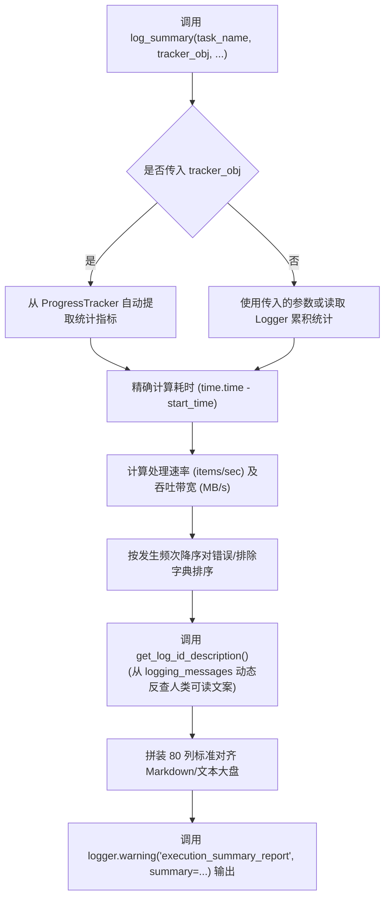

# 2.5. 任务执行结果汇总报表自动生成 (`log_summary`)

> **所属模块**: `agent_common.logger.ProjectLogger`  
> **核心方法**: `ProjectLogger.log_summary()`, `ProjectLogger.get_log_id_description()`  
> **关联模块**: `agent_common.progress_tracker.ProgressTracker`

---

## 1. 概述与企业级应用背景

当企业级数据管道（Airflow DAG、定时批处理进程）或大规模数据迁移结束时，运维与研发团队必须能够第一时间回答以下核心问题：

1. **整体任务耗时多长？平均处理吞吐量 (Throughput) 是多少？**
2. **成功、失败、过滤排除 (Skip) 各有多少条？**
3. **若存在失败，具体由哪些错误原因构成、各发生多少次？**
4. **整体传输与入库的数据总量 (MB) 及平均网络带宽 (MB/s) 表现如何？**

以往每个批处理脚本使用分散的 `print()` 输出，格式参差不齐且错误代码晦涩，增加了故障分析难度。

`ProjectLogger.log_summary()` 自动生成**高可读性、标准 80 列对齐的汇总报表大盘**，并默认以 `WARNING` 级别输出。

---

## 2. 汇总报表生成架构



---

## 3. 核心功能与机制

### 3.1. 错误及排除原因动态文字解析 (`get_log_id_description`)
给定错误或排除标识代码（如 `db_deleted_status_skipped`、`network_timeout`），方法能够自动反查多语言消息字典（`logging_messages_*.yml`），剔除未替换占位符并**自动拼装友好的中英文解释文案**：

- 代码: `db_deleted_status_skipped`
- 输出: `* db_deleted_status_skipped (因逻辑删除状态过滤排除): 120 条`

### 3.2. 精准的速率与带宽吞吐计算
- **总耗时**: `X分 Y秒 (Z秒)` 高精度呈现
- **平均吞吐速率**: 自动计算 `items/sec`
- **传输流量统计**: 自动由字节（`bytes`）转为兆字节（`MB`），并计算每秒传输速率（`MB/s`）

### 3.3. 与 `ProgressTracker` 的无缝协作
将 `ProgressTracker` 实例传入 `tracker_obj` 参数，无需手动收集总数、成功/失败/排除数与开始时间，报表即可全自动一键导出。

---

## 4. 标准汇总报表输出样式

```text
================================================================================
                    [数据流水线同步执行结果汇总报表]
================================================================================
- 任务开始 / 结束时间   : 2026-09-04 22:00:00 ~ 2026-09-04 22:05:30
- 总计消耗时间          : 5分 30.0秒 (330.00秒)
--------------------------------------------------------------------------------
- 待处理目标总数        : 100,000 条
- 处理成功 / 失败       : 99,500 条 / 300 条
- 策略排除 (Skip)       : 200 条
- 异常/报错细分明细 (共 300条):
  * network_timeout (网络连接超时): 250 条
  * schema_mismatch (必填列缺失或字段类型不匹配): 50 条
- 策略排除细分明细 (共 200条):
  * db_deleted_status_skipped (因逻辑删除状态过滤排除): 150 条
  * db_duplicate_pk_skipped (主键已存在或冲突过滤排除): 50 条
- 累计传输数据总量      : 1,024.50 MB (平均 3.10 MB/s)
- 平均处理速率          : 303.03 items/sec
- [补充元数据] 流水线执行节点: Airflow_Worker_03
================================================================================
```

---

## 5. 实战调用示例

### 5.1. 手动传递指标输出报表

```python
import time
from agent_common.logger import ProjectLogger

logger = ProjectLogger("BatchMigrator")
start_ts = time.time()

# 业务处理逻辑
logger.record_success(count_int=950)
logger.record_failure(count_int=30, log_id_str="network_timeout")
logger.record_failure(count_int=20, log_id_str="schema_mismatch")
logger.record_excluded("db_deleted_status_skipped", count_int=50)

# 输出执行汇总报表
logger.log_summary(
    task_name_str="客户数据全量同步",
    total_items_int=1050,
    start_time_float=start_ts,
    total_bytes_int=1024 * 1024 * 150,  # 150 MB
    extra_lines_list=[
        "来源数据集: customer_dw.activity_logs",
        "目标分析表: analytics_dw.daily_snapshot",
    ]
)
```

### 5.2. 配合 `ProgressTracker` 一键导出

```python
from agent_common.logger import ProjectLogger
from agent_common import ProgressTracker

logger = ProjectLogger("DataPipeline")
tracker = ProgressTracker(total_items_int=50000, logger_obj=logger, item_name_str="条记录")

for item in data_items:
    try:
        # 执行业务处理...
        tracker.increment_success(bytes_int=len(item))
    except Exception as e:
        tracker.increment_failure(error_msg_str=str(e))

# 任务结束后，ProgressTracker 自动触发 logger.log_summary()
tracker.log_summary(extra_lines_list=["批处理版本: v1.2.0"])
```

---

## 6. 运维最佳实践

1. **为何默认采用 `WARNING` 级别记录**:
   - `log_summary()` 刻意以 `WARNING` 级别打印，确保在生产环境普遍过滤掉 `INFO` 日志时（`logging.level: WARNING`），关键的任务完工总结大盘依然能够可靠输出到日志流中。
2. **充分使用 `extra_lines_list`**:
   - 建议在 `extra_lines_list` 中输出执行容器 IP、调度分区日期、数据源 URI 等审计与排障关键元数据。
