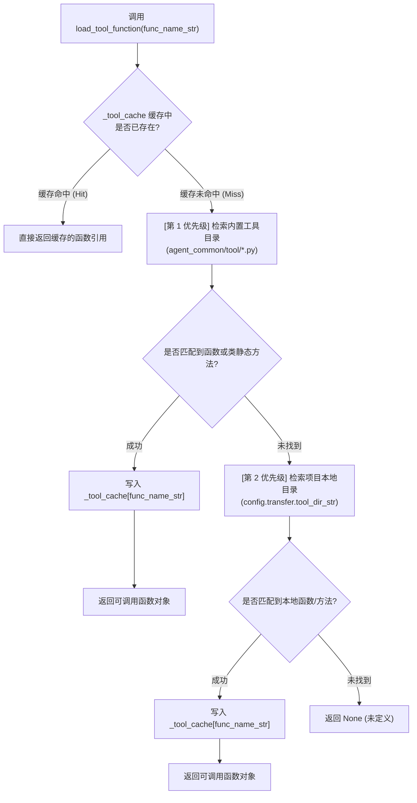

# 4.1. 双层级 Tool 工具目录层级发现与动态加载 (`ToolParser`)

> **所属模块**: `agent_common.tool_parser.ToolParser`  
> **核心方法**: `load_tool_function()`, `scan_rules_for_tool_functions()`  
> **依赖模块**: `importlib`, `inspect`, `pathlib`, `agent_common.logger.ProjectLogger`, `agent_common.config_loader.ConfigLoader`

---

## 1. 概述与企业级应用背景

在企业级数据迁移与湖仓架构（Medallion Architecture）数据管道中，为了将源系统（如 Dell ECS、各类业务数据库、第三方 API）的数据转换为标准业务模型，需要频繁调用各类工具函数（Tool）。

若将所有工具函数生硬地绑定在同一处，会引发明显冲突：
1. **企业通用规范 vs 领域特有逻辑的耦合**: 全局通用的标准时间戳生成（`DateTimeUtils`）或格式化器，与特定业务专属的映射逻辑（如业务废弃码清洗、各项目特定哈希计算）纠缠在一起，破坏了公共基础包的自洽性。
2. **版本发布与协同摩擦**: 仅为了修改某一领域特定的辅助函数，就必须全量升级并重新发布基础共享包 `agent_common`。

`ToolParser` 采用**双层级 2 阶段 Tool 动态查找架构**：
- **第 1 优先级 (企业标准内置工具)**: 优先扫描并检索 `agent_common` 包自带的公共标准工具库（`agent_common/tool/`）。
- **第 2 优先级 (项目本地专属工具)**: 查找在 `config.yml` 中 `transfer.tool_dir_str` 指定的项目本地目录（如 `medallion/tool/`）。

加载成功的函数将直接入驻内存高速缓存字典（`_tool_cache`），在处理数百万条记录的高并发批处理循环中以纳秒级速度零开销反复调用。

---

## 2. 层级查找架构与运行原理



---

## 3. 细粒度检索算法

接收到给定的函数名字符串（`func_name_str`）时，`ToolParser` 会执行以下 3 级深度匹配：

1. **模块顶级普通函数查找**:
   - 检索目标模块顶部通过 `def my_tool_func(...)` 显式声明的函数。
2. **`类名.方法名` 点记法显式查找**:
   - 若入参包含点号（例如 `DateTimeUtils.get_now_compact`），直接定位目标类并提取其内部静态/类方法。
3. **类内部成员方法自动穿透查找**:
   - 即使仅传入简单方法名（例如 `get_now_compact`），也会自动遍历模块内声明的各个类，检测并提取首个同名方法。

---

## 4. 核心方法签名

### 4.1. 动态加载工具函数 (`load_tool_function`)
```python
def load_tool_function(self, func_name_str: str) -> Optional[Callable]
```
- **入参**: `func_name_str`（如 `'get_now_compact'`, `'DateTimeUtils.get_now_compact'`, `'convert_abolition_code'`）。
- **返回值**: 可调用的 Python 函数对象 (`Callable`)，不存在时返回 `None`。

### 4.2. 规则集工具函数提前扫描校验 (`scan_rules_for_tool_functions`)
```python
def scan_rules_for_tool_functions(self, rule_node_any: Any, found_funcs_set: Set[str]) -> None
```
- **应用场景 (Fail-Fast)**:
  - 在大型管道启动的极早期阶段，递归扫描整棵 YAML 映射规则树（`table_rules.yml`, `mapping.yml` 等），搜集所有引用的 Tool 函数名。
  - 在启动阶段提前校验所有工具函数的存在性，彻底杜绝数据跑了几小时后因某个函数未定义而中途崩溃。

---

## 5. 实战代码示例

### 5.1. 内置与本地工具动态检索

```python
from agent_common.tool_parser import ToolParser

tool_parser = ToolParser()

# 1. 显式通过类名加载内置工具方法 (DateTimeUtils)
now_func = tool_parser.load_tool_function("DateTimeUtils.get_now_compact")
print(now_func())  # 输出例如: '20260918203000'

# 2. 仅凭方法名穿透匹配内置工具
today_func = tool_parser.load_tool_function("get_today_yyyymmdd")
print(today_func())  # 输出例如: '20260918'

# 3. 查找加载项目特有工具 (medallion/tool/ 下的业务函数)
custom_func = tool_parser.load_tool_function("custom_code_converter")
if custom_func:
    result = custom_func("AB01")
```

### 5.2. 流水线启动早期进行规则完整性校验 (Fail-Fast)

```python
from agent_common.tool_parser import ToolParser
from agent_common.logger import ProjectLogger

logger = ProjectLogger("PipelineValidator")
tool_parser = ToolParser()

# 数据转换规则配置定义
pipeline_rules = {
    "target_table": "dw_users",
    "columns": {
        "created_at": "{DateTimeUtils.get_now_timestamp()}",
        "user_code": "{custom_hasher(user_id)}",
        "legacy_flag": "{check_legacy(status)}",
    }
}

# 1. 自动递归提取规则中所依赖的所有 Tool 函数名
used_funcs_set: set[str] = set()
tool_parser.scan_rules_for_tool_functions(pipeline_rules, used_funcs_set)

# 2. 在处理数据前逐一验证函数可用性
missing_funcs = [fn for fn in used_funcs_set if tool_parser.load_tool_function(fn) is None]

if missing_funcs:
    logger.error("missing_tools_detected", missing_list=missing_funcs)
    raise RuntimeError(f"关键 Tool 函数缺失或未实现: {missing_funcs}")
```

---

## 6. 运维与架构建议

1. **内置工具优先权保障**: 若内置工具包与本地业务目录存在同名函数，**基础包内的内置工具始终优先加载**。本地专用工具建议附加明确前缀（如 `biz_`, `project_`）。
2. **目录路径配置**: 本地工具目录默认读取 `config.yml` 中的 `transfer.tool_dir_str`（默认值为 `"medallion/tool"`），可按需自由调整。
3. **坚持执行启动预检**: 请务必在批处理入口调用 `scan_rules_for_tool_functions`，确保拼写错误或漏提交的函数在启动第 1 秒即可 Fail-Fast 暴露。
