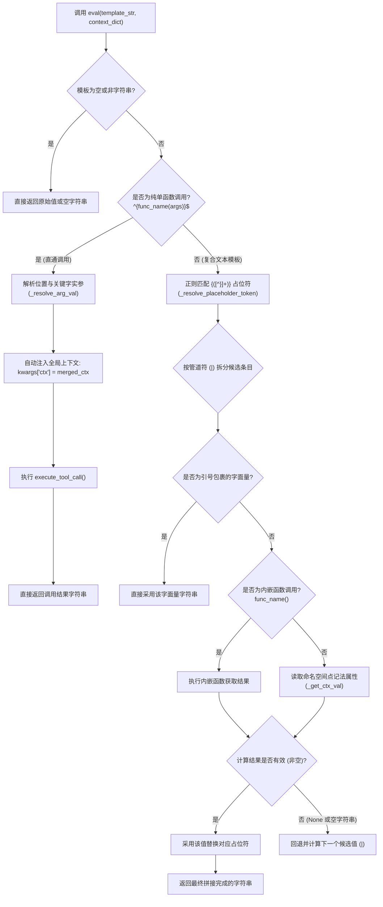

# 4.2. 声明式模板替换与表达式评估 (`ToolParser.eval`)

> **所属模块**: `agent_common.tool_parser.ToolParser`  
> **核心方法**: `eval()`, `execute_tool_call()`  
> **依赖模块**: `re`, `inspect`, `agent_common.logger.ProjectLogger`, `agent_common.config_loader.ConfigLoader`

---

## 1. 概述与企业级应用背景

在企业级数据管道中，将源端输入（如 S3/ECS 对象键、元数据、业务 JSON 数据等）映射并写入目标数仓（BigQuery、GCS 等）时，采用**声明式模板 (Declarative Template)** 能够让业务映射规则完全通过 YAML 配置文件灵活配置，杜绝在 Python 业务逻辑中散落硬编码。

`ToolParser.eval()` 提供了支持多种语法结构的表达式解析引擎：
1. **单一工具函数直接调用**: `"{DateTimeUtils.get_now_compact()}"`, `"{calc_age(json.birth_year)}"`
2. **点记法命名空间属性提取**: `"{ecs.key}"`, `"{sys.today}"`, `"{json.user.name}"`
3. **管道符 (`|`) 链式回退**: `"{meta.title|json.header.title|'UNTITLED'}"`
4. **智能参数自适应绑定与上下文无感注入**: 自动反射分析目标函数的签名参数（`inspect.signature`），仅绑定该函数声明的形参，并自动注入全局运行上下文（`ctx=merged_ctx`）。

---

## 2. 模板评估架构与解析流水线



---

## 3. 语法特性与表达式规范

| 语法形态 | 表达式范例 | 行为与用途说明 |
| :--- | :--- | :--- |
| **单函数直接调用** | `"{get_today_yyyymmdd()}"`<br/>`"{DateTimeUtils.get_now_timestamp()}"` | 直接运行指定工具函数，并将返回值转换为字符串。 |
| **带参函数调用** | `"{code_lookup('STATUS', json.status_cd)}"` | 支持传入单/双引号包裹的字面量入参或上下文路径入参。 |
| **命名空间变量** | `"{ecs.key}"`<br/>`"{json.user.address.city}"` | 使用点记法递归检索嵌套上下文字典对应字段。 |
| **管道符默认值回退** | `"{ecs.title\|json.title\|'默认标题'}"` | 从左至右顺序计算，一旦遇到非 `None` 且非空字符串（`""`）的值即刻采纳返回。 |
| **复合路径拼接** | `"archive/{sys.today}/{ecs.filename}.json"` | 混合静态字符与多个动态占位符，安全无缝拼装。 |

---

## 4. 核心方法签名

### 4.1. 模板评估 (`eval`)
```python
def eval(
    self,
    template_str: Optional[str],
    context_dict: Optional[Dict[str, Any]] = None,
) -> Optional[str]
```
- **参数**:
  - `template_str`: 待求值的模板字符串（例如 `'{sys.today}_{ecs.key}'`）。
  - `context_dict`: 提供命名空间数据（如 `ecs`, `sys`, `json`）的字典。
- **返回值**: 替换计算后的最终字符串。入参若为 `None` 则安全返回 `None`。

### 4.2. 工具函数安全受控执行 (`execute_tool_call`)
```python
def execute_tool_call(
    self,
    func_name_str: str,
    args_list: list[Any],
    kwargs_dict: Dict[str, Any],
) -> Any
```
- **智能实参裁剪**:
  - 自动通过 `inspect.signature(tool_func)` 分析目标函数。
  - 若目标函数未声明 `**kwargs`，底层将自动过滤多余的键值对，从根源上阻止 `TypeError: unexpected keyword argument`。

---

## 5. 实战代码示例

### 5.1. 综合模板解析实战

```python
from agent_common.tool_parser import ToolParser

tool_parser = ToolParser()

# 准备上下文数据
context = {
    "ecs": {
        "key": "raw/media/2026/sample_video.mp4",
        "size": 1048576,
    },
    "meta": {
        "category": "broadcast",
        # 模拟 title 字段缺失
    },
    "json": {
        "title": "晚间新闻联播",
    },
    "sys": {
        "today": "20260918",
    }
}

# 1. 直接执行内置工具方法
res1 = tool_parser.eval("{DateTimeUtils.get_now_compact()}", context)
print(res1)  # 输出类似: '20260918203000'

# 2. 命名空间 + 管道符回退机制
# 因 meta.title 缺失，自动回退采纳 json.title
res2 = tool_parser.eval("{meta.title|json.title|'默认标题'}", context)
print(res2)  # 输出: '晚间新闻联播'

# 3. 动态组织复合归档路径
res3 = tool_parser.eval("archive/{sys.today}/{ecs.key}", context)
print(res3)  # 输出: 'archive/20260918/raw/media/2026/sample_video.mp4'

# 4. 字面量托底保底
res4 = tool_parser.eval("{meta.author|'系统管理员'}", context)
print(res4)  # 输出: '系统管理员'
```

### 5.2. 自定义函数无感接入上下文 (`ctx`)

```python
# 本地工具示例: medallion/tool/calc_retention.py
def calculate_retention(days: int = 30, ctx: dict = None) -> str:
    """结合当前上下文的 sys.today 计算生命周期到期日"""
    today_str = ctx.get("sys", {}).get("today", "20260101")
    return f"{today_str}_expire_in_{days}d"

# 模板中无需显式传递 ctx，框架将自动无缝注入
res = tool_parser.eval("{calculate_retention(days=90)}", context)
print(res)  # 输出: '20260918_expire_in_90d'
```

---

## 6. 运维与最佳实践

1. **管道符字面量必须加引号**: 在使用管道符 `|` 设置静态兜底字符串时，必须使用单引号 (`'...'`) 或双引号 (`"..."`) 包裹。否则会被解析为上下文键名，导致解析为空。
2. **Fail-Fast 错误传导**: 若被调用的工具函数发生未经处理的业务异常，`execute_tool_call` 记录完整的 `logger.exception` 后立即向上重新抛出，杜绝脏数据悄无声息地落库。
3. **遵循命名空间规范**: 构建 `context` 字典时，推荐统一遵循 `{ecs.*}`, `{sys.*}`, `{json.*}`, `{meta.*}` 的结构约定，提升可读性。
