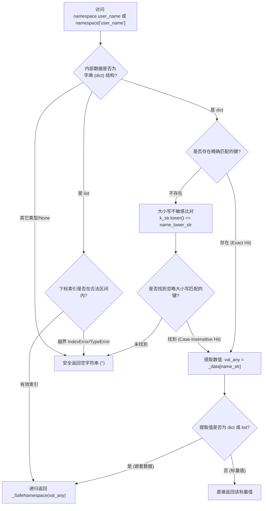

# 4.3. 安全命名空间穿透与导航 (`_SafeNamespace`)

> **所属模块**: `agent_common.tool_parser._SafeNamespace`  
> **核心方法**: `__getattr__()`, `__getitem__()`, `__str__()`, `__bool__()`  
> **依赖模块**: Python 原生标准库 (Zero-dependency)

---

## 1. 概述与企业级应用背景

从异构数据源（Dell ECS 元数据、存量业务数据库转储、第三方 REST API 等）摄入的 JSON 数据，字段大小写格式往往缺乏严谨约束（如 `userId` vs `USERID` vs `userid`），且某些记录常常存在字段全量缺失。

若直接使用 Python 原生字典或常规对象属性访问（`data['user']['name']` 或 `data.user.name`），会导致严重问题：
1. **`KeyError` 与 `AttributeError` 引发管道崩溃**: 在百万级批处理循环中，仅仅因为第 100,000 条记录缺少某个可选属性，整个作业便异常中断。
2. **防御性样板代码严重泛滥**: 开发者不得不写满繁冗的 `data.get('user', {}).get('name', '')`，严重降低代码可读性与维护效率。

`_SafeNamespace` 兼具点记法属性导航与下标（`[]`）访问，原生支持**大小写不敏感检索**，并在**键缺失时安全返回空字符串 (`""`)**，是专为数据摄入设计的高性能安全包装器。

---

## 2. 安全检索架构与递归包装原理



---

## 3. 核心特性规范

### 3.1. 点记法与下标访问统合
经 `_SafeNamespace` 包装的对象，可以混用点记法（`ns.user.name`）与字典下标（`ns['user']['name']`）。

### 3.2. 自动忽略大小写 (Case-Insensitive)
无论原始数据键名是 `{"CreatedAt": "2026-09-18"}` 还是其它变体，`ns.createdat`、`ns.CREATED_AT`、`ns.createdAt` 均能稳健提取。

### 3.3. 深度不存在字段安全兜底 (`""`)
即使查询深达 10 层的未定义路径（`ns.non_existing.deep.nested.field`），也不会抛出 `NoneType error` 或 `KeyError`，始终安全返回空字符串 (`""`)。

### 3.4. 布尔与字符串评估支持
- `__str__()`: 转换底层数据为字符串（为 `None` 时输出 `""`）。
- `__bool__()`: 遵循 Python 真值测试，数据为空字典、空列表或空串时返回 `False`。

---

## 4. 实战代码示例

```python
from agent_common.tool_parser import _SafeNamespace

# 模拟结构不规整的异构输入
raw_data = {
    "Header": {
        "TRANSACTION_ID": "TX-998823",
        "Sender": "System-A"
    },
    "Payload": {
        "items": [
            {"ItemCode": "P001", "Qty": 10},
            {"ItemCode": "P002", "Qty": 5}
        ]
    }
}

ns = _SafeNamespace(raw_data)

# 1. 大小写混合安全访问
tx_id = ns.header.transaction_id
print(tx_id)  # 输出: 'TX-998823'

sender = ns.Header.sender
print(sender)  # 输出: 'System-A'

# 2. 列表与字典混合多层穿透
first_item = ns.payload.items[0].itemcode
print(first_item)  # 输出: 'P001'

# 3. 访问深层缺失字段，安全返回空串
missing_val = ns.payload.metadata.author.email
print(f"提取结果: '{missing_val}'")  # 输出: ''
print(bool(missing_val))              # 输出: False

# 4. 数组越界安全访问
out_of_bounds = ns.payload.items[999].itemcode
print(f"越界访问结果: '{out_of_bounds}'")  # 输出: ''
```

---

## 5. 运维与最佳实践

1. **模板评估基石**: `ToolParser.eval()` 内部全面采用 `_SafeNamespace` 绑定变量上下文，确保规则撰写人员无需担心源端 JSON 字段大小写或缺漏引起的不可预知错误。
2. **字段有效性判断**: 缺失字段返回 `""`，因而只需直接使用 `if ns.target_field:` 即可简洁判断。
3. **消除冗余防御性代码**: 彻底告别繁琐的 `try-except KeyError` 与连环 `.get()`，大幅提升管道处理代码的清爽度与吞吐效率。
