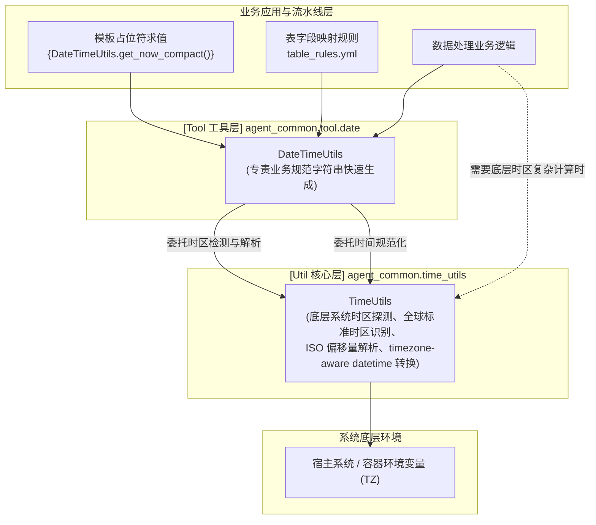

# 4.4. 内置公共日期时间工具 (`DateTimeUtils`)

> **所属模块**: `agent_common.tool.date.DateTimeUtils`  
> **核心方法**: `get_today_yyyymmdd()`, `get_now_timestamp()`, `get_now_no_tz()`, `get_now_compact()`, `parse_datetime()`  
> **底层核心支持**: `agent_common.time_utils.TimeUtils` (专责系统时区识别与时间解析)

---

## 1. 概述与企业级应用背景

在企业级数据工程与湖仓分层架构中，不论是表转换规则（`table_rules.yml`）还是 GCS/BigQuery 写入路径模板，均高频需要将当前日期与时间格式化为规范的标准字符串。

常见诉求包括：
- **BigQuery TIMESTAMP 字段写入**: 需要包含时区偏移量的标准 ISO 8601 时间戳（如 `YYYY-MM-DD HH:MM:SS+08:00`）。
- **分区目录生成**: 凌晨批处理时需准确定位当前的 8 位日期（`YYYYMMDD`），防止时区错位。
- **无时区控制台日志**: 需要便于阅读的纯时间文本（`YYYY-MM-DD HH:MM:SS`）。
- **文件命名与批次标识**: 需使用 14 位紧凑时间（`YYYYMMDDHHMMSS`）。

`DateTimeUtils` 作为 `agent_common` 的**第一优先级内置工具 (Built-in Tool)**，为声明式模板（`{DateTimeUtils.get_today_yyyymmdd}`）及业务代码提供开箱即用的时间生成与转换服务。

---

## 2. 时间模块双层架构: `DateTimeUtils` vs `TimeUtils`

`agent_common` 明确将时间管理划分为**底层基础设施层 (`TimeUtils`)** 与 **上层业务工具层 (`DateTimeUtils`)**：



### 💡 两者的明确职责划分
1. **`TimeUtils` (底层设施)**:
   - 自动探测容器与宿主机的实际系统时区。
   - 解析全球主要时区缩写（UTC, CST, JST, KST, EST 等）及 ISO 8601 偏移量。
   - 将任意输入时间统一规整为 timezone-aware `datetime` 对象。
2. **`DateTimeUtils` (格式化工具)**:
   - 基于 `TimeUtils` 提供的时区底座，快速产出各业务存储所需的标准字符串。
   - 深度集成于 `ToolParser`，直接支持模板占位符调用。

---

## 3. 核心方法与接口规范

### 3.1. 获取当天 8 位日期 (`get_today_yyyymmdd`)
```python
@classmethod
def get_today_yyyymmdd(cls, tz_obj: Optional[timezone] = None) -> str
```
- **格式**: `YYYYMMDD` (例如 `'20260918'`)
- **用途**: 组织按日分区的存储路径、分区表分区主键。
- **特性**: 未指定 `tz_obj` 时自动绑定当前系统时区，避免凌晨作业时因 UTC 时差导致日期回退一天。

### 3.2. 获取标准 ISO 8601 时间戳 (`get_now_timestamp`)
```python
@classmethod
def get_now_timestamp(cls, tz_obj: Optional[timezone] = None) -> str
```
- **格式**: `YYYY-MM-DD HH:MM:SS+08:00` 或 `+00:00`
- **用途**: 写入 BigQuery `TIMESTAMP` 字段、审计日志事件戳。

### 3.3. 获取无时区时间文本 (`get_now_no_tz`)
```python
@classmethod
def get_now_no_tz(cls, tz_obj: Optional[timezone] = None) -> str
```
- **格式**: `YYYY-MM-DD HH:MM:SS` (例如 `'2026-09-18 20:30:15'`)
- **用途**: 终端控制台打印、Markdown 汇总报表呈现。

### 3.4. 获取 14 位压缩时间戳 (`get_now_compact`)
```python
@classmethod
def get_now_compact(cls, tz_obj: Optional[timezone] = None) -> str
```
- **格式**: `YYYYMMDDHHMMSS` (例如 `'20260918203015'`)
- **用途**: 备份归档后缀、任务事务流水号生成。

### 3.5. 转换为 timezone-aware 对象 (`parse_datetime`)
```python
@classmethod
def parse_datetime(cls, dt_input_any: Any, default_tz_obj: Optional[timezone] = None) -> Optional[datetime]
```
- 将字符串、时间戳或无时区时间安全解析并注入时区信息，失败时安全返回 `None`。

---

## 4. 实战代码示例

### 4.1. 在业务代码中直接调用

```python
from agent_common.tool.date import DateTimeUtils
from agent_common import TimeUtils

# 1. 依据系统时区生成各类字符串
today_str = DateTimeUtils.get_today_yyyymmdd()
print(f"今日日期: {today_str}")  # '20260918'

ts_str = DateTimeUtils.get_now_timestamp()
print(f"BigQuery 入库时间戳: {ts_str}")  # '2026-09-18 20:30:15+08:00'

compact_str = DateTimeUtils.get_now_compact()
print(f"紧凑时间戳: {compact_str}")  # '20260918203015'

# 2. 显式指定 UTC 时区生成
utc_tz = TimeUtils.resolve_timezone("UTC")
utc_ts = DateTimeUtils.get_now_timestamp(tz_obj=utc_tz)
print(f"UTC 标准时间戳: {utc_ts}")

# 3. 规范化异构源端时间
raw_iso = "2026-08-15T12:00:00Z"
normalized_dt = DateTimeUtils.parse_datetime(raw_iso)
print(normalized_dt)  # 2026-08-15 12:00:00+00:00
```

### 4.2. 配合 ToolParser 模板动态求值

```python
from agent_common.tool_parser import ToolParser

tool_parser = ToolParser()

# 定义路径模板
template_path = "lake/events/{DateTimeUtils.get_today_yyyymmdd()}/{DateTimeUtils.get_now_compact()}_event.json"

# 动态求值
evaluated_path = tool_parser.eval(template_path)
print(evaluated_path)
# 输出: lake/events/20260918/20260918203015_event.json
```

---

## 5. 运维与架构建议

1. **分层使用**:
   - 复杂的跨时区换算、日期加减数学运算请使用 `TimeUtils`。
   - 规则模板求值、存储目录组织与报表输出请使用 `DateTimeUtils`。
2. **云原生 Pod 容器时区排错**:
   - 部署在云上的容器默认时区通常为 UTC。确保在镜像或 Pod 环境变量中正确声明 `TZ`，或在需要时直接显式指定目标时区，杜绝跨时区日期错位。
