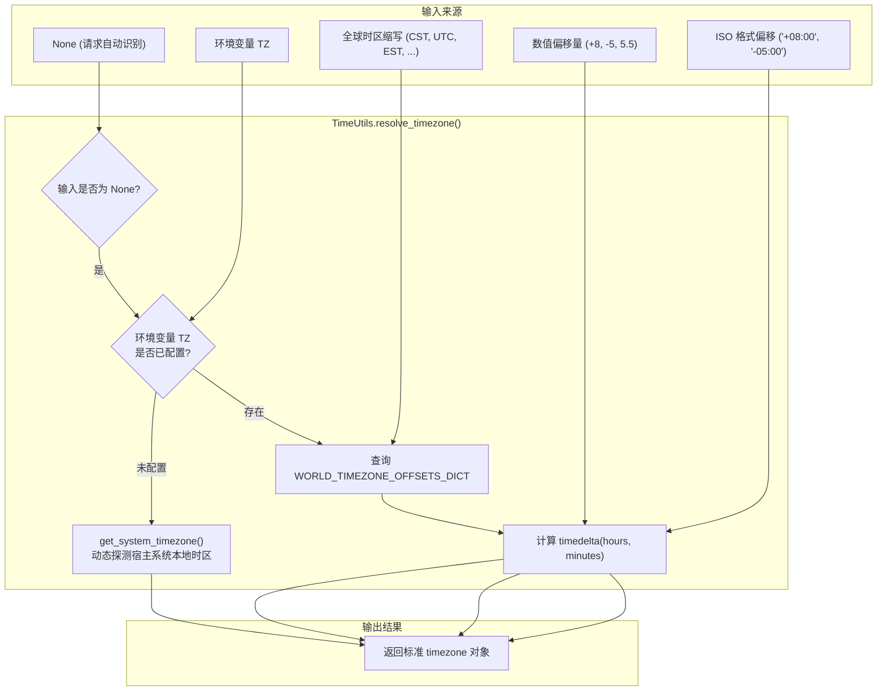

# 5.1. 宿主系统时区识别、全球标准时间解析与时间规范化 (`TimeUtils`)

> **所属模块**: `agent_common.utils.TimeUtils`  
> **核心方法**: `get_system_timezone()`, `get_system_timezone_offset_str()`, `resolve_timezone()`, `format_timezone_offset()`, `parse_datetime()`  
> **核心数据**: `WORLD_TIMEZONE_OFFSETS_DICT` (涵盖全球 30+ 主流时区偏移映射字典)  
> **引入版本**: `v0.4.69` (核心工具解耦), `v0.4.74` (支持 `parse_datetime`)

---

## 1. 概述与企业级应用背景

在企业混合云与多区域架构中，同一套数据流水线可能部署在差异化的底层环境中：
- **IDC 本地机器**: 宿主系统通常设定为北京/首尔时区（如 UTC+8 / UTC+9）。
- **Kubernetes / Cloud Run 容器**: 容器基底时区默认往往是世界协调时（`UTC`, UTC+0）。

若时间处理逻辑简单假设特定时区，或滥用无时区 naive `datetime`，会造成严重后果：
1. **凌晨作业日期回退**: 凌晨 00:00 ~ 08:00 之间触发的容器按 UTC 日期归档，导致数据落入前一天的分区目录中。
2. **数仓 TIMESTAMP 偏差**: 缺失时区偏移量直接入库，产生数小时的业务统计失真。
3. **多区域异构数据整合困难**: 无法将来自美东 (EST)、欧洲 (CET)、亚洲 (CST/JST) 的不同数据时间统一归纳对齐。

`TimeUtils` 在运行时动态感知宿主机与容器环境的物理时区，支持解析全球主流时区缩写及任意合法偏移量，是将各类非规整时间数据**规范化为 `timezone-aware datetime` 的核心时间基础设施**。

---

## 2. 时间基础设施架构与规范化流水线



---

## 3. 全球主流标准时区字典 (`WORLD_TIMEZONE_OFFSETS_DICT`)

| 区域 / 范畴 | 支持缩写 | 相对 UTC 偏移量 | 代表城市 / 备注 |
| :--- | :--- | :---: | :--- |
| **标准参考** | `UTC`, `GMT`, `Z` | UTC+0 | 格林尼治标准时间、世界协调时 |
| **亚洲 / 大洋洲** | `CST_ASIA`, `HKT`, `SGT` | UTC+8 | 北京、上海、香港、新加坡 |
| | `KST`, `JST` | UTC+9 | 首尔、东京 |
| | `IST` | UTC+5:30 | 新德里（印度标准时间，半小时偏差） |
| | `ICT` | UTC+7 | 曼谷、河内 |
| | `AEST` / `AEDT` | UTC+10 / UTC+11 | 悉尼（澳大利亚东部标准 / 夏令时） |
| | `NZST` / `NZDT` | UTC+12 / UTC+13 | 奥克兰（新西兰标准 / 夏令时） |
| **欧洲** | `CET` / `CEST` | UTC+1 / UTC+2 | 巴黎、柏林 |
| | `WET` / `WEST` | UTC+0 / UTC+1 | 里斯本、伦敦 |
| | `BST` | UTC+1 | 伦敦（英国夏令时） |
| | `MSK` | UTC+3 | 莫斯科 |
| **北美** | `EST` / `EDT` | UTC-5 / UTC-4 | 纽约、华盛顿 |
| | `CST` / `CDT` | UTC-6 / UTC-5 | 芝加哥 |
| | `MST` / `MDT` | UTC-7 / UTC-6 | 丹佛 |
| | `PST` / `PDT` | UTC-8 / UTC-7 | 洛杉矶、旧金山 |
| | `AKST` / `AKDT` | UTC-9 / UTC-8 | 阿拉斯加 |
| | `HST` | UTC-10 | 夏威夷 |

---

## 4. 核心方法说明

### 4.1. 动态感知宿主时区 (`get_system_timezone`)
```python
@classmethod
def get_system_timezone(cls) -> timezone
```
- 基于 `datetime.now().astimezone().utcoffset()` 反射出当前进程运行所在主机的真实时区，失败时兜底至 `timezone.utc`。

### 4.2. 输出系统时区偏移文本 (`get_system_timezone_offset_str`)
```python
@classmethod
def get_system_timezone_offset_str(cls) -> str
```
- 返回类似 `'+08:00'`, `'+09:00'`, `'-05:00'` 的标准文本。

### 4.3. 通用时区解析 (`resolve_timezone`)
```python
@classmethod
def resolve_timezone(cls, tz_input_any: Optional[timezone | str | int | float] = None) -> timezone
```
- 支持解析名称缩写、纯数值（如 `8` ➔ `+08:00`）、带符号文本。无法识别的非法格式抛出 `ValueError`。

### 4.4. 统一规整为 timezone-aware 时间 (`parse_datetime`)
```python
@classmethod
def parse_datetime(cls, dt_input_any: Any, default_tz_obj: Optional[timezone] = None) -> Optional[datetime]
```
- 自动识别 ISO 8601、末尾带有 `Z` 的时间文本或原生 datetime 对象，并确保输出挂载明确时区的标准对象。

---

## 5. 实战代码示例

```python
from agent_common.utils import TimeUtils
from datetime import datetime

# 1. 动态识别本地时区
sys_tz = TimeUtils.resolve_timezone()
print(f"本地系统时区: {sys_tz}")
print(f"本地时区偏移: {TimeUtils.get_system_timezone_offset_str()}")

# 2. 解析全球主要城市时区
cst_tz = TimeUtils.resolve_timezone("CST_ASIA")  # UTC+08:00
est_tz = TimeUtils.resolve_timezone("EST")       # UTC-05:00
ist_tz = TimeUtils.resolve_timezone("IST")       # UTC+05:30

# 3. 批量将非标准来源时间规整为统一规范对象
inputs = [
    "2026-09-18T20:30:00Z",            # UTC ISO 格式
    "2026-09-18 20:30:00+08:00",       # 明确包含时区的文本
    datetime(2026, 9, 18, 20, 30, 0),  # 无时区 naive datetime
    None,                               # 缺省值
    "INVALID_DATE_STRING"               # 脏数据
]

for item in inputs:
    normalized_dt = TimeUtils.parse_datetime(item)
    print(f"原始: {str(item):<25} ➔ 规整后: {normalized_dt}")
```

---

## 6. 与 `DateTimeUtils` 的协作分工

1. **底层引擎 vs 表现工具**:
   - `TimeUtils` 是专注于时区数学计算、解析与规范化的**底层引擎**。
   - `DateTimeUtils` 引用 `TimeUtils`，专注于为业务管道提供诸如 `YYYYMMDD`、`YYYYMMDDHHMMSS` 等**高层模板字符串生成**。
2. **容器化配置建议**:
   - 在 Dockerfile 或 K8s 部署配置中明确设置 `ENV TZ=Asia/Shanghai`，使 `TimeUtils` 无缝继承业务时区，防止跨时区调度故障。
