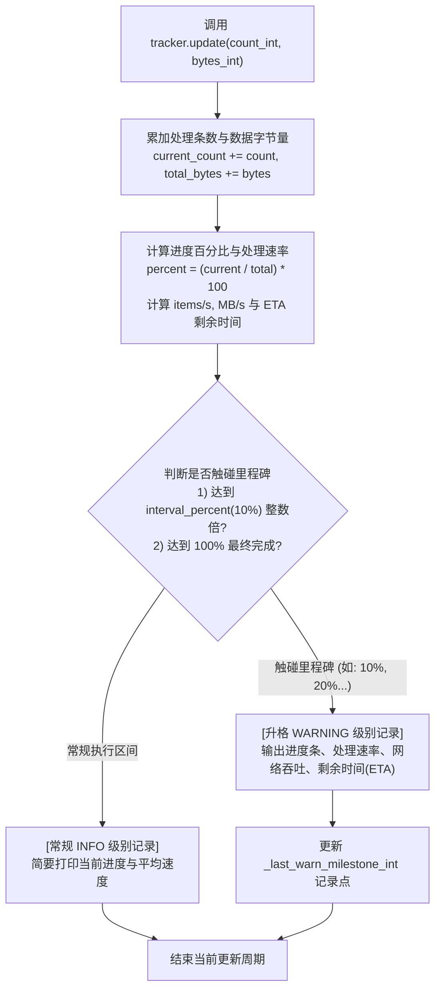

# 5.2. 多线程实时进度跟踪与里程碑告警 (`ProgressTracker`)

> **所属模块**: `agent_common.utils.ProgressTracker`  
> **核心方法**: `update()`  
> **关联模块**: `agent_common.logger.ProjectLogger`, `agent_common.config_loader.config`

---

## 1. 概述与企业级应用背景

在处理数万至数百万级海量对象文件 (S3/ECS) 或向 BigQuery 大规模迁移数据的批处理作业中，**实时进度可视化**与准确预测**预计剩余耗时 (ETA)** 至关重要。

传统简单的循环计数日志往往面临以下瓶颈：
1. **日志洪泛 (Log Flooding)**: 若处理 1,000,000 条数据每条都打日志，将导致采集存储成本飙升并掩盖关键报错。
2. **作业假死难以分辨**: 连续数十分钟没有任何日志输出，运维人员无法判断进程是仍在运行还是陷入了死锁挂起 (Hang)。
3. **关键节点识别度低**: 在成千上万行日志流中，难以快速抓住 10%、20%、50% 等里程碑节点。

`ProgressTracker` 实时统计处理条数与传输数据量，**常规进展以 `INFO` 级别输出**，而**达到指定的进度百分比倍数（如 10% 里程碑）以及最终 100% 完工时，自动升格为 `WARNING` 级别记录**，极大便利了运维大盘的过滤与观察。

---

## 2. 进度追踪与里程碑升格运行机制



---

## 3. 核心配置与参数规范

可在 `config.yml` 的 `progress_tracker` 节点灵活调节：

```yaml
progress_tracker:
  interval_percent_int: 10       # 里程碑告警步长间隔 (单位: %)
  default_task_name_str: "任务"  # 默认任务名称文本
```

### 3.1. 构造函数 (`__init__`)
```python
def __init__(
    self,
    total_items_int: int,
    logger_obj: Any = None,
    task_name_str: Optional[str] = None,
    start_time_float: Optional[float] = None,
) -> None
```

### 3.2. 状态刷新方法 (`update`)
```python
def update(
    self,
    count_int: int = 1,
    bytes_int: int = 0,
    details_str: str = "",
) -> None
```
- **输出格式**:
  - **里程碑 (`WARNING`)**:  
    `[任务名 进度里程碑] 进度: 500/1,000 (50%) | 速度: 25.4条/s 12.30 MB/s | 预估剩余时间(ETA): 0m 19s`
  - **常规输出 (`INFO`)**:  
    `[任务名] 123/1,000 (12%) | 24.8条/s (11.80 MB/s)`

---

## 4. 实战代码示例

### 4.1. 海量文件传输进度监听

```python
from agent_common.utils import ProgressTracker
from agent_common.logger import ProjectLogger
import time

logger = ProjectLogger("MigrationService")
file_list = [{"name": f"file_{i}.dat", "size": 1024 * 512} for i in range(100)]

# 初始化进度跟踪器
tracker = ProgressTracker(
    total_items_int=len(file_list),
    logger_obj=logger,
    task_name_str="GCS 文件同步"
)

for file_info in file_list:
    time.sleep(0.05)
    
    # 完成一个文件传输后上报
    tracker.update(
        count_int=1,
        bytes_int=file_info["size"],
        details_str=file_info["name"]
    )
```

### 4.2. 线程池并发块批处理进度汇总

```python
from concurrent.futures import ThreadPoolExecutor
from agent_common.utils import ProgressTracker
from agent_common.logger import ProjectLogger

logger = ProjectLogger("BatchWorker")
chunks = [range(i, i + 50) for i in range(0, 1000, 50)]

tracker = ProgressTracker(
    total_items_int=1000,
    logger_obj=logger,
    task_name_str="并发块处理"
)

def process_chunk(chunk_items):
    processed_count = len(chunk_items)
    tracker.update(count_int=processed_count)

with ThreadPoolExecutor(max_workers=4) as executor:
    executor.map(process_chunk, chunks)
```

---

## 5. 运维与最佳实践

1. **里程碑告警的监控收益**:
   - 在 Datadog、Grafana 或 CloudWatch 等统一监控平台中，只需过滤 `WARNING` 级别，即可只抓取批处理任务的 10% 整数倍进度与 ETA，彻底消除无用噪音。
2. **除零安全防护**:
   - 若传入的总数 `total_items_int` 为 0，底层自动使用 `max(1, total_items_int)` 进行保护，绝不抛出 `ZeroDivisionError`。
3. **精准评估网络瓶颈**:
   - 只要在传输时附加 `bytes_int`，追踪器即可计算平均吞吐量（`MB/s`），协助运维第一时间察觉跨云网络限速。
