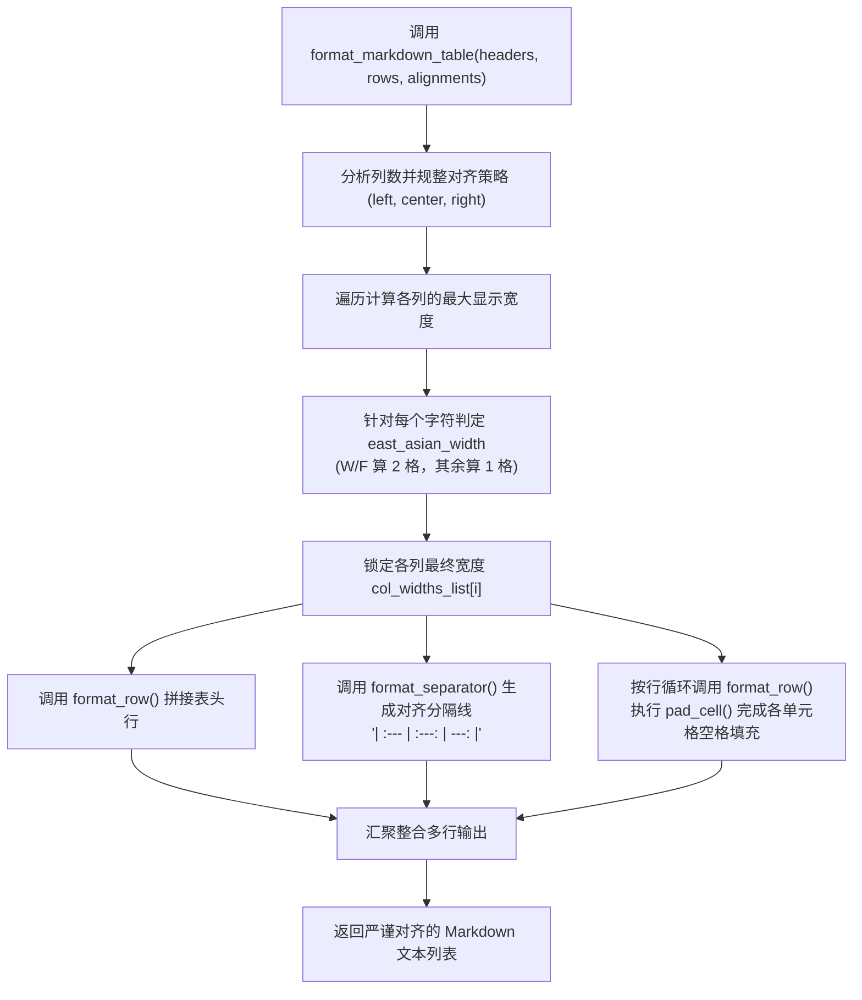

# 5.3. Unicode 全角字符宽度计算与 Markdown/控制台表格精准对齐器 (`TableFormatter`)

> **所属模块**: `agent_common.utils.TableFormatter`  
> **核心方法**: `calculate_display_width()`, `format_markdown_table()`, `format_row()`, `format_separator()`, `pad_cell()`  
> **依赖模块**: `unicodedata` (Python 标准库), `agent_common.config_loader.config`  
> **引入版本**: `v0.4.63`

---

## 1. 概述与企业级应用背景

批处理结束后，在终端控制台或向 GitHub/Slack/飞书输出结果汇总表格时，经常遇到如下错位痛点：

```text
# 简单使用 len() 计算空格填充时引发的表格变形
| 文件名 | 状态 | 耗时 |
| sample_file.json | 成功 | 1.2s |
| 中文业务数据文件.json | 成功 | 2.5s |   <-- 中文字符占2格，右侧竖线 (|) 严重错位！
```

Python 原生 `len("中文")` 返回的字符数为 `2`，但在等宽字体（Monospace）终端与 Markdown 解析器中，**东亚全角字符（中文、日文假名、韩文、全角标点）的实际视觉显示宽度为英文字符的 2 倍（Display Width = 2）**。

`TableFormatter` 借助原生标准库 `unicodedata.east_asian_width`，以纳秒级高精度测算文本的实际视觉呈现宽度，并根据列对齐规则（左、中、右），**实现所有数据行竖线 (`|`) 严丝合缝的精准垂直对齐**。

---

## 2. 宽度测算与表格渲染流水线



---

## 3. 东亚字符分类规范 (`unicodedata.east_asian_width`)

| 标识 | 分类名 (Category) | 涵盖字符范例 | 视觉显示宽度 (Display Width) |
| :---: | :--- | :--- | :---: |
| **`W`** | **Wide (全角字符)** | 中文汉字、日文假名、韩文字符 | **2 格** |
| **`F`** | **Fullwidth (全角英数/标点)** | 全角英文字母（`Ａ`）、全角符号（`！`） | **2 格** |
| **`Na`** | Narrow (半角字符) | 基础 ASCII 英文、数字（`0`~`9`）、英文标点 | 1 格 |
| **`H`** | Halfwidth (半角片假名) | 半角片假名字符 | 1 格 |
| **`N`** | Neutral (中立字符) | 阿拉伯文、希伯来文等 | 1 格 |
| **`A`** | Ambiguous (多义字符) | 希腊字母、部分特殊符号 | 1 格 |

---

## 4. 核心方法与接口规范

### 4.1. 测算视觉宽度 (`calculate_display_width`)
```python
@classmethod
def calculate_display_width(cls, text_str: str) -> int
```
- 基于 `unicodedata.east_asian_width(c) in ("W", "F")` 规则，遇全角字符计 2 格，半角计 1 格。

### 4.2. 生成对齐 Markdown 表格 (`format_markdown_table`)
```python
@classmethod
def format_markdown_table(
    cls,
    headers_list: list[str],
    rows_list: list[list[str]],
    alignments_list: Optional[list[str]] = None,
) -> list[str]
```
- 接收表头列表、二维数据行以及对齐选项（`'left'`, `'center'`, `'right'`），生成格式规整的多行字符串列表。

### 4.3. 单元格字符填充 (`pad_cell`)
```python
@classmethod
def pad_cell(
    cls,
    cell_text_str: str,
    target_width_int: int,
    align_mode_str: str = "left",
) -> str
```
- 依据对齐方式智能补充前后置空格。

---

## 5. 实战代码示例

```python
from agent_common.utils import TableFormatter

headers = ["阶段环节", "目标实体/文件", "数据条数", "运行耗时", "最终状态"]
rows = [
    ["源端数据提取", "ecs_export_20260918.csv", "12,500", "1.4s", "已完成"],
    ["清洗转换", "cleaned_dataset.parquet", "12,498", "3.8s", "成功"],
    ["BigQuery 内联 MERGE", "analytics.tb_sales_log", "12,498", "2.1s", "成功"],
]
alignments = ["left", "left", "right", "right", "center"]

table_lines = TableFormatter.format_markdown_table(
    headers_list=headers,
    rows_list=rows,
    alignments_list=alignments
)

print("\n".join(table_lines))
```

**控制台严密垂直对齐输出效果**:
```text
| 阶段环节              | 目标实体/文件           | 数据条数 | 运行耗时 | 最终状态 |
| :-------------------- | :---------------------- | -------: | -------: | :------: |
| 源端数据提取          | ecs_export_20260918.csv |   12,500 |     1.4s |  已完成  |
| 清洗转换              | cleaned_dataset.parquet |   12,498 |     3.8s |   成功   |
| BigQuery 内联 MERGE   | analytics.tb_sales_log  |   12,498 |     2.1s |   成功   |
```

---

## 6. 运维与最佳实践

1. **配置外部化**:
   - 表格分隔线最小宽度等样式可在 `config.yml` 的 `table_formatter` 节点调优。
2. **报表原生底座**:
   - `ProjectLogger.log_summary()` 在输出 80 列总结报表时底层直接集成了 `TableFormatter`，确保全链路日志呈现体验的高度一致。
